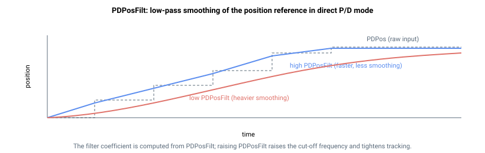

# PDPosFilt

在直接脉冲/方向模式下对 PDPos 进行平滑的一阶低通截止频率（Hz/100）。

## 概述

`PDPosFilt` 是一阶低通滤波器的截止频率，该滤波器应用于 [PDPos](PDPos.md) 自运动开始以来的变化量。它对生成的位置参考进行平滑，使得当解码后的脉冲方向指令发生阶跃时，轴以斜坡方式响应而非直接阶跃。该滤波器仅用于**直接** P/D 运动（[MotionMode](../02-motion-configuration/MotionMode.md) = 3）；间接 P/D 运动使用二阶轨迹规划器，没有此类滤波器。

`PDPosFilt` 是直接模式 P/D 滤波器面向用户的截止频率形式，取代了直接输入滤波器系数的旧方法：写入 `PDPosFilt` 后，控制器会自动计算内部系数 [PDFiltFact](PDFiltFact.md)。

## 工作原理

该值以 Hz × 100 为单位表示。若所需截止频率为 250 Hz，则 `PDPosFilt = 25000`；默认值 `12800` 对应 128 Hz。

写入 `PDPosFilt` 时，控制器使用连续低通 `w / (s + w)` 的后向欧拉离散化方法，将频率转换为直接模式参考更新所使用的整数滤波器系数 [PDFiltFact](PDFiltFact.md)（范围 1–64）：

$$
\text{PDFiltFact} = 64 \cdot \frac{2\pi\,T_s\,\text{PDPosFilt}}{100 + 2\pi\,T_s\,\text{PDPosFilt}}
$$

其中 `Ts` 为控制采样时间，`w = 2π·(PDPosFilt/100)`。早期固件在分母中省略了 `2π` 因子（使用 `100 + Ts·PDPosFilt`），因此相同的 `PDPosFilt` 在早期固件中产生略大的系数；最小值（4150）在两种形式下均产生 `PDFiltFact = 1`。最小值（4150）是使计算出的系数不舍入为 0（会冻结参考值）的最小频率。`PDPosFilt` **越大**，滤波器越快（平滑越少，`PosRef` 更紧密地跟随脉冲流）；**越小**，平滑越重。

该滤波器仅在**直接** P/D 运动（[MotionMode](../02-motion-configuration/MotionMode.md) = 3）中有效；间接 P/D 运动使用二阶轨迹规划器，没有此类滤波器。



## 示例

```text
APDPosFilt=25000     ; 250 Hz cut-off frequency (faster, less smoothing)
APDPosFilt=12800     ; 128 Hz cut-off frequency (default)
APDPosFilt=4150      ; minimum (heaviest smoothing)
```

## 另请参阅

- [PDFiltFact](PDFiltFact.md) — 该频率转换成的内部系数
- [PDPos](PDPos.md) — 变化量被滤波后送入 `PosRef` 的计数器
- [MotionMode](../02-motion-configuration/MotionMode.md) — 选择直接（3）还是间接（4）P/D 运动
