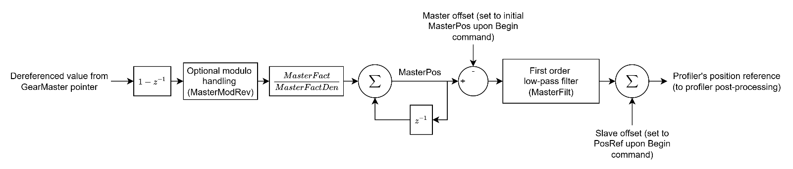
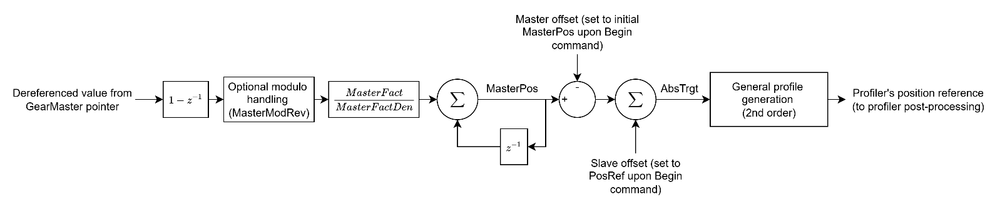

# Motion mode – Gear motion

This section extends from direct gear motion ([MotionMode](../../../02-keywords/10-motion/02-motion-configuration/MotionMode.md) = 5) and indirect gear motion ([MotionMode](../../../02-keywords/10-motion/02-motion-configuration/MotionMode.md) = 6). All the keywords in this section are only applicable under these motion modes.

Gear motion mode is normally used for virtual gear application where the controlled axis (as virtual slave) must move proportionally with respect to another axis (virtual master), scaled by a factor.

The master variable is referred to (pointed) by the [GearMaster](../../../02-keywords/10-motion/07-motion-mode-gear-motion/GearMaster.md) variable. The change in the master variable undergoes optional modulo handling and is scaled (by [MasterFact](../../../02-keywords/10-motion/07-motion-mode-gear-motion/MasterFact.md) and [MasterFactDen](../../../02-keywords/10-motion/07-motion-mode-gear-motion/MasterFactDen.md)). Finally, the scaled value is accumulated in [MasterPos](../../../02-keywords/10-motion/07-motion-mode-gear-motion/MasterPos.md). This operation is done at every controller cycle regardless of the state of motion or the motion mode ([MotionMode](../../../02-keywords/10-motion/02-motion-configuration/MotionMode.md)).

Two gear motion modes are available:

1.  Direct gear motion

After setting MotionMode = 5 and commanding start of motion ([Begin](../../../02-keywords/10-motion/04-motion-command/Begin.md)), the master and slave offsets will be reset to MasterPos and initial position reference once. This is to ensure the generated position reference only takes the change in MasterPos since the start of motion. Afterwards, any MasterPos change will corresponds to the same change in profiler’s position reference, subject to a low-pass filter ([MasterFilt](../../../02-keywords/10-motion/07-motion-mode-gear-motion/MasterFilt.md)).

Axis stays in this motion state indefinitely, until motion stop is requested or axis is disabled.

2.  Indirect gear motion

After setting MotionMode = 6 and commanding start of motion ([Begin](../../../02-keywords/10-motion/04-motion-command/Begin.md)), the master and slave offsets will similarly be reset to MasterPos and initial position reference once.

Instead, any change in MasterPos corresponds to the same change in the target position ([AbsTrgt](../13-motion-mode-ptp/AbsTrgt.md)). AbsTrgt is fed to the second-order profile generator, which respects the maximum kinematic limits of Speed, Accel and Decel. The filter to smoothen out the scaled delta is also absent.

**Note:**

1. For both direct and indirect gear motion, once motion is commanded, axis will stay in the moving motion state indefinitely, until motion stop is requested or axis is disabled.
2. Both direct and indirect gear motion position reference are saturated/protected by software limits.
3. For indirect gear motion, the profile generation is only up to second order. Please contact Agito if third or higher order motion profile is needed.
4. Modulo handling with MasterModRev is required only if GearMaster selected variable involves in modulo operation.
