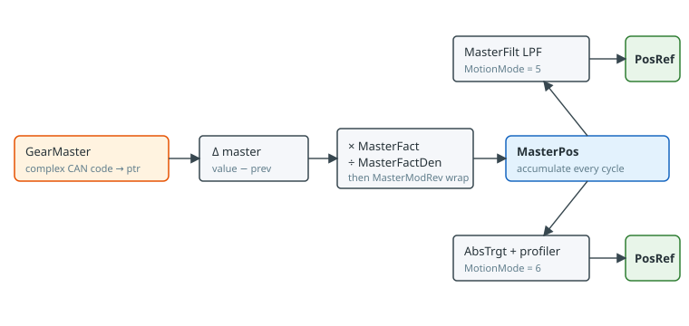
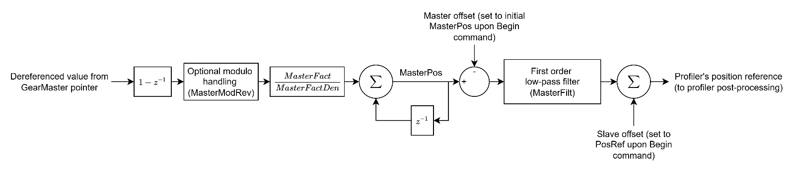
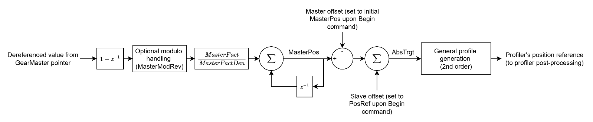

# 运动模式 – 电子齿轮运动

本节介绍直接电子齿轮运动（[MotionMode](../../../02-keywords/10-motion/02-motion-configuration/MotionMode.md) = 5）和间接电子齿轮运动（[MotionMode](../../../02-keywords/10-motion/02-motion-configuration/MotionMode.md) = 6）的相关内容。本节所有关键字仅适用于这些运动模式。

电子齿轮运动模式通常用于虚拟齿轮应用，其中受控轴（作为虚拟从轴）必须按比例跟随另一轴（虚拟主轴）的运动，并由一个比例因子进行缩放。

主变量由 [GearMaster](../../../02-keywords/10-motion/07-motion-mode-gear-motion/GearMaster.md) 变量指定（指向）。主变量的变化量经过可选的取模处理，并按 [MasterFact](../../../02-keywords/10-motion/07-motion-mode-gear-motion/MasterFact.md) 和 [MasterFactDen](../../../02-keywords/10-motion/07-motion-mode-gear-motion/MasterFactDen.md) 进行缩放。最终，缩放后的值累加到 [MasterPos](../../../02-keywords/10-motion/07-motion-mode-gear-motion/MasterPos.md) 中。此操作在每个控制器周期执行，与运动状态或运动模式（[MotionMode](../../../02-keywords/10-motion/02-motion-configuration/MotionMode.md)）无关。

共有两种电子齿轮运动模式：

1.  直接电子齿轮运动

设置 MotionMode = 5 并发出运动启动指令（[Begin](../../../02-keywords/10-motion/04-motion-command/Begin.md)）后，主轴和从轴偏置将分别重置为 MasterPos 和初始位置参考，仅重置一次。这确保生成的位置参考仅反映自运动开始以来 MasterPos 的变化量。此后，MasterPos 的任何变化都将对应规划器位置参考的相同变化，并经过低通滤波器（[MasterFilt](../../../02-keywords/10-motion/07-motion-mode-gear-motion/MasterFilt.md)）处理。

轴将无限期保持此运动状态，直至请求停止运动或禁用轴。

2.  间接电子齿轮运动

设置 MotionMode = 6 并发出运动启动指令（[Begin](../../../02-keywords/10-motion/04-motion-command/Begin.md)）后，主轴和从轴偏置同样会重置一次。

不同之处在于，MasterPos 的任何变化对应目标位置（[AbsTrgt](../13-motion-mode-ptp/AbsTrgt.md)）的相同变化。AbsTrgt 输入至二阶曲线规划器，该规划器遵守速度、加速度和减速度的最大运动学限制。用于平滑缩放增量的滤波器在此模式下不存在。

**注意：**

1. 对于直接和间接电子齿轮运动，一旦运动被指令启动，轴将无限期保持运动状态，直至请求停止运动或禁用轴。
2. 直接和间接电子齿轮运动的位置参考均受软件限位饱和/保护。
3. 对于间接电子齿轮运动，曲线生成最高支持二阶。如需三阶或更高阶运动曲线，请联系 Agito。
4. 仅当 GearMaster 选定的变量涉及取模操作时，才需要使用 MasterModRev 进行取模处理。

**相关独立模式：** [MotionMode](../../../02-keywords/10-motion/02-motion-configuration/MotionMode.md) `= 10` 是一种更窄的**直接从轴**模式，其中轴 A 的参考由轴 B 的参考变化直接驱动，并由 [MasterFact](../../../02-keywords/10-motion/07-motion-mode-gear-motion/MasterFact.md) 缩放。该模式**不**使用 `GearMaster`、`MasterPos`、`MasterFilt`、`MasterFactDen` 或 `MasterModRev`。参见 [MotionMode10](../../../02-keywords/10-motion/07-motion-mode-gear-motion/MotionMode10.md)。
