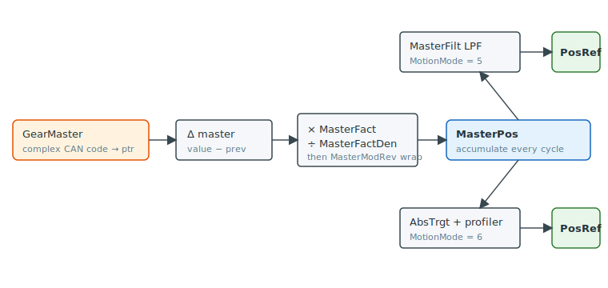

# GearMaster

Complex CAN code selecting the master variable for gear motion.

## Overview

`GearMaster` selects which variable the axis follows in gear motion ([MotionMode](../02-motion-configuration/MotionMode.md) `= 5` direct or `= 6` indirect). It is not a fixed enumeration but a [complex CAN code](../../../01-keyword-usage-and-syntax/complex-can-code.md) — the encoded reference of *any* keyword, including its axis letter and array index — so the master can be another axis's position, an encoder, a counter, an analog input, and so on. Each control cycle the firmware reads that variable, scales its change by [MasterFact](MasterFact.md) / [MasterFactDen](MasterFactDen.md), and accumulates the result into [MasterPos](MasterPos.md), which drives the follower's reference [PosRef](../01-kinematics-status/PosRef.md).

## How it works

### Resolution into a live pointer

`GearMaster` is decoded once, when the value is set, by `SpGearMaster` (`SpecialFuncs.c:5913`). The complex CAN code is split into axis number, array index and base CAN code by `ComplexCANToTokens`, and the firmware stores a direct pointer to the chosen variable's storage:

```text
glpGearMasterPointer[axis] = &(selected keyword's global)[masterAxis][index]
```

It also captures the variable's current value as the "previous" value so the first cycle produces a zero delta (`SpecialFuncs.c:5952`). Thereafter the gearing macro dereferences this pointer every cycle (`AG300_CTL01ControlInterrupt.h:181`) — there is no per-cycle table lookup, keeping the interrupt fast.



### Special case: 64-bit axis-to-axis gearbox

If all of the following hold, the firmware switches to a faster, exact path that tracks the master axis's full 64-bit reference instead of its reported 32-bit value (`SpecialFuncs.c:5926`–`5933`):

| Condition |
|---|
| [MasterFact](MasterFact.md) `= 65536` (unity numerator) |
| [MasterFilt](MasterFilt.md) `= 64` (filter pass-through) |
| [MotionMode](../02-motion-configuration/MotionMode.md) `= 5` (direct gear) |
| `GearMaster` points at the post-shaping reference of another axis |

In this mode (`gsTake64bitsMasterPosRef = 1`) the follower reads the master's internal `gllPosRef` directly (`AG300_CTL01ControlInterrupt.h:175`), giving a drift-free 1:1 electronic gearbox between two controlled axes.

### Relationship to the other gearing keywords

- The scaled, accumulated master change is reported by [MasterPos](MasterPos.md).
- If the selected master variable itself wraps (its `ModRev` is non-zero — e.g. a rotary [Pos](../01-kinematics-status/Pos.md) or another axis's [PosRef](../01-kinematics-status/PosRef.md)), you must set [MasterModRev](MasterModRev.md) to that wrap so the accumulation stays continuous.

`GearMaster` is `OKMTRON` but **not** `OKINMOTN`: change the master selection only while the axis is not in gear motion.

## Examples

```text
AGearMaster=...      ; set to the complex CAN code of the desired master variable
AGearMaster          ; read the current master complex CAN code
```

The value is a complex CAN code; build it with the [complex CAN code](../../../01-keyword-usage-and-syntax/complex-can-code.md) rules for the keyword, axis and index you want to follow.

## See also

- [MasterPos](MasterPos.md) — accumulated, scaled master position
- [MasterFact](MasterFact.md) / [MasterFactDen](MasterFactDen.md) — gear ratio numerator / denominator
- [MasterFilt](MasterFilt.md) — low-pass filter on the geared reference (direct mode)
- [MasterModRev](MasterModRev.md) — modulo divisor for the master variable
- [MotionMode](../02-motion-configuration/MotionMode.md) — selects gear motion (`= 5` or `6`)
- [complex CAN code](../../../01-keyword-usage-and-syntax/complex-can-code.md) — how the master is encoded
