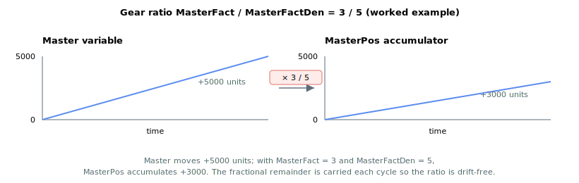

# MasterPos

Accumulated, scaled position of the gear-motion master variable.

## Overview

`MasterPos` tracks the change of the master variable (selected by [GearMaster](GearMaster.md)) after scaling, by accumulating the scaled delta each control cycle. The accumulation runs **regardless of motion state or motion mode** — it is updated even when the axis is idle — so when gear motion begins the follower can move relative to where `MasterPos` was at that instant. It is read-only.

## How it works

### Per-cycle accumulation

The update runs once per controller cycle. Each cycle the controller reads the master variable, forms the change since the previous cycle, scales it, applies the modulo wrap correction (if [MasterModRev](MasterModRev.md) ≠ 0), and adds it to the running total:

$$
\Delta_{\text{MasterPos}} = \frac{\text{MasterFact}}{\text{MasterFactDen}} \cdot \Delta_{\text{master variable}}
$$

The accumulation keeps sub-unit precision so the gear ratio builds up without rounding drift, which matters at high `MasterFact` or for slow masters.



### How it drives the follower

`MasterPos` is the bridge between the master and the follower's reference. At gear `Begin` the controller snapshots `MasterPosInitial = MasterPos` and `PosRefInitial = PosRef`, then each cycle:

- **Direct gear** (`MotionMode = 5`): `PosRef = PosRefInitial + lowpass(MasterPos − MasterPosInitial)`, the low-pass set by [MasterFilt](MasterFilt.md).
- **Indirect gear** (`MotionMode = 6`): `AbsTrgt = PosRefInitial + (MasterPos − MasterPosInitial)`, which the PTP profiler then chases under [Speed](../03-kinematics-configuration/Speed.md)/[Accel](../03-kinematics-configuration/Accel.md) limits.

Because only the change *since Begin* moves the follower, `MasterPos` accumulating while idle does not cause a jump at start.

## Examples

```text
AMasterPos          ; read the accumulated scaled master position
```

## Changes between versions

In **v5 (central-i)** `MasterPos` is reported as a 64-bit value with the larger range shown in the frontmatter. The v5 accumulation applies the full `MasterFact / MasterFactDen` ratio (carrying the fractional remainder) and supports 32-bit, 64-bit and floating-point master variables; v4 applies only the `MasterFact` numerator (scaled relative to a base of 65536) to a 32-bit master. **v5 is central-i only**, so on standalone `MasterPos` remains the v4 32-bit value.

## See also

- [GearMaster](GearMaster.md) — selects the master variable
- [MasterFact](MasterFact.md) / [MasterFactDen](MasterFactDen.md) — gear ratio numerator / denominator
- [MasterFilt](MasterFilt.md) — low-pass filter applied to the geared reference (direct mode)
- [MasterModRev](MasterModRev.md) — modulo divisor for correct accumulation
- [PosRef](../01-kinematics-status/PosRef.md) — the follower reference `MasterPos` drives
