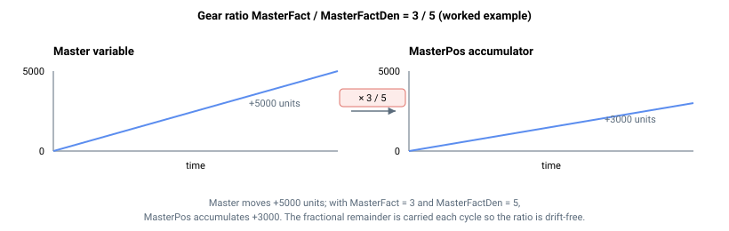

# MasterPos

齿轮运动主变量经缩放后的累积位置。

## 概述

`MasterPos` 通过每个控制周期累积经缩放的增量，跟踪主变量（由 [GearMaster](GearMaster.md) 选择）的变化量。**无论运动状态或运动模式如何**，累积均持续运行——即使轴处于空闲状态也会更新——因此当齿轮运动开始时，从动轴可相对于该时刻的 `MasterPos` 值进行运动。该参数为只读。

## 工作原理

### 逐周期累积

更新每个控制器周期执行一次。每个周期，控制器读取主变量，计算相较于上一个周期的变化量，对其进行缩放，应用取模环绕修正（若 [MasterModRev](MasterModRev.md) ≠ 0），然后将其加至累积总量：

$$
\Delta_{\text{MasterPos}} = \frac{\text{MasterFact}}{\text{MasterFactDen}} \cdot \Delta_{\text{master variable}}
$$

累积保持亚单位精度，使齿轮比在累积过程中不产生舍入漂移，这在 `MasterFact` 较大或主轴速度较慢时尤为重要。



### 如何驱动从动轴

`MasterPos` 是主轴与从动轴参考值之间的桥梁。在齿轮 `Begin` 时，控制器快照 `MasterPosInitial = MasterPos` 和 `PosRefInitial = PosRef`，之后每个周期：

- **直接齿轮**（`MotionMode = 5`）：`PosRef = PosRefInitial + lowpass(MasterPos − MasterPosInitial)`，低通由 [MasterFilt](MasterFilt.md) 设定。
- **间接齿轮**（`MotionMode = 6`）：`AbsTrgt = PosRefInitial + (MasterPos − MasterPosInitial)`，由 PTP 规划器在 [Speed](../03-kinematics-configuration/Speed.md)/[Accel](../03-kinematics-configuration/Accel.md) 限值下追踪该目标。

由于只有自 Begin 起的变化量才会驱动从动轴运动，空闲期间 `MasterPos` 的累积不会在启动时引起跳变。

## 示例

```text
AMasterPos          ; 读取累积的缩放主位置
```

## 版本间变更

在 **v5（central-i）** 中，`MasterPos` 以 64 位值报告，具有前置参数中所示的更大范围。v5 的累积应用完整的 `MasterFact / MasterFactDen` 比值（保留小数余数），并支持 32 位、64 位和浮点型主变量；v4 仅将 `MasterFact` 分子（相对于基数 65536 缩放）应用于 32 位主变量。**v5 仅适用于 central-i**，因此在独立版本上，`MasterPos` 仍为 v4 的 32 位值。

## 另请参阅

- [GearMaster](GearMaster.md) — 选择主变量
- [MasterFact](MasterFact.md) / [MasterFactDen](MasterFactDen.md) — 齿轮比分子 / 分母
- [MasterFilt](MasterFilt.md) — 应用于齿轮参考量的低通滤波器（直接模式）
- [MasterModRev](MasterModRev.md) — 用于正确累积的取模除数
- [PosRef](../01-kinematics-status/PosRef.md) — `MasterPos` 所驱动的从动轴参考值
