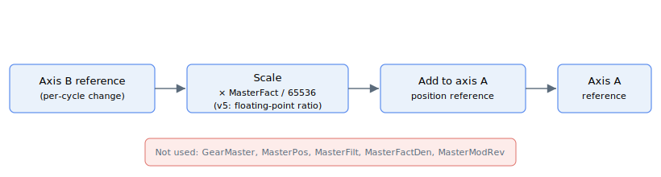

# MotionMode = 10 — Direct slave motion

Direct slave motion mode ([MotionMode](../02-motion-configuration/MotionMode.md) `= 10`) is a separate, narrower mode from gear motion. Axis A's position reference is driven each control cycle from the change in axis B's position reference, scaled by [MasterFact](MasterFact.md). It does **not** use [GearMaster](GearMaster.md), [MasterPos](MasterPos.md), [MasterFilt](MasterFilt.md), [MasterFactDen](MasterFactDen.md) or [MasterModRev](MasterModRev.md).



## How it works

### Per-cycle update

While the mode is in motion, every control cycle the controller forms the change in axis B's position reference since the previous cycle and adds it, scaled by `MasterFact`, to axis A's position reference. There is no intermediate accumulator (no `MasterPos`), no low-pass filter (no `MasterFilt`) and no master selection by complex CAN code (no `GearMaster`) — the master is hard-wired to axis B's reference, and the slave is hard-wired to axis A.

$$
\Delta_{\text{PosRef A}} = \frac{\text{MasterFact}}{65536} \cdot \Delta_{\text{PosRef B}}
$$

The follower change is added to axis A's existing reference each cycle, so the reference accumulates by `MasterFact / 65536` of axis B's reference change. A negative `MasterFact` reverses the follower direction relative to the master.

### Begin

Issuing [Begin](../04-motion-command/Begin.md) with `MotionMode = 10`:

- snapshots axis B's current position reference as the "previous" value, so the first cycle produces a zero change (no jump at start);
- starts the motion immediately (no `BeginDInOn` arming path is honoured for this mode);
- marks axis A as in motion.

The mode does not run a kinematic profiler, so it is not subject to [Speed](../03-kinematics-configuration/Speed.md), [Accel](../03-kinematics-configuration/Accel.md), [Decel](../03-kinematics-configuration/Decel.md) limits. Software position limits ([FwdPLim](../../06-protections/03-motion/position-limit-protection/FwdPLim.md), [RevPLim](../../06-protections/03-motion/position-limit-protection/RevPLim.md)) are also **not** clamped inside this mode — the follower reference is built directly from axis B's reference change each cycle. Plan the motion accordingly.

### Ending the motion

The mode runs until the axis is disabled or the master (axis B) stops moving. Unlike direct gear motion ([MotionMode](../02-motion-configuration/MotionMode.md) `= 5`), this mode does not implement the standard `Stop`/`Abort` deceleration path — to end it, disable the slave axis or set a new `MotionMode` after the motion has ended.

## Availability and restrictions

- **Multi-axis builds only.** The mode requires axis B to exist; on single-axis builds it is not active.
- **Hard-wired master/slave assignment.** Axis A is the slave; axis B is the master. The mode is not (yet) generalised to arbitrary axis pairs.
- **No `Stop`/`Abort` handling.** Use motor-off or a `MotionMode` change after motion completion.
- **No software-limit clamping.** The follower reference is not bounded by `FwdPLim`/`RevPLim` inside this mode.
- **No filter and no master accumulator.** Compare with direct gear motion ([MotionMode](../02-motion-configuration/MotionMode.md) `= 5`), which routes the master through `MasterPos` and `MasterFilt`.

## How it differs from direct gear motion

| Aspect | Direct slave (`MotionMode = 10`) | Direct gear (`MotionMode = 5`) |
|---|---|---|
| Master selection | Hard-wired to axis B's reference | Any variable, via [GearMaster](GearMaster.md) |
| Slave axis | Hard-wired to axis A | The commanded axis |
| Ratio | [MasterFact](MasterFact.md) only (v4: integer, v5: floating-point) | [MasterFact](MasterFact.md) / [MasterFactDen](MasterFactDen.md), with fractional-remainder carry on v5 |
| Master accumulator | None (no [MasterPos](MasterPos.md)) | [MasterPos](MasterPos.md) accumulates each cycle |
| Smoothing filter | None (no [MasterFilt](MasterFilt.md)) | First-order low-pass via [MasterFilt](MasterFilt.md) |
| Modulo handling | None (no [MasterModRev](MasterModRev.md)) | [MasterModRev](MasterModRev.md) wraps the master |
| Software limits | Not clamped inside this mode | Clamped by [FwdPLim](../../06-protections/03-motion/position-limit-protection/FwdPLim.md) / [RevPLim](../../06-protections/03-motion/position-limit-protection/RevPLim.md) |
| `Stop` / `Abort` deceleration | Not implemented | Implemented |

If you need any of the gear-motion features (a configurable master, exact rational ratios, smoothing, modulo wrap, software limits or a controlled stop), use direct or indirect gear motion ([MotionMode](../02-motion-configuration/MotionMode.md) `= 5` or `= 6`) instead.

## Changes between versions

The mathematical role of `MasterFact` is the same on both versions — scaling axis B's per-cycle reference change before adding it to axis A's reference — but the precision differs:

| | v4 (standalone &amp; central-i) | v5 (central-i) |
|---|---|---|
| Ratio applied | `MasterFact / 65536` as an integer quotient | `MasterFact` interpreted as a floating-point ratio, applied without the integer shift |
| Per-cycle rounding | Truncation in the integer quotient | Rounded floating-point multiply |

**v5 is central-i only.** Both versions hard-wire axis A as the slave and axis B as the master.

## Examples

```text
; --- Axis A as direct slave of axis B at unity ratio ---
AMasterFact[1]=65536  ; 65536 = unity (1:1) on v4; on v5 also unity
AMotionMode[1]=10     ; 10 = direct slave (axis A follows axis B)
ABegin                ; latches axis B reference; A now tracks dB each cycle

; --- Read axis A's reference while axis B moves ---
APosRef[1]            ; updates each cycle by MasterFact x change in axis B's reference

; --- End the motion by disabling the slave axis ---
AMotorOn[1]=0         ; disable the slave; this mode does not honour Stop/Abort
```

`MasterFact = -65536` reverses the follower direction relative to axis B. Other ratios scale linearly (`MasterFact = 131072` doubles the follower change per master change).

## See also

- [MotionMode](../02-motion-configuration/MotionMode.md) — selects the type of motion (this is value `10`)
- [MasterFact](MasterFact.md) — scaling factor read by this mode
- [GearMaster](GearMaster.md) — **not** used by this mode (used by `MotionMode = 5` / `= 6`)
- [MasterPos](MasterPos.md), [MasterFilt](MasterFilt.md), [MasterFactDen](MasterFactDen.md), [MasterModRev](MasterModRev.md) — gear-motion only; not used by this mode
- [PosRef](../01-kinematics-status/PosRef.md) — the reference this mode drives directly
- [Begin](../04-motion-command/Begin.md) — starts the motion
