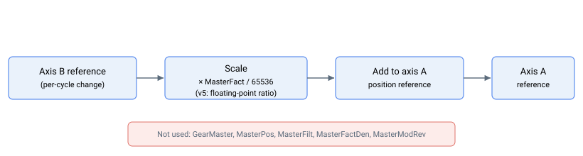

# MotionMode = 10 — 直接从动运动

直接从动运动模式（[MotionMode](../02-motion-configuration/MotionMode.md) `= 10`）是一种独立的、比齿轮运动更简化的模式。轴 A 的位置参考在每个控制周期由轴 B 的位置参考变化量驱动，并按 [MasterFact](MasterFact.md) 缩放。该模式**不**使用 [GearMaster](GearMaster.md)、[MasterPos](MasterPos.md)、[MasterFilt](MasterFilt.md)、[MasterFactDen](MasterFactDen.md) 或 [MasterModRev](MasterModRev.md)。



## 工作原理

### 逐周期更新

运动进行中，每个控制周期，控制器计算轴 B 的位置参考相较于上一周期的变化量，并将其乘以 `MasterFact` 后加至轴 A 的位置参考。没有中间累加器（无 `MasterPos`）、没有低通滤波器（无 `MasterFilt`）、也没有通过复杂 CAN 码进行主轴选择（无 `GearMaster`）——主轴硬性绑定为轴 B 的参考值，从动轴硬性绑定为轴 A。

$$
\Delta_{\text{PosRef A}} = \frac{\text{MasterFact}}{65536} \cdot \Delta_{\text{PosRef B}}
$$

从动轴变化量每周期叠加至轴 A 的现有参考值，因此参考值按轴 B 参考变化量的 `MasterFact / 65536` 倍累积。负的 `MasterFact` 使从动轴方向相对于主轴反向。

### Begin

以 `MotionMode = 10` 发出 [Begin](../04-motion-command/Begin.md)：

- 快照轴 B 当前位置参考作为"上一"值，使第一个周期产生零变化量（启动时无跳变）；
- 立即开始运动（该模式不响应 `BeginDInOn` 的触发路径）；
- 将轴 A 标记为运动中。

该模式不运行运动学规划器，因此不受 [Speed](../03-kinematics-configuration/Speed.md)、[Accel](../03-kinematics-configuration/Accel.md)、[Decel](../03-kinematics-configuration/Decel.md) 限值的约束。软件位置限位（[FwdPLim](../../06-protections/03-motion/position-limit-protection/FwdPLim.md)、[RevPLim](../../06-protections/03-motion/position-limit-protection/RevPLim.md)）在该模式内也**不**进行钳位——从动轴参考值直接由每周期轴 B 的参考变化量构建。请据此规划运动。

### 结束运动

该模式保持运动状态直至轴被禁用或设置了新的 `MotionMode`；若主轴（轴 B）停止运动，从动轴参考值将停止变化，而轴仍处于运动中状态。与直接齿轮运动（[MotionMode](../02-motion-configuration/MotionMode.md) `= 5`）不同——后者在请求 `Stop`/`Abort` 时立即结束运动（受控停止还会额外关闭电机并记录受控停止故障）——该模式对 `Stop`/`Abort` 完全不响应：从动轴持续跟踪轴 B。如需结束该模式，请在运动结束后禁用从动轴或设置新的 `MotionMode`。

## 可用性与限制

- **仅限多轴构建。** 该模式要求轴 B 存在；在单轴构建中不可用。
- **主从轴分配硬性固定。** 轴 A 为从动轴；轴 B 为主轴。该模式尚未推广至任意轴对。
- **不响应 `Stop`/`Abort`。** 使用电机关闭或在运动结束后更改 `MotionMode`。
- **无软件限位钳位。** 从动轴参考值在该模式内不受 `FwdPLim`/`RevPLim` 约束。
- **无滤波器，无主轴累加器。** 与直接齿轮运动（[MotionMode](../02-motion-configuration/MotionMode.md) `= 5`）相比，后者将主轴信号经 `MasterPos` 和 `MasterFilt` 处理。

## 与直接齿轮运动的区别

| 方面 | 直接从动（`MotionMode = 10`） | 直接齿轮（`MotionMode = 5`） |
|---|---|---|
| 主轴选择 | 硬性绑定至轴 B 的参考值 | 任意变量，通过 [GearMaster](GearMaster.md) 选择 |
| 从动轴 | 硬性绑定至轴 A | 被指令的轴 |
| 比值 | 仅 [MasterFact](MasterFact.md)（v4：整数，v5：浮点数） | [MasterFact](MasterFact.md) / [MasterFactDen](MasterFactDen.md)，v5 带小数余数延续 |
| 主轴累加器 | 无（无 [MasterPos](MasterPos.md)） | [MasterPos](MasterPos.md) 每周期累积 |
| 平滑滤波器 | 无（无 [MasterFilt](MasterFilt.md)） | 通过 [MasterFilt](MasterFilt.md) 实现一阶低通 |
| 取模处理 | 无（无 [MasterModRev](MasterModRev.md)） | [MasterModRev](MasterModRev.md) 对主轴进行环绕处理 |
| 软件限位 | 该模式内不进行钳位 | 由 [FwdPLim](../../06-protections/03-motion/position-limit-protection/FwdPLim.md) / [RevPLim](../../06-protections/03-motion/position-limit-protection/RevPLim.md) 钳位 |
| `Stop` / `Abort` 响应 | 忽略——运动继续 | 立即结束运动（无减速斜坡） |

若需要任何齿轮运动功能（可配置主轴、精确有理比值、平滑、取模环绕、软件限位或受控停止），请改用直接或间接齿轮运动（[MotionMode](../02-motion-configuration/MotionMode.md) `= 5` 或 `= 6`）。

## 版本间变更

`MasterFact` 的数学作用在两个版本中相同——在将轴 B 每周期参考变化量加至轴 A 的参考值之前进行缩放——但精度有所不同：

| | v4（独立版本 &amp; central-i） | v5（central-i） |
|---|---|---|
| 应用的比值 | `MasterFact / 65536` 作为整数商 | `MasterFact` 解释为浮点比值，不进行整数移位应用 |
| 逐周期舍入 | 整数商的截断 | 四舍五入的浮点乘法 |

**v5 仅适用于 central-i。** 两个版本均硬性将轴 A 作为从动轴，轴 B 作为主轴。

## 示例

```text
; --- 轴 A 以单位比值直接跟随轴 B ---
AMasterFact=65536     ; 65536 = 单位（1:1）在 v4 上；v5 同样为单位比值
AMotionMode=10        ; 10 = 直接从动（轴 A 跟随轴 B）
ABegin                ; 锁存轴 B 参考值；A 现在每周期跟踪 dB

; --- 轴 B 运动时读取轴 A 的参考值 ---
APosRef               ; 每周期按 MasterFact x 轴 B 参考变化量更新

; --- 通过禁用从动轴结束运动 ---
AMotorOn=0            ; 禁用从动轴；该模式不响应 Stop/Abort
```

`MasterFact = -65536` 使从动轴方向相对于轴 B 反向。其他比值线性缩放（`MasterFact = 131072` 使每次主轴变化对应的从动轴变化量加倍）。

## 另请参阅

- [MotionMode](../02-motion-configuration/MotionMode.md) — 选择运动类型（此为值 `10`）
- [MasterFact](MasterFact.md) — 该模式读取的缩放因子
- [GearMaster](GearMaster.md) — 该模式**不**使用（由 `MotionMode = 5` / `= 6` 使用）
- [MasterPos](MasterPos.md)、[MasterFilt](MasterFilt.md)、[MasterFactDen](MasterFactDen.md)、[MasterModRev](MasterModRev.md) — 仅用于齿轮运动；该模式不使用
- [PosRef](../01-kinematics-status/PosRef.md) — 该模式直接驱动的参考值
- [Begin](../04-motion-command/Begin.md) — 启动运动
