# Motion mode - Electronic cam (ECAM)

This section extends from direct ECAM motion ([MotionMode](../../../02-keywords/10-motion/02-motion-configuration/MotionMode.md) = 7). All the keywords in this section are only applicable under this motion mode.

Cam-follower mechanism is roller bearing system where the follower (slave) tracks the cam lobe profile. The cam (also known as master) is driven by a motor. Electronic cam (ECAM) motion is an electronic equivalent of such mechanical system.

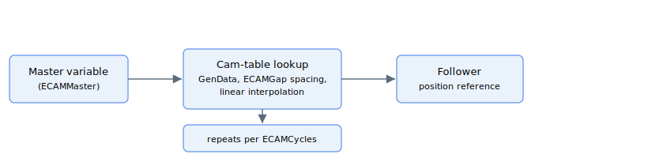

For ECAM motion, axis behaves as a slave to a user-defined master variable (its complex CAN code is defined by [ECAMMaster](../../../02-keywords/10-motion/08-motion-mode-electronic-cam-ecam/ECAMMaster.md)). As master value changes, the axis position reference will track a cam pattern (1D look-up table) that maps to a range of evenly, linearly spaced master values, with the gap defined by [ECAMGap](../../../02-keywords/10-motion/08-motion-mode-electronic-cam-ecam/ECAMGap.md). Linear interpolation on the look-up table is used if the master value is in between the discrete intervals.

The cam pattern is stored in [GenData](../../../02-keywords/20-arrays/GenData.md), with the starting and ending indices being [ECAMStart](../../../02-keywords/10-motion/08-motion-mode-electronic-cam-ecam/ECAMStart.md) and [ECAMEnd](../../../02-keywords/10-motion/08-motion-mode-electronic-cam-ecam/ECAMEnd.md) respectively. If part/all of the pattern repeats, user can define the starting and ending indices of the repeating pattern through [ECAMStartCyc](../../../02-keywords/10-motion/08-motion-mode-electronic-cam-ecam/ECAMStartCyc.md) and [ECAMEndCyc](../../../02-keywords/10-motion/08-motion-mode-electronic-cam-ecam/ECAMEndCyc.md), and the number of occurrences through [ECAMCycles](../../../02-keywords/10-motion/08-motion-mode-electronic-cam-ecam/ECAMCycles.md). The indices follow the order as shown.

$$
\text{ECAMStart} \leq \text{ECAMStartCyc} < \text{ECAMEndCyc} \leq \text{ECAMEnd}
$$

User can trace the current cycle index by using [ECAMCycCount](../../../02-keywords/10-motion/08-motion-mode-electronic-cam-ecam/ECAMCycCount.md).

User can save maximum 10 sets of ECAM pattern, as all relevant ECAM keywords are of array type with size 10. The pattern to be used can be chosen via [ECAMTableNum](../../../02-keywords/10-motion/08-motion-mode-electronic-cam-ecam/ECAMTableNum.md) keyword only when axis is not in motion.

User can call [StopECAM](../../../02-keywords/10-motion/08-motion-mode-electronic-cam-ecam/StopECAM.md) command to exit ECAM motion while preserving starting and ending segments. After calling such command, the range of master value will shrink and changing master value will still change the axis (slave) position reference, up until master value is out of the shrunk range. Please refer to the keyword description for more information.

However, to exit ECAM motion immediately such that changing master value will no longer change the axis (slave) position reference, user can use [Stop](../../../02-keywords/10-motion/04-motion-command/Stop.md) command instead.

There are a few selectable configurations of ECAM motion, which are illustrated by the figures below using virtual linear cam model.

1.  ECAMGap \> 0 and ECAMCycles \> 0

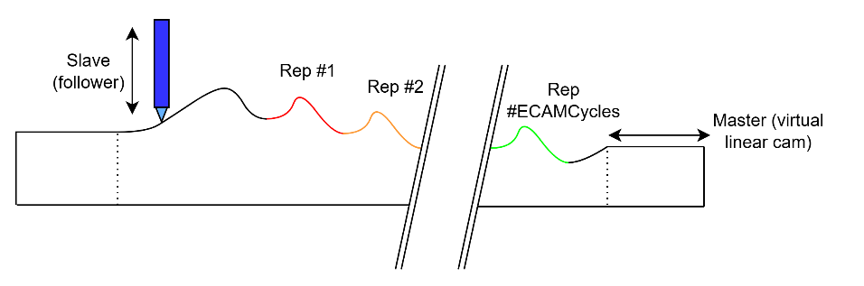
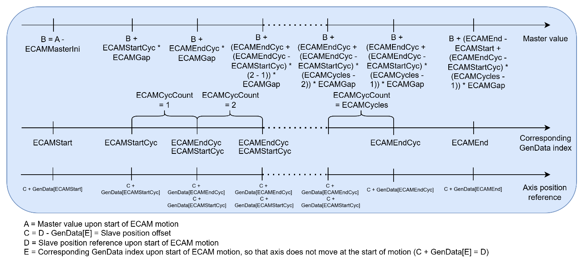

> If ECAMCycles is positive, the number of similar patterns will be $\text{ECAMCycles}$, with ECAMCycCount spanning from 1 to ECAMCycles.
>
> If ECAMGap is positive, the array index will follow ascending order from ECAMStart to ECAMEnd (similarly from ECAMStartCyc to ECAMEndCyc for repetition) as the master value increases. If the master value goes below or beyond the range of values, slave position reference will clamp to the $C + \text{GenData}[\text{ECAMStart}]$ or $C + \text{GenData}[\text{ECAMEnd}]$, respectively.
>
> Under this combination of ECAMCycles and ECAMGap, the starting master position can be defined by a combination of master value upon the start of ECAM motion and [ECAMMasterIni](../../../02-keywords/10-motion/08-motion-mode-electronic-cam-ecam/ECAMMasterIni.md).

2.  ECAMGap \< 0 and ECAMCycles \> 0

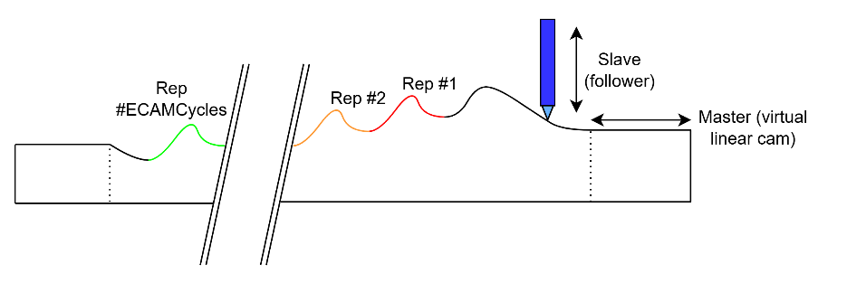
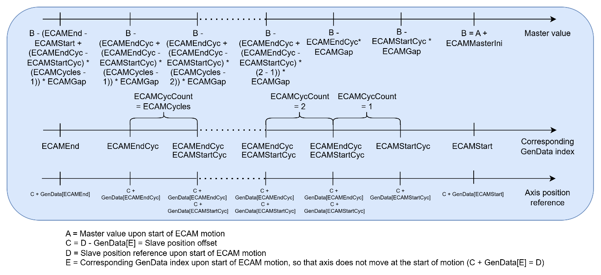

> If ECAMCycles is positive, the number of similar patterns will be $\text{ECAMCycles}$, with ECAMCycCount spanning from 1 to ECAMCycles.
>
> If ECAMGap is negative, the array index will follow descending order from ECAMEnd to ECAMStart (similarly from ECAMStartCyc to ECAMEndCyc for repetition) as the master value increases. If the master value goes below or beyond the range of values, slave position reference will clamp to the $C + \text{GenData}[\text{ECAMEnd}]$ or $C + \text{GenData}[\text{ECAMStart}]$, respectively.
>
> Under this combination of ECAMCycles and ECAMGap, the ending master position can be defined by a combination of master value upon the start of ECAM motion and ECAMMasterIni.

3.  ECAMGap \> 0 and ECAMCycles \< 0

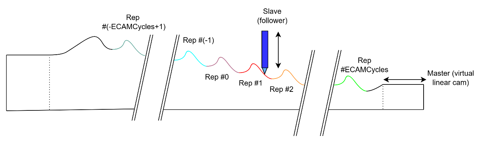
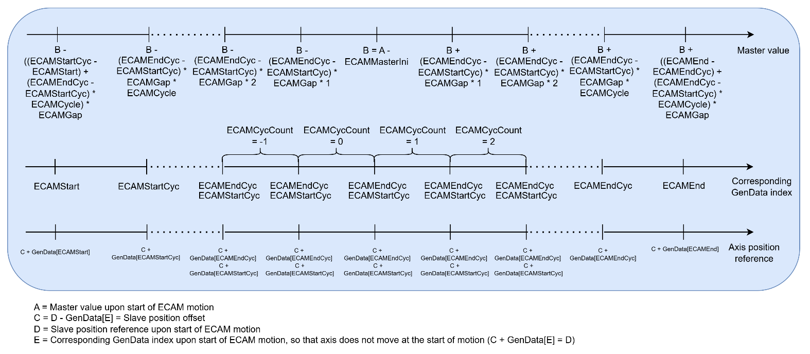

> If ECAMCycles is negative, the number of similar patterns will be $2 \cdot |\text{ECAMCycles}|$, with ECAMCycCount spanning from -ECAMCycles + 1 to ECAMCycles. The middle location of the repeating pattern will be defined by a combination of master value upon the start of ECAM motion and ECAMMasterIni.
>
> Under positive ECAMGap, the array index will follow ascending order from ECAMStart to ECAMEnd (similarly from ECAMStartCyc to ECAMEndCyc for repetition) as the master value increases. If the master value goes below or beyond the range of values, slave position reference will clamp to the $C + \text{GenData}[\text{ECAMStart}]$ or $C + \text{GenData}[\text{ECAMEnd}]$, respectively.

4.  ECAMGap \< 0 and ECAMCycles \< 0

> 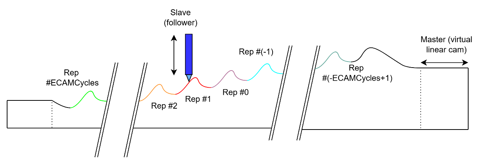
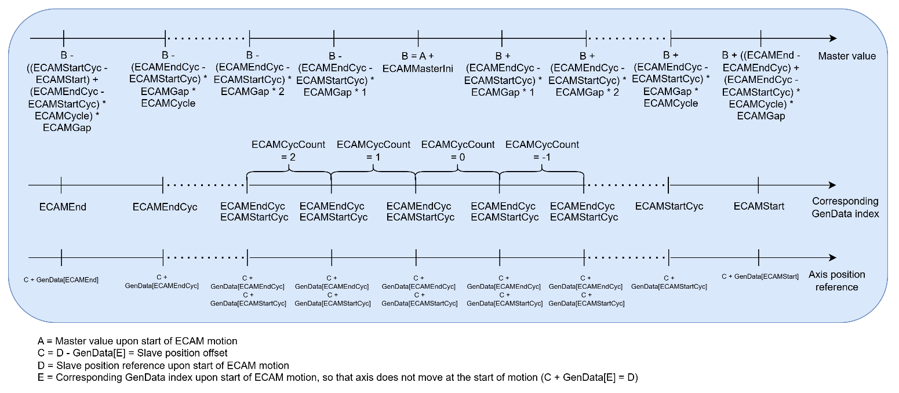

> If ECAMCycles is negative, the number of similar patterns will be $2 \cdot |\text{ECAMCycles}|$, with ECAMCycCount spanning from -ECAMCycles + 1 to ECAMCycles. The middle location of the repeating pattern will be defined by a combination of master value upon the start of ECAM motion and ECAMMasterIni.
>
> With negative ECAMGap, the array index will follow descending order from ECAMEnd to ECAMStart (similarly from ECAMEndCyc to ECAMStartCyc for repetition) as the master value increases. If the master value goes below or beyond the range of values, slave position reference will clamp to the $C + \text{GenData}[\text{ECAMEnd}]$ or $C + \text{GenData}[\text{ECAMStart}]$, respectively.

5.  ECAMGap \> 0 and ECAMCycles = 2147483647 (Endless ECAM)

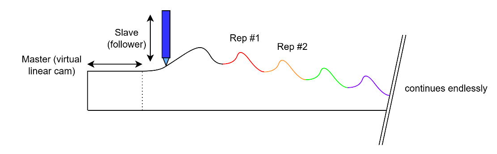

> This mode is the similar to the positive ECAMGap and ECAMCycles configuration, except there is no positive limit on the master position. This also means that the GenData elements between ECAMEndCyc and ECAMEnd will be ignored.
>
> Please refer to the first configuration, for the cam index and slave position value at every master location.

6.  ECAMGap \< 0 and ECAMCycles = 2147483647 (Endless ECAM)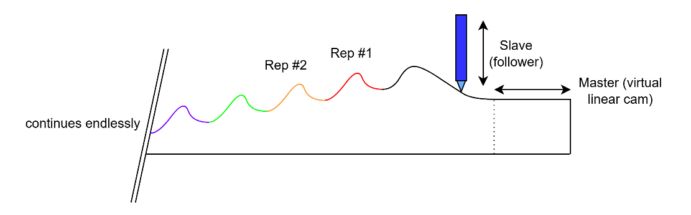

> This mode is the similar to the negative ECAMGap and positive ECAMCycles configuration, except there is no negative limit on the master position. The GenData elements between ECAMEndCyc and ECAMEnd will be ignored.
>
> Please refer to the second configuration, for the cam index and slave position value at every master location.

7.  ECAMGap \> 0 and ECAMCycles = -2147483648 (Endless ECAM)

> 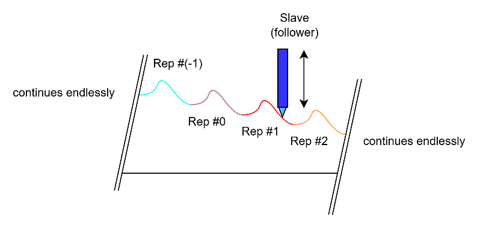
>
> This mode is the similar to the positive ECAMGap and negative ECAMCycles configuration, except there is no positive and negative limit on the master position. The GenData elements between ECAMStart and ECAMStartCyc and between ECAMEndCyc and ECAMEnd will be ignored.
>
> Within each cycle interval, as master value increases, the referenced index will go from ECAMStartCyc to ECAMEndCyc. ECAMCycCount increments as master value increases.
>
> Please refer to the third configuration, for the cam index and slave position value at every master location.

8.  ECAMGap \< 0 and ECAMCycles = -2147483648 (Endless ECAM)

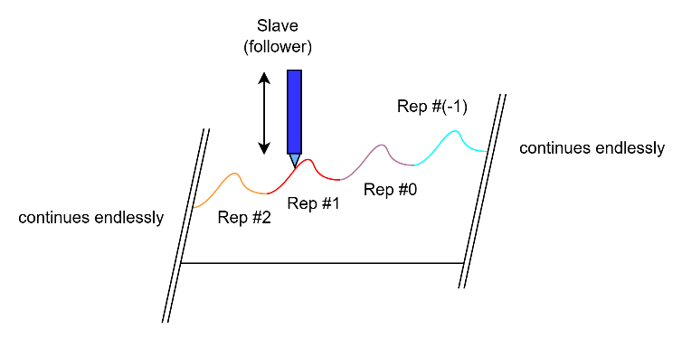

> This mode is the similar to the negative ECAMGap and ECAMCycles configuration, except there is no positive and negative limit on the master position. The GenData elements between ECAMStart and ECAMStartCyc and between ECAMEndCyc and ECAMEnd will be ignored.
>
> Within each cycle interval, as master value increases, the referenced index will go from ECAMEndCyc to ECAMStartCyc. ECAMCycCount decrements as master value increases.
>
> Please refer to the fourth configuration, for the cam index and slave position value at every master location.
