# 运动模式 - 电子凸轮（ECAM）

本节内容基于直接 ECAM 运动（[MotionMode](../../../02-keywords/10-motion/02-motion-configuration/MotionMode.md) = 7）进行扩展。本节所有关键字仅在该运动模式下适用。

凸轮从动机构是一种滚动轴承系统，从动件（从轴）跟踪凸轮轮廓。凸轮（也称为主轴）由电机驱动。电子凸轮（ECAM）运动是此类机械系统的电子等效实现。

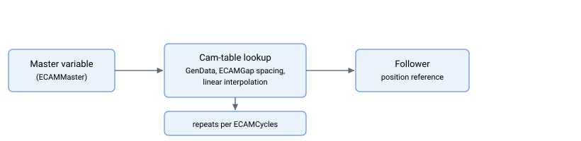

对于 ECAM 运动，轴作为从轴，跟随用户定义的主变量（其复杂 CAN 码由 [ECAMMaster](../../../02-keywords/10-motion/08-motion-mode-electronic-cam-ecam/ECAMMaster.md) 定义）。随着主变量值的变化，轴的位置参考将跟踪一条凸轮曲线（一维查找表），该曲线映射到一组均匀线性间隔的主变量值范围，间距由 [ECAMGap](../../../02-keywords/10-motion/08-motion-mode-electronic-cam-ecam/ECAMGap.md) 定义。当主变量值位于离散区间之间时，使用查找表的线性插值。

凸轮曲线存储在 [GenData](../../../02-keywords/20-arrays/GenData.md) 中，起始和结束索引分别为 [ECAMStart](../../../02-keywords/10-motion/08-motion-mode-electronic-cam-ecam/ECAMStart.md) 和 [ECAMEnd](../../../02-keywords/10-motion/08-motion-mode-electronic-cam-ecam/ECAMEnd.md)。若部分或全部曲线存在重复，用户可通过 [ECAMStartCyc](../../../02-keywords/10-motion/08-motion-mode-electronic-cam-ecam/ECAMStartCyc.md) 和 [ECAMEndCyc](../../../02-keywords/10-motion/08-motion-mode-electronic-cam-ecam/ECAMEndCyc.md) 定义重复段的起止索引，并通过 [ECAMCycles](../../../02-keywords/10-motion/08-motion-mode-electronic-cam-ecam/ECAMCycles.md) 定义重复次数。索引按如下所示的顺序排列。

$$
\text{ECAMStart} \leq \text{ECAMStartCyc} < \text{ECAMEndCyc} \leq \text{ECAMEnd}
$$

用户可使用 [ECAMCycCount](../../../02-keywords/10-motion/08-motion-mode-electronic-cam-ecam/ECAMCycCount.md) 跟踪当前循环索引。

用户最多可保存 10 组 ECAM 曲线，因为所有相关 ECAM 关键字均为大小为 10 的数组类型。仅在轴非运动状态时，可通过 [ECAMTableNum](../../../02-keywords/10-motion/08-motion-mode-electronic-cam-ecam/ECAMTableNum.md) 关键字选择要使用的曲线。

用户可调用 [StopECAM](../../../02-keywords/10-motion/08-motion-mode-electronic-cam-ecam/StopECAM.md) 命令，在保留起始和结束段的同时退出 ECAM 运动。调用该命令后，主变量值的范围将缩小，主变量值的改变仍会改变轴（从轴）的位置参考，直至主变量值超出缩小后的范围。详情请参阅关键字说明。

若要立即退出 ECAM 运动，使主变量值的改变不再影响轴（从轴）的位置参考，用户可改用 [Stop](../../../02-keywords/10-motion/04-motion-command/Stop.md) 命令。

ECAM 运动有几种可选配置，以下通过虚拟线性凸轮模型进行图示说明。

1.  ECAMGap \> 0 且 ECAMCycles \> 0

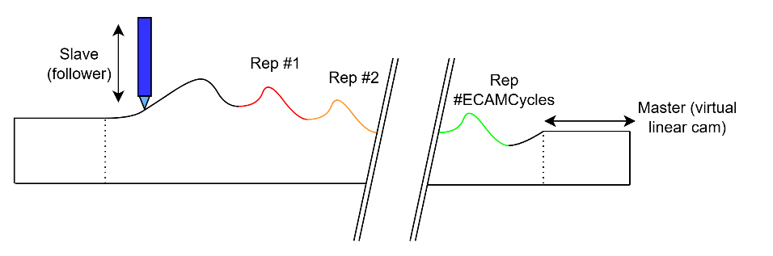
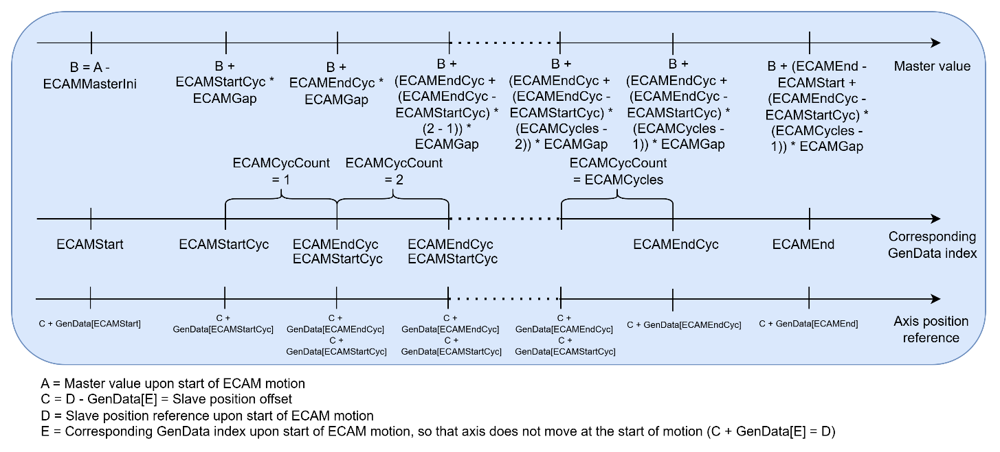

> 若 ECAMCycles 为正，重复曲线的数量为 $\text{ECAMCycles}$，ECAMCycCount 从 1 到 ECAMCycles 递增。
>
> 若 ECAMGap 为正，随着主变量值增大，数组索引按从 ECAMStart 到 ECAMEnd 的升序排列（重复段同理，从 ECAMStartCyc 到 ECAMEndCyc）。若主变量值低于或超出值域范围，从轴位置参考将分别钳位至 $C + \text{GenData}[\text{ECAMStart}]$ 或 $C + \text{GenData}[\text{ECAMEnd}]$。
>
> 在 ECAMCycles 和 ECAMGap 的该组合下，起始主位置可由 ECAM 运动开始时的主变量值与 [ECAMMasterIni](../../../02-keywords/10-motion/08-motion-mode-electronic-cam-ecam/ECAMMasterIni.md) 的组合定义。

2.  ECAMGap \< 0 且 ECAMCycles \> 0

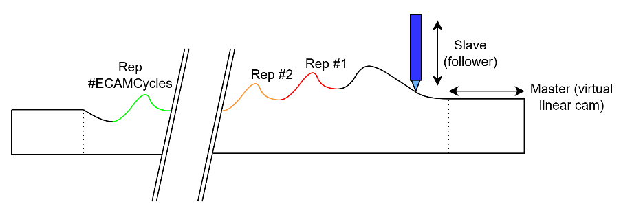
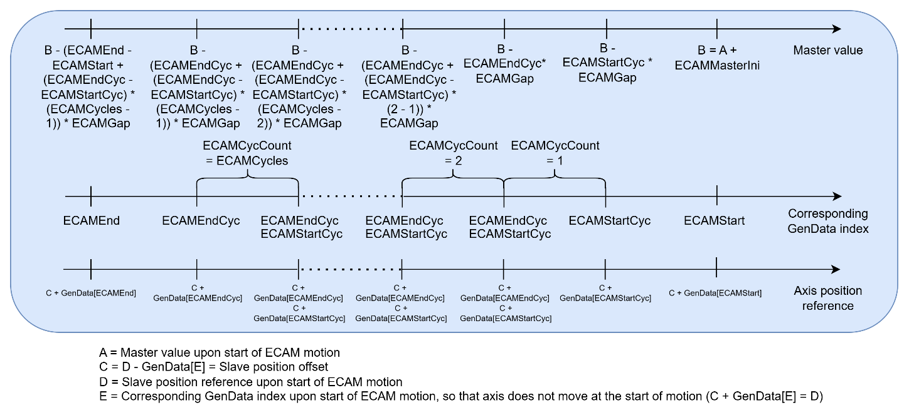

> 若 ECAMCycles 为正，重复曲线的数量为 $\text{ECAMCycles}$，ECAMCycCount 从 1 到 ECAMCycles 递增。
>
> 若 ECAMGap 为负，随着主变量值增大，数组索引按从 ECAMEnd 到 ECAMStart 的降序排列（重复段同理，从 ECAMStartCyc 到 ECAMEndCyc）。若主变量值低于或超出值域范围，从轴位置参考将分别钳位至 $C + \text{GenData}[\text{ECAMEnd}]$ 或 $C + \text{GenData}[\text{ECAMStart}]$。
>
> 在 ECAMCycles 和 ECAMGap 的该组合下，结束主位置可由 ECAM 运动开始时的主变量值与 ECAMMasterIni 的组合定义。

3.  ECAMGap \> 0 且 ECAMCycles \< 0

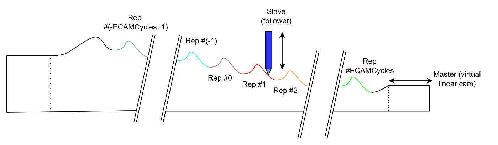
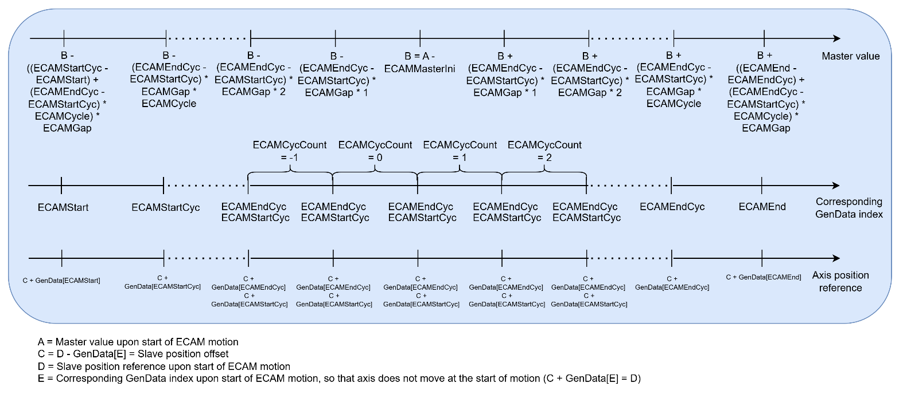

> 若 ECAMCycles 为负，重复曲线的数量为 $2 \cdot |\text{ECAMCycles}|$，ECAMCycCount 从 -ECAMCycles + 1 到 ECAMCycles 递变。重复曲线的中间位置由 ECAM 运动开始时的主变量值与 ECAMMasterIni 的组合定义。
>
> 在 ECAMGap 为正的情况下，随着主变量值增大，数组索引按从 ECAMStart 到 ECAMEnd 的升序排列（重复段同理，从 ECAMStartCyc 到 ECAMEndCyc）。若主变量值低于或超出值域范围，从轴位置参考将分别钳位至 $C + \text{GenData}[\text{ECAMStart}]$ 或 $C + \text{GenData}[\text{ECAMEnd}]$。

4.  ECAMGap \< 0 且 ECAMCycles \< 0

> 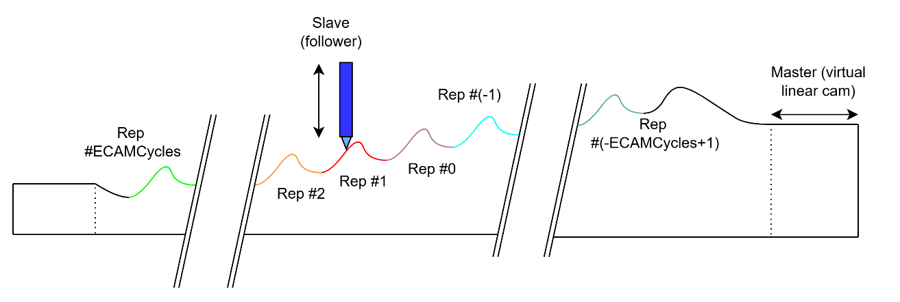
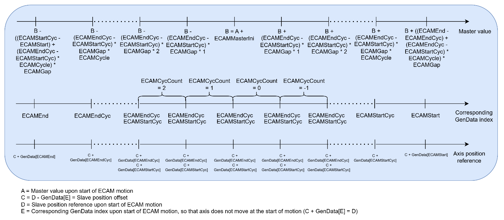

> 若 ECAMCycles 为负，重复曲线的数量为 $2 \cdot |\text{ECAMCycles}|$，ECAMCycCount 从 -ECAMCycles + 1 到 ECAMCycles 递变。重复曲线的中间位置由 ECAM 运动开始时的主变量值与 ECAMMasterIni 的组合定义。
>
> 在 ECAMGap 为负的情况下，随着主变量值增大，数组索引按从 ECAMEnd 到 ECAMStart 的降序排列（重复段同理，从 ECAMEndCyc 到 ECAMStartCyc）。若主变量值低于或超出值域范围，从轴位置参考将分别钳位至 $C + \text{GenData}[\text{ECAMEnd}]$ 或 $C + \text{GenData}[\text{ECAMStart}]$。

5.  ECAMGap \> 0 且 ECAMCycles = 2147483647（无限 ECAM）

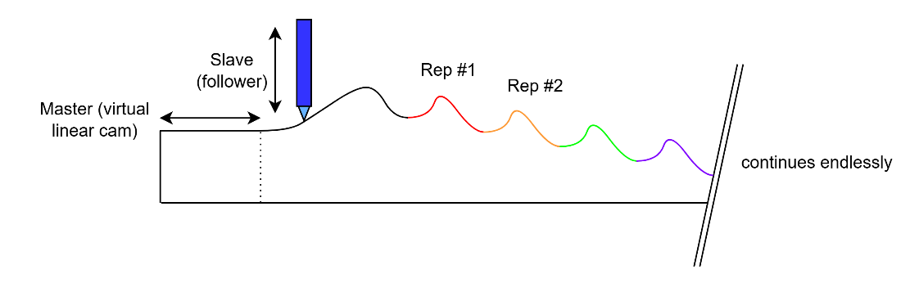

> 该模式与 ECAMGap 为正、ECAMCycles 为正的配置类似，但主位置无正向限制。这也意味着 ECAMEndCyc 与 ECAMEnd 之间的 GenData 元素将被忽略。
>
> 各主位置处的凸轮索引和从轴位置值，请参阅第一种配置。

6.  ECAMGap \< 0 且 ECAMCycles = 2147483647（无限 ECAM）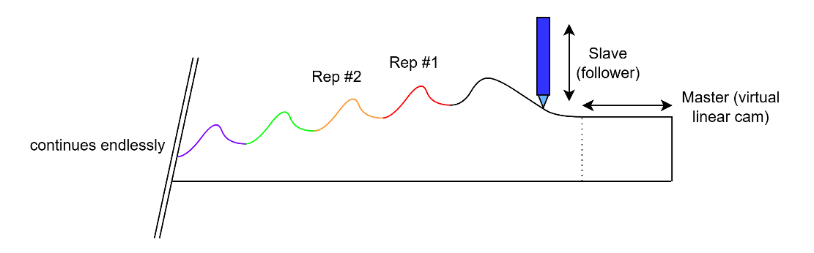

> 该模式与 ECAMGap 为负、ECAMCycles 为正的配置类似，但主位置无负向限制。ECAMEndCyc 与 ECAMEnd 之间的 GenData 元素将被忽略。
>
> 各主位置处的凸轮索引和从轴位置值，请参阅第二种配置。

7.  ECAMGap \> 0 且 ECAMCycles = -2147483648（无限 ECAM）

> 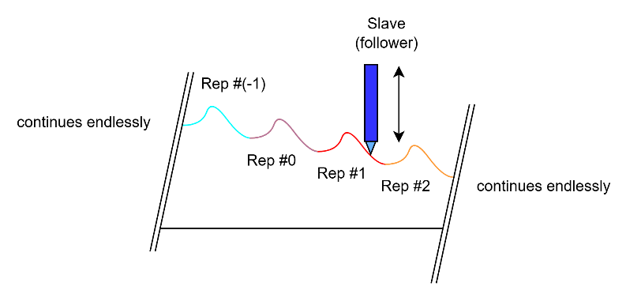
>
> 该模式与 ECAMGap 为正、ECAMCycles 为负的配置类似，但主位置无正向和负向限制。ECAMStart 与 ECAMStartCyc 之间以及 ECAMEndCyc 与 ECAMEnd 之间的 GenData 元素将被忽略。
>
> 在每个循环区间内，随着主变量值增大，参考索引从 ECAMStartCyc 增至 ECAMEndCyc。随主变量值增大，ECAMCycCount 递增。
>
> 各主位置处的凸轮索引和从轴位置值，请参阅第三种配置。

8.  ECAMGap \< 0 且 ECAMCycles = -2147483648（无限 ECAM）

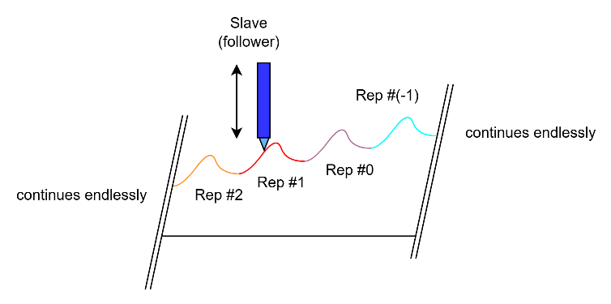

> 该模式与 ECAMGap 为负、ECAMCycles 为负的配置类似，但主位置无正向和负向限制。ECAMStart 与 ECAMStartCyc 之间以及 ECAMEndCyc 与 ECAMEnd 之间的 GenData 元素将被忽略。
>
> 在每个循环区间内，随着主变量值增大，参考索引从 ECAMEndCyc 减至 ECAMStartCyc。随主变量值增大，ECAMCycCount 递减。
>
> 各主位置处的凸轮索引和从轴位置值，请参阅第四种配置。
