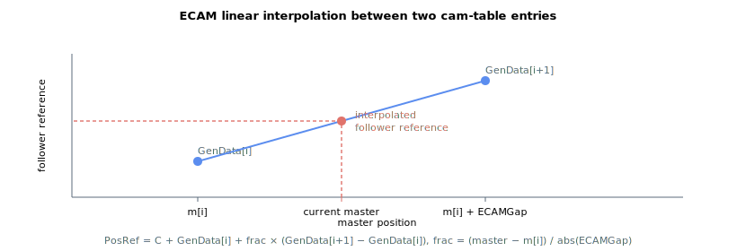

# ECAMGap

Linear spacing between successive ECAM master values; its sign sets pattern direction.

## Overview

`ECAMGap` defines the linear interval between master values. It is an array of 10 cam patterns, one element per pattern. Its absolute value is the linear spacing between successive master values that map to successive [GenData](../../20-arrays/GenData.md) indices in the cam look-up table; linear interpolation is used between intervals. Its sign sets the ordering direction of the pattern and the increment/decrement direction of [ECAMCycCount](ECAMCycCount.md).

## How it works

Successive cam-table entries are mapped to master positions that are `abs(ECAMGap)` apart. In a simple example where `ECAMCycles = 1`, `ECAMGap = 2000`, `ECAMStart ≤ 400` and `ECAMEnd ≥ 401`: if `GenData[400]` corresponds to a master position of 6554, then `GenData[401]` corresponds to a master position of 8554.

### Master-to-index mapping

Every control cycle the controller converts the accumulated master position (see [ECAMMaster](ECAMMaster.md)) into a fractional table index by dividing the master's distance from the start of the current segment by `abs(ECAMGap)`. The integer part selects the lower table entry; the fractional part is the interpolation weight:

```text
index_fraction = (master_position - segment_start) / abs(ECAMGap)
i1             = floor(index_fraction) + segment_start_index   ; lower entry
i2             = i1 + 1                                         ; upper entry
frac           = index_fraction - floor(index_fraction)        ; 0.0 .. 1.0
```

The slave (follower) position reference is then linearly interpolated between the two entries and offset by the slave position captured when motion started (`C`):

```text
PosRef = C + GenData[i1] + frac * (GenData[i2] - GenData[i1]) + cycle_offset
```



For a worked example, take `ECAMGap = 1000`, `GenData[i1] = 2000`, `GenData[i1+1] = 5000`. When the master sits 400 units past the position that maps to `GenData[i1]`, `frac = 400 / 1000 = 0.4` and the follower offset (before adding `C` and `cycle_offset`) is `2000 + 0.4 × (5000 − 2000) = 3200`.

`C` is set so the follower does not jump at start: it is the follower's position when [Begin](../04-motion-command/Begin.md) is issued, less the table value at the starting master position (which is positioned by [ECAMMasterIni](ECAMMasterIni.md)). `cycle_offset` accumulates the height difference of the repeating segment across completed cycles (see [ECAMStartCyc](ECAMStartCyc.md) / [ECAMEndCyc](ECAMEndCyc.md)) so the follower advances continuously even when a cycle's first and last table values differ.

Because the interpolation is computed at full internal precision, consecutive cam-table entries may not differ by more than a fixed limit (`131071` user units); a pattern that violates this is rejected at [Begin](../04-motion-command/Begin.md).

### Direction

- If `ECAMGap` is positive, the cam pattern follows ascending order: as the master position increases, the corresponding `GenData` index increases, and [ECAMCycCount](ECAMCycCount.md) increments.
- If `ECAMGap` is negative, the controller negates the master reading so the order is inverted: as the master position increases, the corresponding `GenData` index decreases, and [ECAMCycCount](ECAMCycCount.md) decrements.

`ECAMGap` may not be `0` (the master-to-index division would be undefined); a zero gap is rejected at [Begin](../04-motion-command/Begin.md).

## Examples

```text
AECAMGap[1]=2000     ; master-value spacing for cam pattern 1
AECAMGap[1]         ; read current value
```

Refer to the figures in [Motion mode – Electronic cam (ECAM)](00-overview.md) for more information on the ordering logics.

## Changes between versions

| | v4 (standalone &amp; central-i) | v5 (central-i) |
|---|---|---|
| Range | `-8000000` … `8000000` | `-2147483647` … `2147483647` |

In **v5** the allowed `ECAMGap` range is widened to the full 32-bit signed span, permitting much coarser master spacing. The master-to-index mapping is otherwise unchanged. **v5 is central-i only.**

## See also

- [ECAMCycles](ECAMCycles.md) — number of pattern occurrences (sign also matters)
- [ECAMCycCount](ECAMCycCount.md) — increments/decrements per the sign of `ECAMGap`
- [GenData](../../20-arrays/GenData.md) — array storing the cam pattern
