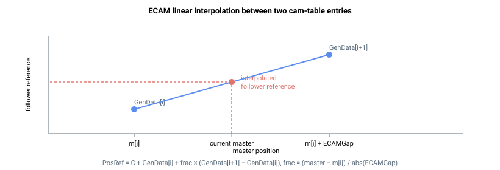

# ECAMGap

相邻 ECAM 主轴值之间的线性间距；其符号决定曲线方向。

## 概述

`ECAMGap` 定义主轴值之间的线性间距。它是一个包含 10 个凸轮曲线的数组，每个曲线对应一个元素。其绝对值是映射到凸轮查找表中相邻 [GenData](../../20-arrays/GenData.md) 索引的相邻主轴值之间的线性间距；各间距之间采用线性插值。其符号决定曲线的排列方向以及 [ECAMCycCount](ECAMCycCount.md) 的递增/递减方向。

## 工作原理

相邻凸轮表条目映射到相距 `abs(ECAMGap)` 的主轴位置。以一个简单示例为例：`ECAMCycles = 1`，`ECAMGap = 2000`，`ECAMStart ≤ 400` 且 `ECAMEnd ≥ 401`：若 `GenData[400]` 对应主轴位置 6554，则 `GenData[401]` 对应主轴位置 8554。

### 主轴到索引的映射

每个控制周期，控制器通过将累积主轴位置（参见 [ECAMMaster](ECAMMaster.md)）距当前段起始处的距离除以 `abs(ECAMGap)`，将其转换为小数表索引。整数部分选择下方表条目，小数部分为插值权重：

```text
index_fraction = (master_position - segment_start) / abs(ECAMGap)
i1             = floor(index_fraction) + segment_start_index   ; 下方条目
i2             = i1 + 1                                         ; 上方条目
frac           = index_fraction - floor(index_fraction)        ; 0.0 .. 1.0
```

从动件（跟随轴）位置参考随后在两个条目之间线性插值，并叠加运动开始时捕获的从动件位置偏移量（`C`）：

```text
PosRef = C + GenData[i1] + frac * (GenData[i2] - GenData[i1]) + cycle_offset
```



以一个具体示例为例：`ECAMGap = 1000`，`GenData[i1] = 2000`，`GenData[i1+1] = 5000`。当主轴位于映射到 `GenData[i1]` 的位置之后 400 个单位时，`frac = 400 / 1000 = 0.4`，从动件偏移量（加 `C` 和 `cycle_offset` 之前）为 `2000 + 0.4 × (5000 − 2000) = 3200`。

`C` 是发出 [Begin](../04-motion-command/Begin.md) 时捕获的从动件位置；凸轮曲线叠加在其上，因此起始主轴位置处（由 [ECAMMasterIni](ECAMMasterIni.md) 定位）的表值也被叠加。为避免起始时出现阶跃，凸轮表通常编写为使其起始条目为 `0`。`cycle_offset` 在已完成的循环中累积重复段首尾表值之差（参见 [ECAMStartCyc](ECAMStartCyc.md) / [ECAMEndCyc](ECAMEndCyc.md)），使从动件在循环首尾表值不同时仍能连续前进。

插值后的从动件参考在每个控制周期还会被钳位至软件位置限位：若计算得到的 `PosRef` 将超过 [FwdPLim](../../06-protections/03-motion/position-limit-protection/FwdPLim.md)，则保持在 `FwdPLim`；若将低于 [RevPLim](../../06-protections/03-motion/position-limit-protection/RevPLim.md)，则保持在 `RevPLim`。该钳位作用于最终参考值（与 [ECAMStart](ECAMStart.md) / [ECAMEnd](ECAMEnd.md) 中描述的开始前/结束后对 `GenData[ECAMStart]` / `GenData[ECAMEnd]` 的钳位相互独立），因此表值超出位置限位的凸轮曲线将使从动件在限位处展平。

由于插值以完整内部精度计算，相邻凸轮表条目的差值不得超过由产品采样频率决定的内部限值。在标准 16 384 Hz 控制频率（v4 和 v5 所有出货配置均采用）下，该限值约为 `131 071` 用户单位；违反此限制的曲线将在 [Begin](../04-motion-command/Begin.md) 时被拒绝。

### 方向

- 若 `ECAMGap` 为正，凸轮曲线按升序排列：随着主轴位置增大，对应的 `GenData` 索引增大，[ECAMCycCount](ECAMCycCount.md) 递增。
- 若 `ECAMGap` 为负，控制器对主轴读数取反，顺序反转：随着主轴位置增大，对应的 `GenData` 索引减小，[ECAMCycCount](ECAMCycCount.md) 递减。

`ECAMGap` 不得为 `0`（主轴到索引的除法将无定义）；零间距将在 [Begin](../04-motion-command/Begin.md) 时被拒绝。

## 示例

```text
AECAMGap[1]=2000     ; 凸轮曲线 1 的主轴值间距
AECAMGap[1]         ; 读取当前值
```

有关排列逻辑的更多信息，请参阅 [运动模式——电子凸轮（ECAM）](00-overview.md) 中的图示。

## 版本间变化

| | v4（独立版 &amp; central-i） | v5（central-i） |
|---|---|---|
| 范围 | `-8000000` … `8000000` | `-2147483647` … `2147483647` |

**v5** 将允许的 `ECAMGap` 范围扩展至完整的 32 位有符号范围，允许更大的主轴间距。主轴到索引的映射方式保持不变。**v5 仅支持 central-i。**

## 另请参阅

- [ECAMCycles](ECAMCycles.md) — 曲线重复次数（符号同样重要）
- [ECAMCycCount](ECAMCycCount.md) — 按 `ECAMGap` 符号递增/递减
- [GenData](../../20-arrays/GenData.md) — 存储凸轮曲线的数组
