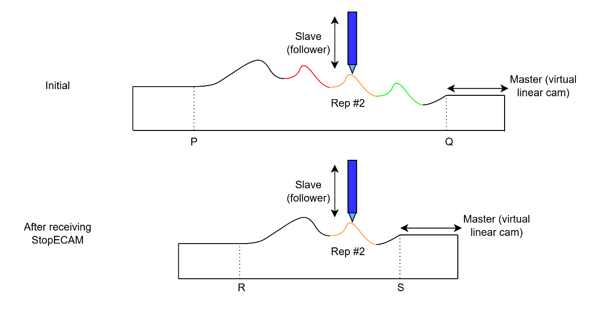
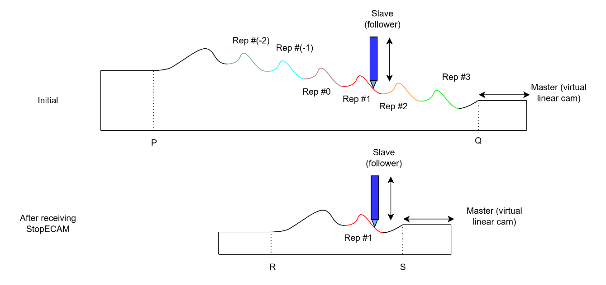

# StopECAM

Exits ECAM motion by shrinking the master range, preserving start/end segments.

## Overview

`StopECAM` is the command used to exit ECAM motion gracefully. Unlike the immediate [Stop](../04-motion-command/Stop.md) command, the axis does not quit ECAM outright: the master range shrinks, appending the beginning and ending pattern segments to the existing cycle pattern. ECAM motion ends only once the master value leaves this new, shrunken range. Stopping via `StopECAM` is also reported by [MotionReason](../05-motion-status/MotionReason.md) (reason code 9).

## How it works

For the example below (`ECAMGap > 0` and `ECAMCycles = 3`), the axis receives `StopECAM` while the master position is in the middle of the second cycle. The master range shrinks so that $R > P$ and $S < Q$. ECAM motion then ends only when the master becomes lower than or equal to $R$, or higher than or equal to $S$. Note that the slave position reference at $R$ does not necessarily equal that at $P$, since the cam pattern has shrunk; the same is true for $S$ compared to $Q$.



The following picture shows the same stopping logic for the condition when `ECAMCycles < 0`.



If the user wants to stop ECAM motion immediately, the [Stop](../04-motion-command/Stop.md) command can be used instead, so that the slave position reference is unchanged regardless of the master value.

## Examples

```text
AStopECAM            ; gracefully exit ECAM motion
```

## See also

- [Stop](../04-motion-command/Stop.md) — exit ECAM motion immediately
- [MotionReason](../05-motion-status/MotionReason.md) — reports `StopECAM` as reason code 9
- [Motion mode – Electronic cam (ECAM)](00-overview.md) — ECAM motion overview
