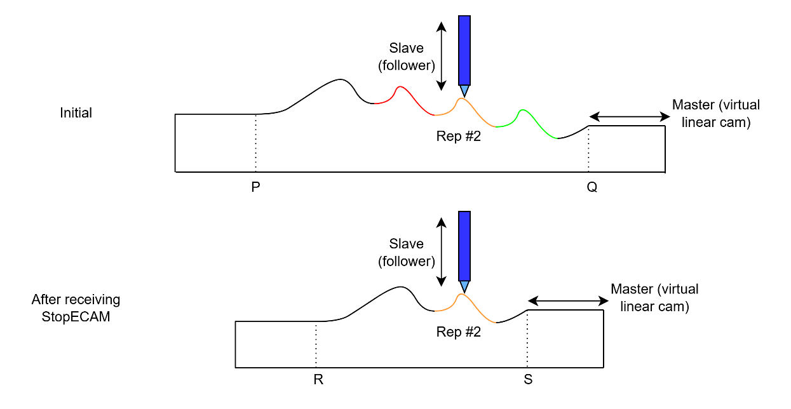
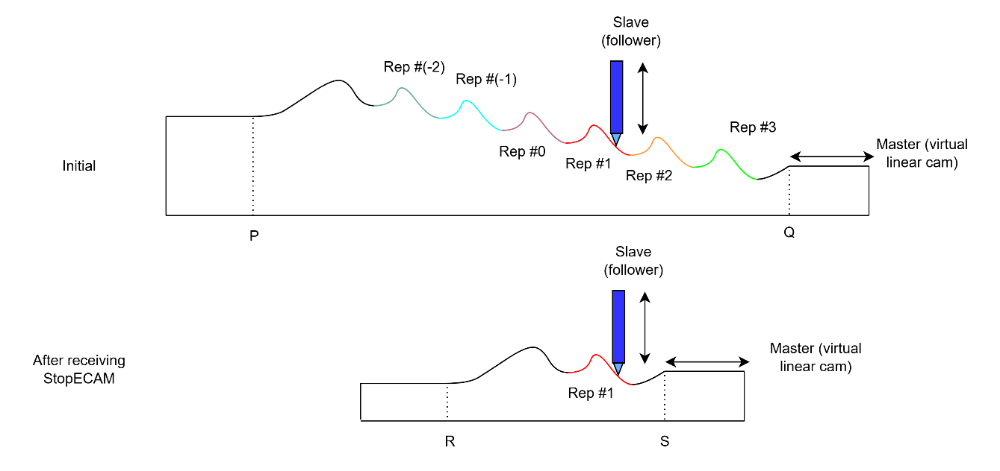

# StopECAM

通过收缩主值范围退出 ECAM 运动，同时保留起始/结束段。

## 概述

`StopECAM` 是用于平稳退出 ECAM 运动的指令。与立即执行的 [Stop](../04-motion-command/Stop.md) 指令不同，轴不会立即退出 ECAM：主值范围收缩，将曲线首段和尾段附加到当前周期曲线中。仅当主值离开这个新的压缩范围后，ECAM 运动才会结束。

在 ECAM 运动进行中发出 `StopECAM`，会设置 [MotionStat](../05-motion-status/MotionStat.md) 中的 ECAM 停止位（第 7 位，掩码 `0x80`），标记该运动为"正在结束 ECAM 运动"，并记录 [MotionReason](../05-motion-status/MotionReason.md) = 9（StopECAM）。当运动实际结束时，该位与其他运动中标志位一同清除。若轴当前未处于 ECAM（直接或间接）运动，该指令无效。

## 工作原理

`StopECAM` 被接受后，控制器将主值范围的全周期跨度压缩到*当前*周期：所有周期起始和结束边界移动到当前周期的起始和结束处，而前导和尾随单次执行段（导入/导出"尾段"，参见 [ECAMStart](ECAMStart.md)）被保留并重新附加到当前周期的外侧。若该运动为无限 ECAM（[ECAMCycles](ECAMCycles.md) = `2147483647` 或 `-2147483648`），则同时清除无限标志，使主值范围具有有限边界。凸轮曲线随后随主变量继续推进直至完成，当主值到达任一压缩端（预起始或后结束钳位）时运动结束。

对于下方示例（`ECAMGap > 0` 且 `ECAMCycles = 3`），轴在第二个周期中间收到 `StopECAM`。主值范围收缩，使得 $R > P$ 且 $S < Q$。ECAM 运动仅在主值小于等于 $R$ 或大于等于 $S$ 时才会结束。注意，$R$ 处的从轴位置参考不一定等于 $P$ 处的值，因为凸轮曲线已收缩；$S$ 与 $Q$ 的关系亦同理。



下图展示了 `ECAMCycles < 0` 条件下相同的停止逻辑。



若用户希望立即停止 ECAM 运动，可使用 [Stop](../04-motion-command/Stop.md) 指令，无论主值如何变化，从轴位置参考均保持不变。

## 示例

```text
AStopECAM            ; 平稳退出 ECAM 运动
```

## 另请参阅

- [Stop](../04-motion-command/Stop.md) — 立即退出 ECAM 运动
- [MotionStat](../05-motion-status/MotionStat.md) — 在运动结束过程中设置 ECAM 停止位（第 7 位）
- [MotionReason](../05-motion-status/MotionReason.md) — 将 `StopECAM` 报告为原因代码 9
- [ECAMStart](ECAMStart.md) — `StopECAM` 保留的导入/导出段
- [运动模式——电子凸轮（ECAM）](00-overview.md) — ECAM 运动概述
