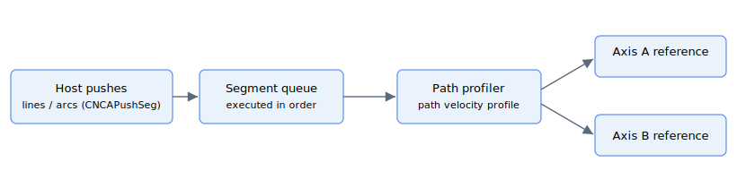

# Motion mode – Computer numerical control (CNC)

CNC mode ([MotionMode](../02-motion-configuration/MotionMode.md) = 11 for CNCA members, 17 for CNCB members) supports two parallel motion engines, **CNCA** and **CNCB**. Each keyword exists as a CNCA / CNCB pair; the keyword files in this folder document both variants together.

The host streams a queue of path segments (lines and arcs) into an engine. The engine executes the segments in order, building a single path-velocity profile that respects the configured speed, acceleration and jerk, and splits the resulting path position across the member axes so they stay coordinated on the path.

## Keyword summary

| Group | Keywords |
|---|---|
| Push / drain the queue | [CNCAPushType/CNCBPushType](CNCAPushType-CNCBPushType.md), [CNCAPushParam/CNCBPushParam](CNCAPushParam-CNCBPushParam.md), [CNCAPushSeg/CNCBPushSeg](CNCAPushSeg-CNCBPushSeg.md), [CNCAClear/CNCBClear](CNCAClear-CNCBClear.md), [CNCARemove/CNCBRemove](CNCARemove-CNCBRemove.md) |
| Queue inspection | [CNCAFIFO/CNCBFIFO](CNCAFIFO-CNCBFIFO.md), [CNCAStatus/CNCBStatus](CNCAStatus-CNCBStatus.md) |
| Active-segment profile (read-only) | [CNCASpeed/CNCBSpeed](CNCASpeed-CNCBSpeed.md), [CNCAAccel/CNCBAccel](CNCAAccel-CNCBAccel.md), [CNCADecel/CNCBDecel](CNCADecel-CNCBDecel.md), [CNCAJerk/CNCBJerk](CNCAJerk-CNCBJerk.md), [CNCAEndSpeed/CNCBEndSpeed](CNCAEndSpeed-CNCBEndSpeed.md), [CNCAAbsTrgt/CNCBAbsTrgt](CNCAAbsTrgt-CNCBAbsTrgt.md), [CNCAPosRef/CNCBPosRef](CNCAPosRef-CNCBPosRef.md), [CNCAdPosRef/CNCBdPosRef](CNCAdPosRef-CNCBdPosRef.md), [CNCAVel/CNCBVel](CNCAVel-CNCBVel.md) |
| Path coordinate (read-only) | [CNCACumPosRef/CNCBCumPosRef](CNCACumPosRef.md) — cumulative commanded path position across all segments since the motion started (counts continuously across segment boundaries, unlike the per-segment active-segment keywords); central-i v5 |
| Path control | [CNCAPercents/CNCBPercents](CNCAPercents-CNCBPercents.md), [CNCASpeedPer/CNCBSpeedPer](CNCASpeedPer-CNCBSpeedPer.md), [CNCAEmrgDec/CNCBEmrgDec](CNCAEmrgDec-CNCBEmrgDec.md), [CNCAEndSegMod/CNCBEndSegMod](CNCAEndSegMod-CNCBEndSegMod.md), [CNCAEndErrCnt/CNCBEndErrCnt](CNCAEndErrCnt-CNCBEndErrCnt.md), [CNCAPause/CNCBPause](CNCAPause-CNCBPause.md), [CNCAStepMode/CNCBStepMode](CNCAStepMode-CNCBStepMode.md), [CNCADoStep/CNCBDoStep](CNCADoStep-CNCBDoStep.md), [StopCNCA](StopCNCA.md), [StopCNCB](StopCNCB.md) |
| Position filter | [CNCAPosFDef/CNCBPosFDef](CNCAPosFDef-CNCBPosFDef.md), [CNCAPosFOn/CNCBPosFOn](CNCAPosFOn-CNCBPosFOn.md) |
| Per-axis encoder scaling | [CNCAEncFactNu/CNCBEncFactNu](CNCAEncFactNu-CNCBEncFactNu.md), [CNCAEncFactDn/CNCBEncFactDn](CNCAEncFactDn-CNCBEncFactDn.md), [CNCAEncRatio/CNCBEncRatio](CNCAEncRatio-CNCBEncRatio.md) (reserved) |

## Queue capacity

The CNC queue size depends on the product. Use [CNCAStatus/CNCBStatus](CNCAStatus-CNCBStatus.md) index 7 to read the actual free space rather than assuming a fixed value:

| Build | CNCA capacity | CNCB capacity |
|---|---|---|
| Standalone AGD (CTL01 series) | 1 200 words | 15 words (CNCB is not really usable here) |
| Standalone AGD (CTL02 series) | 5 000 words | 15 words |
| Central-i AGM800 | 6 000 words | 6 000 words |
