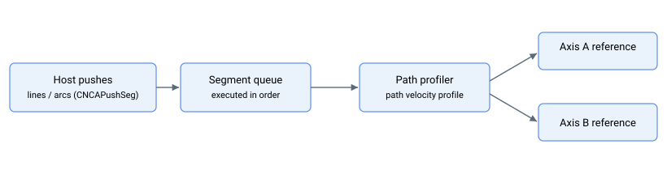

# 运动模式 – 计算机数控（CNC）

CNC 模式（[MotionMode](../02-motion-configuration/MotionMode.md) = 11 对应 CNCA 成员，17 对应 CNCB 成员）支持两个并行运动引擎：**CNCA** 和 **CNCB**。每个关键字均以 CNCA / CNCB 对形式存在；本文件夹中的关键字文件同时记录两个变体。

上位机将一系列路径段（直线和弧线）流式传输到引擎的队列中。引擎按顺序执行各段，构建单一的路径速度曲线，该曲线遵循已配置的速度、加速度和加加速度，并将合成的路径位置分配到各成员轴，使其在路径上保持协调。

## 关键字汇总

| 组别 | 关键字 |
|---|---|
| 压入 / 排空队列 | [CNCAPushType/CNCBPushType](CNCAPushType-CNCBPushType.md)、[CNCAPushParam/CNCBPushParam](CNCAPushParam-CNCBPushParam.md)、[CNCAPushSeg/CNCBPushSeg](CNCAPushSeg-CNCBPushSeg.md)、[CNCAClear/CNCBClear](CNCAClear-CNCBClear.md)、[CNCARemove/CNCBRemove](CNCARemove-CNCBRemove.md) |
| 队列检查 | [CNCAFIFO/CNCBFIFO](CNCAFIFO-CNCBFIFO.md)、[CNCAStatus/CNCBStatus](CNCAStatus-CNCBStatus.md) |
| 当前段曲线（只读） | [CNCASpeed/CNCBSpeed](CNCASpeed-CNCBSpeed.md)、[CNCAAccel/CNCBAccel](CNCAAccel-CNCBAccel.md)、[CNCADecel/CNCBDecel](CNCADecel-CNCBDecel.md)、[CNCAJerk/CNCBJerk](CNCAJerk-CNCBJerk.md)、[CNCAEndSpeed/CNCBEndSpeed](CNCAEndSpeed-CNCBEndSpeed.md)、[CNCAAbsTrgt/CNCBAbsTrgt](CNCAAbsTrgt-CNCBAbsTrgt.md)、[CNCAPosRef/CNCBPosRef](CNCAPosRef-CNCBPosRef.md)、[CNCAdPosRef/CNCBdPosRef](CNCAdPosRef-CNCBdPosRef.md)、[CNCAVel/CNCBVel](CNCAVel-CNCBVel.md) |
| 路径坐标（只读） | [CNCACumPosRef/CNCBCumPosRef](CNCACumPosRef.md) — 自运动开始以来跨所有段的累计指令路径位置（跨段边界持续计数，与按段刷新的当前段关键字不同）；Central-i v5 |
| 路径控制 | [CNCAPercents/CNCBPercents](CNCAPercents-CNCBPercents.md)、[CNCASpeedPer/CNCBSpeedPer](CNCASpeedPer-CNCBSpeedPer.md)、[CNCAEmrgDec/CNCBEmrgDec](CNCAEmrgDec-CNCBEmrgDec.md)、[CNCAEndSegMod/CNCBEndSegMod](CNCAEndSegMod-CNCBEndSegMod.md)、[CNCAEndErrCnt/CNCBEndErrCnt](CNCAEndErrCnt-CNCBEndErrCnt.md)、[CNCAPause/CNCBPause](CNCAPause-CNCBPause.md)、[CNCAStepMode/CNCBStepMode](CNCAStepMode-CNCBStepMode.md)、[CNCADoStep/CNCBDoStep](CNCADoStep-CNCBDoStep.md)、[StopCNCA](StopCNCA.md)、[StopCNCB](StopCNCB.md) |
| 位置滤波器 | [CNCAPosFDef/CNCBPosFDef](CNCAPosFDef-CNCBPosFDef.md)、[CNCAPosFOn/CNCBPosFOn](CNCAPosFOn-CNCBPosFOn.md) |
| 逐轴编码器比例 | [CNCAEncFactNu/CNCBEncFactNu](CNCAEncFactNu-CNCBEncFactNu.md)、[CNCAEncFactDn/CNCBEncFactDn](CNCAEncFactDn-CNCBEncFactDn.md)、[CNCAEncRatio/CNCBEncRatio](CNCAEncRatio-CNCBEncRatio.md)（保留） |

## 队列容量

CNC 队列大小取决于产品型号。请使用 [CNCAStatus/CNCBStatus](CNCAStatus-CNCBStatus.md) 的索引 7 读取实际空闲空间，而不要假设固定值：

| 构型 | CNCA 容量 | CNCB 容量 |
|---|---|---|
| 独立式 AGD（CTL01 系列） | 1 200 字 | 15 字（CNCB 在此处实际不可用） |
| 独立式 AGD（CTL02 系列） | 5 000 字 | 15 字 |
| Central-i AGM800 | 6 000 字 | 6 000 字 |
