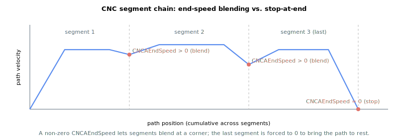

# CNCAEndSpeed/CNCBEndSpeed

Reports the commanded speed at the end of the active CNC segment on group A (or B).

## Overview

`CNCAEndSpeed` (and its `CNCBEndSpeed` counterpart) is a read-only parameter that reports the programmed path speed the profile is commanded to reach at the **end of the currently active segment** on group A (or B), in user units per second. A non-zero end speed is the corner speed that lets two consecutive segments blend without stopping; a zero end speed brings the path to rest at the segment boundary. It is a non-axis, read-only parameter that is not saved to flash.

## How it works

CNC mode runs a single velocity profile along the path. As the path approaches a segment boundary, the deceleration lookahead (using the distance remaining to [CNCAAbsTrgt/CNCBAbsTrgt](CNCAAbsTrgt-CNCBAbsTrgt.md) and the active deceleration [CNCADecel/CNCBDecel](CNCADecel-CNCBDecel.md)) brakes the path velocity [CNCAdPosRef/CNCBdPosRef](CNCAdPosRef-CNCBdPosRef.md) so that it equals `CNCAEndSpeed` exactly at the boundary. This is the look-ahead/cornering mechanism: if the next segment can be entered at that speed, the path carries the velocity straight through the corner; any path fraction not consumed at the boundary is passed into the next segment so motion stays continuous.

The reported value is the segment's **programmed** (raw) end speed as it was pushed to the queue — the corner/boundary speed encoded in the segment, in user units per second — mirroring [CNCAAccel/CNCBAccel](CNCAAccel-CNCBAccel.md) and [CNCADecel/CNCBDecel](CNCADecel-CNCBDecel.md), which report the value encoded in the segment that was pushed.

The deceleration lookahead aims the path velocity at an *effective* boundary target derived from this programmed end speed: that internal target is scaled on-the-fly by the same speed factors as [CNCASpeed/CNCBSpeed](CNCASpeed-CNCBSpeed.md) ([CNCAPercents/CNCBPercents](CNCAPercents-CNCBPercents.md) and [CNCASpeedPer/CNCBSpeedPer](CNCASpeedPer-CNCBSpeedPer.md)), and it is driven to **0** when the path must come to rest at the segment end — on the last queued segment, when a group stop has been requested, or when step mode ([CNCAStepMode/CNCBStepMode](CNCAStepMode-CNCBStepMode.md)) is active. Reading `CNCAEndSpeed` always returns the unscaled programmed value regardless of these overrides.

The end-of-segment transition (blend versus stop) is selected by [CNCAEndSegMod/CNCBEndSegMod](CNCAEndSegMod-CNCBEndSegMod.md).

### Segment-too-short rejection

A non-zero end speed sets the entry speed of the *next* segment, so a segment can be rejected as too short to traverse at the speed it would be entered. When a pushed segment's length divided by the **previous** segment's end speed is no more than one control-cycle period — that is, when the path would cover the whole segment in a single cycle at that entry speed — the push is rejected with instruction error 291, *"CNC segment is too short. Please reduce the End speed of previous segment or increase the target of the current segment."* Either reducing the prior segment's `CNCAEndSpeed` or lengthening the current segment's target [CNCAAbsTrgt/CNCBAbsTrgt](CNCAAbsTrgt-CNCBAbsTrgt.md) clears the condition.



### CNCB note

`CNCBEndSpeed` reports the identical quantity for the independent second CNC group.

## Examples

```text
ACNCAEndSpeed       ; read the active-segment end speed on group A
ACNCBEndSpeed       ; read it on group B
```

## See also

- [CNCADecel/CNCBDecel](CNCADecel-CNCBDecel.md) — deceleration whose lookahead targets this end speed
- [CNCAEndSegMod/CNCBEndSegMod](CNCAEndSegMod-CNCBEndSegMod.md) — end-of-segment blend/stop behaviour
- [CNCAStepMode/CNCBStepMode](CNCAStepMode-CNCBStepMode.md) — step mode drives the effective boundary target to 0
- [CNCAdPosRef/CNCBdPosRef](CNCAdPosRef-CNCBdPosRef.md) — path velocity ramped toward this end speed
- [CNCAVel/CNCBVel](CNCAVel-CNCBVel.md) — resulting resultant velocity
