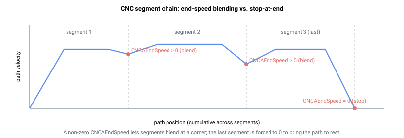

# CNCAEndSpeed/CNCBEndSpeed

报告组 A（或 B）当前活动 CNC 段末的指令速度。

## 概述

`CNCAEndSpeed`（以及对应的 `CNCBEndSpeed`）是只读参数，以用户单位每秒报告组 A（或 B）**当前活动段末**路径速度的编程指令值。非零末速度是使两个连续段在不停止的情况下混合衔接的转角速度；零末速度则使路径在段边界处停止。该参数为非轴只读参数，不保存至闪存。

## 工作原理

CNC 模式沿路径运行单一速度曲线。当路径接近段边界时，减速前瞻（使用到 [CNCAAbsTrgt/CNCBAbsTrgt](CNCAAbsTrgt-CNCBAbsTrgt.md) 的剩余距离以及活动减速度 [CNCADecel/CNCBDecel](CNCADecel-CNCBDecel.md)）对路径速度 [CNCAdPosRef/CNCBdPosRef](CNCAdPosRef-CNCBdPosRef.md) 进行制动，使其在边界处恰好等于 `CNCAEndSpeed`。这是前瞻/转角机制：若下一段可以该速度进入，路径直接将速度带过转角；在边界未消耗的路径分量传递给下一段，使运动保持连续。

报告值为推入队列时的段**编程**（原始）末速度——即段中编码的转角/边界速度，以用户单位每秒表示——与 [CNCAAccel/CNCBAccel](CNCAAccel-CNCBAccel.md) 和 [CNCADecel/CNCBDecel](CNCADecel-CNCBDecel.md) 的报告方式相同，均反映推入段时编码的值。

减速前瞻以编程末速度为基础，向内部导出有效边界目标：该目标与 [CNCASpeed/CNCBSpeed](CNCASpeed-CNCBSpeed.md) 实时使用相同的速度因子（[CNCAPercents/CNCBPercents](CNCAPercents-CNCBPercents.md) 和 [CNCASpeedPer/CNCBSpeedPer](CNCASpeedPer-CNCBSpeedPer.md)）进行缩放；在路径必须在段末停止时——最后一个入队段、已请求组停止或步进模式（[CNCAStepMode/CNCBStepMode](CNCAStepMode-CNCBStepMode.md)）激活时——被驱动至 **0**。读取 `CNCAEndSpeed` 始终返回未缩放的编程值，与这些覆盖无关。

段末过渡（混合还是停止）由 [CNCAEndSegMod/CNCBEndSegMod](CNCAEndSegMod-CNCBEndSegMod.md) 选择。

### 段过短拒绝

非零末速度设置*下一*段的进入速度，因此若段的长度过短，无法以该进入速度通过，则段将被拒绝。当推入段的长度除以**前一**段末速度不超过一个控制周期时间——即路径以该进入速度在单个周期内即可通过整段时——推入被拒绝，并返回指令错误 291：*"CNC segment is too short. Please reduce the End speed of previous segment or increase the target of the current segment."*。减小前一段的 `CNCAEndSpeed` 或增大当前段目标 [CNCAAbsTrgt/CNCBAbsTrgt](CNCAAbsTrgt-CNCBAbsTrgt.md) 均可消除该条件。



### CNCB 说明

`CNCBEndSpeed` 以相同方式报告独立第二 CNC 组活动段的对应值。

## 示例

```text
ACNCAEndSpeed       ; 读取组 A 活动段末速度
ACNCBEndSpeed       ; 读取组 B 活动段末速度
```

## 另请参阅

- [CNCADecel/CNCBDecel](CNCADecel-CNCBDecel.md) — 前瞻以该末速度为目标的减速度
- [CNCAEndSegMod/CNCBEndSegMod](CNCAEndSegMod-CNCBEndSegMod.md) — 段末混合/停止行为
- [CNCAStepMode/CNCBStepMode](CNCAStepMode-CNCBStepMode.md) — 步进模式将有效边界目标驱动为 0
- [CNCAdPosRef/CNCBdPosRef](CNCAdPosRef-CNCBdPosRef.md) — 向该末速度斜坡的路径速度
- [CNCAVel/CNCBVel](CNCAVel-CNCBVel.md) — 合成结果速度
