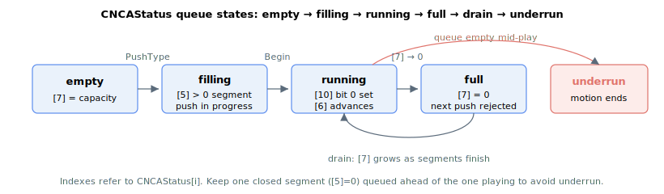

# CNCAStatus/CNCBStatus

Read-only array holding CNC engine status data for queue A (or B).

## Overview

`CNCAStatus` (and its `CNCBStatus` counterpart on the second CNC engine) is a read-only array reporting the live state of the CNC segment queue (FIFO) and motion engine for queue A (or B). Use it to pace host pushes so the queue never underruns, to track which segment is playing, and to read the queue's running/paused/stopping state. It is a non-axis, read-only array, not saved to flash, and is 1-indexed (index 0 is reserved so element indexes start at 1).

## How it works

Some elements are not meaningful in every state — for example, before the first push, when the queue is empty, or when there is no CNC motion. In those cases the element reads `-1`, a value it never takes when valid.

| Index | Reports |
|----|----|
| 1 | Oldest queued entry — the queue position of the segment that will play (or is playing) next. Advances as segments drain. |
| 2 | Last-pushed entry — the queue position of the most recently pushed word. |
| 3 | Start position of the segment currently being filled by pushes. |
| 4 | Total number of parameters the segment being filled expects. |
| 5 | Number of parameters the segment being filled still needs. `0` means the last pushed segment is closed (ready); a non-zero value means a push is still in progress. |
| 6 | Queue position of the segment currently being played back. |
| 7 | **Free space** — number of free words left in the queue. A freshly cleared queue reports the full usable capacity; each pushed word decrements it and each drained segment increments it. The queue is **full** when this reaches 0 (the next push is rejected) and **empty** when it equals the full capacity. |
| 8 | ID assigned to the last pushed segment (24-bit, wraps around). |
| 9 | ID of the segment currently being played back. |
| 10 | **CNC motion status** — a bit-field describing the engine state (see below). |
| 11 | Bit-mask of axes that are members of this CNC group. |
| 12 | Bit-mask of axes involved in the segment currently playing. |
| 13 | Count of automatic-corner segments whose speed was capped by the per-axis maximum-acceleration limit (see below). |
| 14 | Count of segments that hit the per-axis maximum velocity-jump limit. |

When the per-axis acceleration limit is enabled, the controller bounds the speed through each automatically generated corner arc so the centripetal acceleration on every member axis stays within that axis's maximum. The corner-speed ceiling is roughly

$$v_{\text{corner}} = \min_{\text{axis}}\sqrt{\frac{a_{\max,\text{axis}}\,R}{p_{\text{axis}}}}$$

where $R$ is the corner radius and $p_{\text{axis}}$ is the axis's projection factor on the arc. When the requested corner speed exceeds this ceiling, the controller rewrites the end speed of the preceding linear segment and the corner arc's speed and end speed down to the ceiling, and index 13 increments by one.

### Detecting empty, full and underrun

Because element 7 reports free words against the queue's full capacity:

- **Empty / drained:** element 7 equals the full usable capacity. If the engine needs a new segment now and the queue is empty (or the tail segment is still being filled, element 5 ≠ 0), the motion ends — an **underrun**.
- **Full:** element 7 reads 0 — the next push is rejected with an error.

Poll element 7 while streaming and keep at least one closed segment queued ahead of the one playing.



### CNC motion status bit-field (element 10)

Element 10 is `0` when the engine is not in motion, `-1` when not valid, otherwise a bit-field:

| Bit | Set mask | Meaning when set |
|----|----|----|
| 0 | 0x00000001 | CNC motion is active. |
| 3 | 0x00000008 | A decelerate-to-stop has been requested. |
| 4 | 0x00000010 | Path velocity is rising (accelerating). Bits 4 and 5 are mutually exclusive. |
| 5 | 0x00000020 | Path velocity is falling (decelerating). |
| 6 | 0x00000040 | In the smoothing/jerk tail at the end of motion. |
| 9 | 0x00000200 | Waiting for the configured input edge before continuing. |
| 12 | 0x00001000 | A [StopCNCA](StopCNCA.md)/[StopCNCB](StopCNCB.md) stop is in progress. |
| 13 | 0x00002000 | Waiting for the first segment to start motion. |
| 14 | 0x00004000 | A controlled stop (motor-off on fault) has been requested. |

Combined masks: `0x00000009` (bits 0+3) is "in motion or stopping"; `0x00004008` (bits 3+14) is "any stop requested".

## Examples

```text
ACNCAStatus[7]      ; free words in the queue (full capacity = empty, 0 = full)
ACNCAStatus[10]     ; CNC motion status bit-field
ACNCAStatus[5]      ; parameters the segment being filled still needs (0 = closed)
```

## See also

- [CNCAFIFO/CNCBFIFO](CNCAFIFO-CNCBFIFO.md) — raw queued segment data
- [CNCAPushType/CNCBPushType](CNCAPushType-CNCBPushType.md) — push a segment to the queue
- [CNCAVel/CNCBVel](CNCAVel-CNCBVel.md) — actual resultant velocity measured from the member axes
- [StopCNCA](StopCNCA.md) / [StopCNCB](StopCNCB.md) — stop the CNC motion
