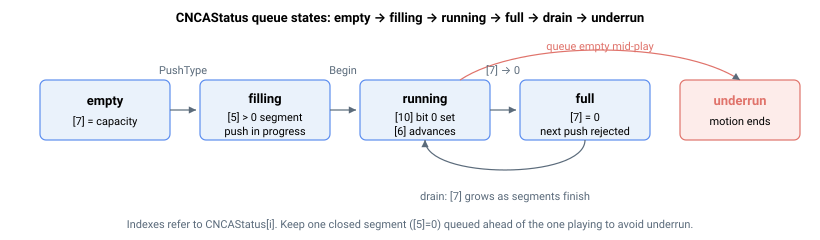

# CNCAStatus/CNCBStatus

保存队列 A（或 B）CNC 引擎状态数据的只读数组。

## 概述

`CNCAStatus`（以及第二 CNC 引擎对应的 `CNCBStatus`）是一个只读数组，实时报告队列 A（或 B）的 CNC 段队列（FIFO）和运动引擎的当前状态。可用它来控制上位机的压入节奏，避免队列欠载；追踪当前正在播放的段；以及读取队列的运行/暂停/停止状态。该参数为非轴只读数组，不保存至闪存，采用 1 索引（索引 0 保留，元素索引从 1 开始）。

## 工作原理

部分元素在特定状态下无意义——例如，在第一次压入之前、队列为空时，或没有 CNC 运动时。在这些情况下，元素读取值为 `-1`，该值在有效状态下不会出现。

| 索引 | 报告内容 |
|----|----|
| 1 | 最旧的已排队条目——下一个将要播放（或正在播放）的段的队列位置。随着段被消耗而递增。 |
| 2 | 最后压入的条目——最近压入字的队列位置。 |
| 3 | 当前正在填充的段的起始位置。 |
| 4 | 正在填充的段期望的参数总数。 |
| 5 | 正在填充的段仍需的参数数量。`0` 表示最后压入的段已关闭（就绪）；非零值表示压入仍在进行中。 |
| 6 | 当前正在播放的段的队列位置。 |
| 7 | **可用空间**——队列中剩余的空闲字数。新清空的队列报告完整可用容量；每压入一个字递减一，每消耗一个段则递增。该值为 0 时队列**已满**（下一次压入将被拒绝），等于完整容量时队列**为空**。 |
| 8 | 分配给最后压入段的 ID（24 位，循环回绕）。 |
| 9 | 当前正在播放的段的 ID。 |
| 10 | **CNC 运动状态**——描述引擎状态的位域（见下文）。 |
| 11 | 该 CNC 组成员轴的位掩码。 |
| 12 | 当前播放段所涉及轴的位掩码。 |
| 13 | 速度被逐轴最大加速度限值限制的自动拐角段计数（见下文）。 |
| 14 | 触发逐轴最大速度跳变限值的段计数。 |

当逐轴加速度限值启用时，控制器会限制每个自动生成拐角弧的通过速度，使每个成员轴的向心加速度保持在该轴最大值以内。拐角速度上限大致为：

$$v_{\text{corner}} = \min_{\text{axis}}\sqrt{\frac{a_{\max,\text{axis}}\,R}{p_{\text{axis}}}}$$

其中 $R$ 为拐角半径，$p_{\text{axis}}$ 为该轴在弧上的投影因子。当请求的拐角速度超过此上限时，控制器将前一线性段的末速度及拐角弧的速度和末速度向下重写至上限值，且索引 13 加一。

### 检测空队列、满队列与欠载

由于元素 7 报告相对于队列完整容量的空闲字数：

- **空/已耗尽：** 元素 7 等于完整可用容量。若引擎此时需要新段而队列为空（或末段仍在填充中，元素 5 ≠ 0），运动将结束——即发生**欠载**。
- **已满：** 元素 7 读取为 0——下一次压入将被拒绝并返回错误。

在流式传输过程中轮询元素 7，并在当前播放段前方保持至少一个已关闭的段。



### CNC 运动状态位域（元素 10）

引擎不在运动时元素 10 为 `0`，无效时为 `-1`，否则为位域：

| 位 | 置位掩码 | 置位含义 |
|----|----|----|
| 0 | 0x00000001 | CNC 运动激活中。 |
| 3 | 0x00000008 | 已请求减速至停止。 |
| 4 | 0x00000010 | 路径速度上升中（加速）。位 4 与位 5 互斥。 |
| 5 | 0x00000020 | 路径速度下降中（减速）。 |
| 6 | 0x00000040 | 处于运动结束时的平滑/急动拖尾阶段。 |
| 9 | 0x00000200 | 等待配置的输入沿后继续。 |
| 12 | 0x00001000 | [StopCNCA](StopCNCA.md)/[StopCNCB](StopCNCB.md) 停止进行中。 |
| 13 | 0x00002000 | 等待第一个段以启动运动。 |
| 14 | 0x00004000 | 已请求受控停止（故障时电机关闭）。 |

组合掩码：`0x00000009`（位 0+3）表示"运动中或停止中"；`0x00004008`（位 3+14）表示"任意停止请求"。

## 示例

```text
ACNCAStatus[7]      ; free words in the queue (full capacity = empty, 0 = full)
ACNCAStatus[10]     ; CNC motion status bit-field
ACNCAStatus[5]      ; parameters the segment being filled still needs (0 = closed)
```

## 另请参阅

- [CNCAFIFO/CNCBFIFO](CNCAFIFO-CNCBFIFO.md) — 原始已入队段数据
- [CNCAPushType/CNCBPushType](CNCAPushType-CNCBPushType.md) — 向队列压入段
- [CNCAVel/CNCBVel](CNCAVel-CNCBVel.md) — 由成员轴测量的实际合速度
- [StopCNCA](StopCNCA.md) / [StopCNCB](StopCNCB.md) — 停止 CNC 运动
