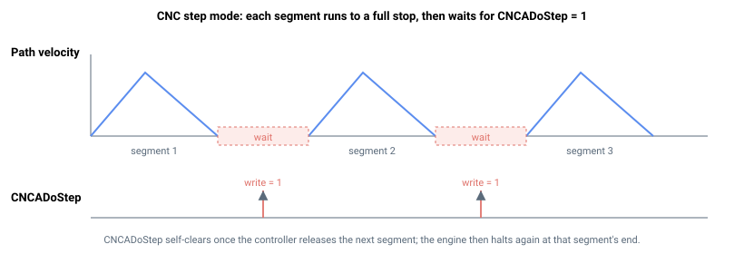

# CNCAStepMode/CNCBStepMode

启用 CNC 步进模式，在每段结束时暂停直至收到释放指令。

## 概述

`CNCAStepMode`（以及第二 CNC 引擎对应的 `CNCBStepMode`）启用 CNC 路径的逐段执行模式，引擎每次仅执行一个已入队的段并停止，而不是连续运行整条路径。这是对零件程序进行试运行或调试的主要工具：可以逐段走查路径，在释放下一段之前验证每步运动。该参数作用于整个 CNC 引擎（而非单个成员轴），不保存至闪存，可随时写入，包括运动过程中。

该参数仅接受两个值：

| 值 | 含义 |
|----|----|
| 0（默认） | 正常连续执行——引擎连续播放各段，在配置的末速度处跨段混合。 |
| 1 | 步进模式——引擎在每段结束时暂停，等待 [CNCADoStep/CNCBDoStep](CNCADoStep-CNCBDoStep.md) = 1 后才执行下一段。 |

步进模式激活时，每个段的末速度均被强制为 `0`，即使段定义中指定了非零末速度。因此每个段在引擎等待前都会平稳减速至完全停止，路径以一系列离散点到点运动而非混合轨迹的方式被遍历。

## 工作原理

CNC 引擎在每个控制周期处理队列时检查 `CNCAStepMode`。当其为 `1` 且一段刚结束时，引擎拒绝加载下一段，直到 [CNCADoStep/CNCBDoStep](CNCADoStep-CNCBDoStep.md) 被置为 `1`；一旦释放一步，恰好加载并执行一个段，引擎在该段结束时再次暂停。步进逐一推进队列中的*每个*项目——不仅包括运动段（直线、圆弧），还包括队列中的非运动项目，如驻留/延迟段、参数修改段、数字量输出写入和数组写入。

由于该值被持续读取，可在路径中途进入步进模式：将其设为 `1`，引擎将在当前执行段结束时暂停。再次写入 `0` 则退出步进模式，引擎从该点起自由运行剩余段。



任何停止运动的指令——[StopCNCA](StopCNCA.md)（或 `StopCNCB`）、通用 [Stop](../04-motion-command/Stop.md) 或 `Abort`——都会自动将 `CNCAStepMode` 强制置回 `0`。这确保停止请求立即被响应；否则处于步进模式等待中的引擎将不响应该请求。

CNCA 路径运行时，各轴通过 [MotionStat](../05-motion-status/MotionStat.md) 报告此状态（CNCA 为位 11 / 掩码 `0x800`，CNCB 为位 14 / 掩码 `0x4000`）。

## 示例

```text
ACNCAStepMode=1      ; halt at the end of each segment (dry-run / debug)
ACNCAStepMode=0      ; resume free, continuous execution of segments
```

## 另请参阅

- [CNCADoStep/CNCBDoStep](CNCADoStep-CNCBDoStep.md) — 步进模式下释放下一段
- [CNCAPause/CNCBPause](CNCAPause-CNCBPause.md) — 沿路径暂停/恢复，不逐段步进
- [StopCNCA](StopCNCA.md) — 停止 CNC 运动（强制关闭步进模式）
- [MotionStat](../05-motion-status/MotionStat.md) — 报告 CNCA/CNCB 运动激活状态（位 11 和位 14）
