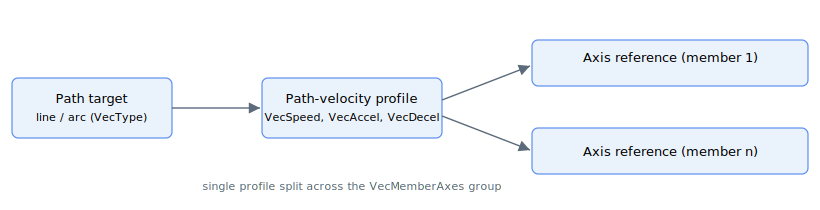

# Motion mode – Vector motion

This section extends from vector motion ([MotionMode](../02-motion-configuration/MotionMode.md) = 16). All the keywords in this section are only applicable under this motion mode.

Vector motion moves a group of axes together along a geometric path. A line or arc target ([VecType](VecType.md)) is run through a single path-velocity profile (set by [VecSpeed](VecSpeed.md), [VecAccel](VecAccel.md) and [VecDecel](VecDecel.md)), and the resulting path position is split across the member axes ([VecMemberAxes](VecMemberAxes.md)) so they stay coordinated on the path. The standard per-axis motion keywords still apply and refer to the individual axes rather than to the vector.

## Group rules at `Begin`

When `Begin` is issued for vector motion the controller validates the group on every member axis selected by [VecMemberAxes](VecMemberAxes.md). The move is rejected at start if any of the following do not hold:

- The command is issued on the **lowest-numbered** member axis (the group master that runs the path profiler).
- The mask on the command axis sets its own bit.
- At least two axes are selected; for an arc ([VecType](VecType.md) = 1) exactly two axes are selected.
- Every member axis is motor-on, has [MotionMode](../02-motion-configuration/MotionMode.md) = 16, and is not already in motion.
- For arcs, the start and end points are equidistant from the configured [VecArcCenter](VecArcCenter.md).

The path profiler runs only on the group master (the lowest-numbered member). Every profile parameter — [VecSpeed](VecSpeed.md), [VecAccel](VecAccel.md), [VecDecel](VecDecel.md), [VecEmrgDec](VecEmrgDec.md) and the jerk-shaping keywords — is read from the master axis when the move starts. The same keywords set on the other member axes are **not** used by the path: each member is driven purely from the master's path coordinate ([VecPosRef](VecPosRef.md)) through the geometry. Configure the profile on the master; the members only need their geometry set up ([VecArcCenter](VecArcCenter.md) for an arc) and to satisfy the group rules above.

## Keyword summary

| Keyword | Role |
|---|---|
| [VecMemberAxes](VecMemberAxes.md) | Bit mask selecting the participating axes |
| [VecType](VecType.md) | Geometry: 0 = linear, 1 = arc |
| [VecArcCenter](VecArcCenter.md) / [VecArcDir](VecArcDir.md) / [VecNumCircles](VecNumCircles.md) | Arc center, sweep direction, extra revolutions |
| [VecSpeed](VecSpeed.md) / [VecAccel](VecAccel.md) / [VecDecel](VecDecel.md) | Path-velocity profile |
| [VecJerk](VecJerk.md) | Legacy `0`-`9` jerk selector (no effect on the vector path) |
| [VecJerkMode](VecJerkMode.md) / [VecJerkInAcc](VecJerkInAcc.md) / [VecJerkInDec](VecJerkInDec.md) | Vector-path S-curve enable and tuning |
| [VecEmrgDec](VecEmrgDec.md) | Emergency deceleration used by `StopVec` and on faults |
| [VecPause](VecPause.md) | Pause / resume the path |
| [StopVec](StopVec.md) | End the move using the emergency deceleration |
| [VecPosRef](VecPosRef.md) / [VecdPosRef](VecdPosRef.md) / [VecAbsTrgt](VecAbsTrgt.md) | Path position, path velocity, total path distance |
| [VecMotionStat](VecMotionStat.md) | Enumerated group state (0 idle / 1 moving / 2 paused / 3 stopping) |
| [VecPosFDef](VecPosFDef.md) / [VecPosFOn](VecPosFOn.md) | Optional output-position filter |
| [VecEncRatio](VecEncRatio.md) / [VecEncFactNu](VecEncFactNu.md) / [VecEncFactDn](VecEncFactDn.md) | Per-axis encoder-resolution compensation |
