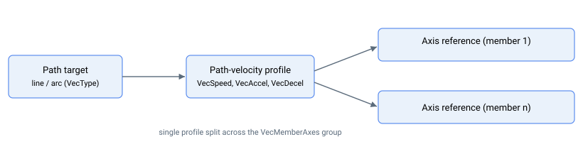

# 运动模式——矢量运动

本节适用于矢量运动（[MotionMode](../02-motion-configuration/MotionMode.md) = 16）。本节中的所有关键字仅在此运动模式下适用。

矢量运动将一组轴沿几何路径协调移动。直线或圆弧目标（[VecType](VecType.md)）通过单一路径速度曲线（由 [VecSpeed](VecSpeed.md)、[VecAccel](VecAccel.md) 和 [VecDecel](VecDecel.md) 设置）运行，所得路径位置分配给各成员轴（[VecMemberAxes](VecMemberAxes.md)），使其在路径上保持协调。标准的每轴运动关键字仍适用，并指向各个独立轴而非矢量整体。

## `Begin` 时的组规则

对矢量运动发出 `Begin` 时，控制器在 [VecMemberAxes](VecMemberAxes.md) 所选的每个成员轴上验证组状态。若以下任一条件不满足，则在启动时拒绝该运动：

- 指令在**编号最小**的成员轴上发出（该轴为运行路径规划器的组主轴）。
- 指令轴上的掩码设置了自身的位。
- 至少选择了两个轴；对于圆弧（[VecType](VecType.md) = 1），恰好选择两个轴。
- 每个成员轴均已电机使能、[MotionMode](../02-motion-configuration/MotionMode.md) = 16，且当前未处于运动中。
- 对于圆弧，起点和终点与配置的 [VecArcCenter](VecArcCenter.md) 等距。

路径规划器仅在组主轴（编号最小的成员轴）上运行。所有曲线参数——[VecSpeed](VecSpeed.md)、[VecAccel](VecAccel.md)、[VecDecel](VecDecel.md)、[VecEmrgDec](VecEmrgDec.md) 及急动整形关键字——均在运动启动时从主轴读取。其他成员轴上设置的相同关键字**不**用于路径：每个成员轴纯粹通过几何关系从主轴的路径坐标（[VecPosRef](VecPosRef.md)）驱动。请在主轴上配置曲线；各成员轴只需设置好几何参数（圆弧的 [VecArcCenter](VecArcCenter.md)）并满足上述组规则即可。

## 关键字汇总

| 关键字 | 作用 |
|---|---|
| [VecMemberAxes](VecMemberAxes.md) | 选择参与轴的位掩码 |
| [VecType](VecType.md) | 几何类型：0 = 直线，1 = 圆弧 |
| [VecArcCenter](VecArcCenter.md) / [VecArcDir](VecArcDir.md) / [VecNumCircles](VecNumCircles.md) | 圆弧圆心、扫描方向、额外圈数 |
| [VecSpeed](VecSpeed.md) / [VecAccel](VecAccel.md) / [VecDecel](VecDecel.md) | 路径速度曲线 |
| [VecJerk](VecJerk.md) | 传统 `0`-`9` 急动度选择器（对矢量路径无效） |
| [VecJerkMode](VecJerkMode.md) / [VecJerkInAcc](VecJerkInAcc.md) / [VecJerkInDec](VecJerkInDec.md) | 矢量路径 S 曲线使能与整定 |
| [VecEmrgDec](VecEmrgDec.md) | `StopVec` 及故障时使用的紧急减速度 |
| [VecPause](VecPause.md) | 暂停/继续路径 |
| [StopVec](StopVec.md) | 使用紧急减速度结束运动 |
| [VecPosRef](VecPosRef.md) / [VecdPosRef](VecdPosRef.md) / [VecAbsTrgt](VecAbsTrgt.md) | 路径位置、路径速度、总路径距离 |
| [VecMotionStat](VecMotionStat.md) | 枚举型组状态（0 空闲 / 1 运动中 / 2 已暂停 / 3 停止中） |
| [VecPosFDef](VecPosFDef.md) / [VecPosFOn](VecPosFOn.md) | 可选输出位置滤波器 |
| [VecEncRatio](VecEncRatio.md) / [VecEncFactNu](VecEncFactNu.md) / [VecEncFactDn](VecEncFactDn.md) | 每轴编码器分辨率补偿 |
