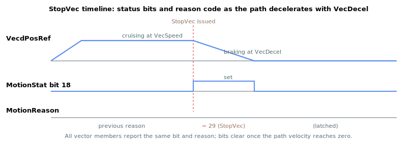

# StopVec

Command that stops coordinated vector motion, decelerating all member axes along the path.

## Overview

`StopVec` is a command that stops coordinated vector motion ([MotionMode](../02-motion-configuration/MotionMode.md) = 16). All participating axes (selected by [VecMemberAxes](VecMemberAxes.md)) decelerate together using the configured [VecDecel](VecDecel.md) deceleration and come to rest, keeping the vector path coordinated as it stops. It is an axis-related command function that can be issued at any time, including during motion. `StopVec` is the way to end a vector move before it reaches its programmed endpoint.

## How it works

`StopVec` may be issued on any member axis. The controller finds the group that axis belongs to and, if the group is actively moving or paused, applies the stop to **all** member axes together so the path stays coordinated as it brakes:

1. It records the stop reason on every member axis: [MotionReason](../05-motion-status/MotionReason.md) = 29 ("ended due to StopVec command").
2. It sets the vector-stop request bit on every member axis: the [MotionStat](../05-motion-status/MotionStat.md) vector-stop bit (bit 18, mask `0x00040000`).
3. It switches the group's internal state to "stopping" ([VecMotionStat](VecMotionStat.md) = 3), which makes the path-velocity profiler ramp the commanded path speed to zero. The deceleration used for that ramp is the normal [VecDecel](VecDecel.md); the faster [VecEmrgDec](VecEmrgDec.md) is reserved for limit-switch / software-limit events (see [VecEmrgDec](VecEmrgDec.md)).

Because the deceleration is applied to the single path velocity and the geometry still splits it across the axes, the move follows its programmed path while slowing — it does not deviate. When the path velocity reaches zero the in-motion status bits of all member axes are cleared and the move ends. Issuing `StopVec` when the group is not in motion has no effect.



A motor-off or fault on a member axis, or a member axis reaching a hardware limit switch or software position limit, **does** raise the emergency-deceleration flag, so those events brake at [VecEmrgDec](VecEmrgDec.md) instead — see the reason codes 30-34 in [MotionReason](../05-motion-status/MotionReason.md). Use [VecPause](VecPause.md) instead of `StopVec` if you want to halt the move and later resume it from where it stopped.

## Examples

```text
AStopVec             ; stop the active vector motion (invoke as a command)
```

## See also

- [VecDecel](VecDecel.md) — deceleration rate that brakes the path on `StopVec`
- [VecEmrgDec](VecEmrgDec.md) — emergency-deceleration rate used instead on limit/fault events
- [VecMotionStat](VecMotionStat.md) — reports the resulting motion state
- [VecPause](VecPause.md) — temporarily pause (vs. stop) vector motion
