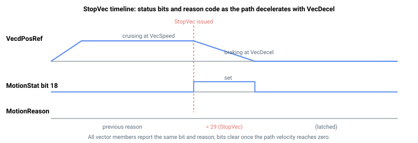

# StopVec

停止协调矢量运动并沿路径减速所有成员轴的指令。

## 概述

`StopVec` 是一条停止协调矢量运动（[MotionMode](../02-motion-configuration/MotionMode.md) = 16）的指令。所有参与轴（由 [VecMemberAxes](VecMemberAxes.md) 选择）使用配置的 [VecDecel](VecDecel.md) 减速度协同减速至静止，在停止过程中保持矢量路径协调。它是一个轴相关的指令函数，可在任意时刻发出，包括运动期间。`StopVec` 是在矢量运动到达编程终点之前结束该运动的方式。

## 工作原理

`StopVec` 可在任意成员轴上发出。控制器找到该轴所属的组，若组正在运动或已暂停，则对**所有**成员轴一起施加停止，使路径在制动时保持协调：

1. 在每个成员轴上记录停止原因：[MotionReason](../05-motion-status/MotionReason.md) = 29（"因 StopVec 指令结束"）。
2. 在每个成员轴上设置矢量停止请求位：[MotionStat](../05-motion-status/MotionStat.md) 矢量停止位（位 18，掩码 `0x00040000`）。
3. 将组的内部状态切换为"停止中"（[VecMotionStat](VecMotionStat.md) = 3），使路径速度规划器将指令路径速度斜坡降至零。该斜坡所用减速度为正常 [VecDecel](VecDecel.md)；较快的 [VecEmrgDec](VecEmrgDec.md) 保留用于限位开关/软件限位事件（参见 [VecEmrgDec](VecEmrgDec.md)）。

由于减速度施加于单一路径速度，而几何关系仍将其分配给各轴，运动在减速过程中沿编程路径行进，不发生偏离。当路径速度降至零时，所有成员轴的运动中状态位被清除，运动结束。在组未处于运动中时发出 `StopVec` 无任何效果。



若运动期间某成员轴到达**软件位置限位**，则触发紧急减速标志，以 [VecEmrgDec](VecEmrgDec.md) 制动路径（触发轴报告 [MotionReason](../05-motion-status/MotionReason.md) = 6/7，其他成员轴报告 [MotionReason](../05-motion-status/MotionReason.md) = 34）；由输入信号触发的受控停止执行相同处理（被指令轴报告 [MotionReason](../05-motion-status/MotionReason.md) = 28）。成员轴电机失能或故障则会**立即结束运动，不经斜坡**（[MotionReason](../05-motion-status/MotionReason.md) = 30）。硬件反向/正向限位开关不通过矢量紧急减速路径处理。若需停止运动并在停止处继续，请使用 [VecPause](VecPause.md) 而非 `StopVec`。

## 示例

```text
AStopVec             ; stop the active vector motion (invoke as a command)
```

## 另请参阅

- [VecDecel](VecDecel.md) — `StopVec` 时制动路径所用的减速度
- [VecEmrgDec](VecEmrgDec.md) — 限位/故障事件时改用的紧急减速度
- [VecMotionStat](VecMotionStat.md) — 报告所得运动状态
- [VecPause](VecPause.md) — 临时暂停（而非停止）矢量运动
