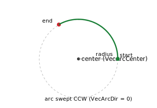

# VecArcCenter

Per-axis coordinate of the arc center, from which the controller derives the arc radius.

## Overview

For an arc vector ([VecType](VecType.md) = 1), `VecArcCenter` defines the location of the arc center so the controller can calculate the radius. Like all vector-motion keywords, it is per axis: the coordinate of the arc center is given by the `VecArcCenter` of the two member axes that form the arc plane. It must be set up before motion, together with [VecArcDir](VecArcDir.md) (sweep direction) and [VecNumCircles](VecNumCircles.md) (number of revolutions).

It is saved to flash and cannot be modified while in motion.

## How it works

An arc is defined by three things that are all fixed when the move starts: the **start point** (the current position of the two member axes), the **end point** (their targets, from [AbsTrgt](../13-motion-mode-ptp/AbsTrgt.md) / [RelTrgt](../13-motion-mode-ptp/RelTrgt.md)), and the **center** (the `VecArcCenter` of the two member axes). From these the controller derives the rest of the geometry:

1. **Radius.** It measures the distance from the center to the start point and from the center to the end point. These two radii must agree to within a few counts; if they differ by more the move is rejected (the center is inconsistent with the two end points). The radius used is the average of the two.
2. **Start and end angles.** It computes the angle of the start point and of the end point about the center.
3. **Swept angle and path length.** Combined with [VecArcDir](VecArcDir.md) (which way round) and [VecNumCircles](VecNumCircles.md) (how many extra full turns), this gives the total arc length stored as [VecAbsTrgt](VecAbsTrgt.md).

During the move the path coordinate [VecPosRef](VecPosRef.md) is divided by the radius to get the angle swept so far; each member axis is then driven to `VecArcCenter + radius × cosine/sine` of that angle. The two member axes are given in a significant order — the first is the arc-plane "X" axis (cosine term) and the second the "Y" axis (sine term).



## Examples

```text
AVecArcCenter=50000  ; this axis's coordinate of the arc center (user units)
```

## See also

- [VecType](VecType.md) — selects linear vs. arc vector
- [VecArcDir](VecArcDir.md) — arc sweep direction (CW/CCW)
- [VecNumCircles](VecNumCircles.md) — number of full arcs to run
