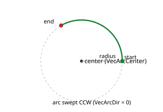

# VecArcCenter

弧心的各轴坐标，控制器由此推导弧半径。

## 概述

对于圆弧矢量（[VecType](VecType.md) = 1），`VecArcCenter` 定义弧心位置，以便控制器计算半径。与所有矢量运动关键字一样，它是按轴设置的：弧心坐标由构成弧平面的两个成员轴各自的 `VecArcCenter` 给定。必须在运动前与 [VecArcDir](VecArcDir.md)（扫描方向）和 [VecNumCircles](VecNumCircles.md)（圈数）一同配置。

该参数保存至闪存，运动中不可修改。

## 工作原理

圆弧由运动启动时固定的三个要素定义：**起点**（两个成员轴的当前位置）、**终点**（其目标，来自 [AbsTrgt](../13-motion-mode-ptp/AbsTrgt.md) / [RelTrgt](../13-motion-mode-ptp/RelTrgt.md)）以及**圆心**（两个成员轴的 `VecArcCenter`）。控制器由此推导其余几何量：

1. **半径。** 测量圆心到起点的距离以及圆心到终点的距离。这两个半径的差值必须在 3 个计数以内；若差值超出，则运动被拒绝（圆心与两端点不一致）。使用两者的平均值作为半径。
2. **起始角和终止角。** 计算起点和终点相对圆心的角度。
3. **扫过角度与路径长度。** 结合 [VecArcDir](VecArcDir.md)（旋转方向）和 [VecNumCircles](VecNumCircles.md)（额外整圈数），得出存储为 [VecAbsTrgt](VecAbsTrgt.md) 的总弧长。

运动过程中，路径坐标 [VecPosRef](VecPosRef.md) 除以半径得到已扫过的角度；随后每个成员轴被驱动至 `VecArcCenter + 半径 × 该角度的余弦/正弦`。余弦和正弦取自内部查找表，并在相邻项之间进行线性插值，而非每周期调用实时三角函数，从而保持每周期更新的高效性。两个成员轴的顺序有意义——第一个为弧平面的"X"轴（余弦项），第二个为"Y"轴（正弦项）。

除等半径校验外，`Begin` 时的圆弧设置还会验证 [VecArcDir](VecArcDir.md) 为 `0` 或 `1`、[VecSpeed](VecSpeed.md) 在允许范围内以及 [VecNumCircles](VecNumCircles.md) 不为负值；若任一项不满足，运动将被拒绝。



## 示例

```text
AVecArcCenter=50000  ; this axis's coordinate of the arc center (user units)
```

## 另请参阅

- [VecType](VecType.md) — 选择直线或圆弧矢量
- [VecArcDir](VecArcDir.md) — 圆弧扫描方向（顺时针/逆时针）
- [VecNumCircles](VecNumCircles.md) — 运行的完整弧圈数
