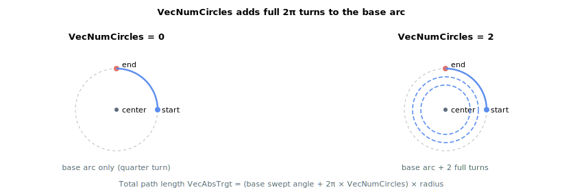

# VecNumCircles

Number of additional full revolutions to add to a vector arc move (0 = just the base arc, no extra turns).

## Overview

`VecNumCircles` sets how many complete revolutions are added to the base arc in vector arc motion ([VecType](VecType.md) = 1). With it set to zero the move is just the base arc swept from the start point to the end point; each unit adds one more full turn (2π) to the path. It works together with [VecArcCenter](VecArcCenter.md) and [VecArcDir](VecArcDir.md), which define the arc geometry and direction. It is an axis-related parameter saved to flash, and cannot be changed while the axis is in motion.

## How it works

When the arc move starts, the controller works out the angle to sweep from the start point to the end point in the direction set by [VecArcDir](VecArcDir.md), and then adds one full turn (2π) for each circle requested by `VecNumCircles`. That total swept angle, multiplied by the radius, becomes the total path length [VecAbsTrgt](VecAbsTrgt.md):

| Setting | Result |
|----|----|
| `VecNumCircles = 0`, start ≠ end | A single partial arc from the start point to the end point. |
| `VecNumCircles = 0`, start = end | The base sweep only — for a clockwise arc this is one full turn; for a counter-clockwise arc the base sweep is zero, so add turns with `VecNumCircles`. |
| `VecNumCircles = N` (1-100) | The base arc plus `N` additional full revolutions. |

The path-velocity profile then runs along this extended path exactly as for a single arc: it accelerates, cruises and decelerates over the whole multi-turn length, so the move only slows to a stop after the final revolution. A move still in progress can be ended early with [StopVec](StopVec.md). The maximum is 100 additional revolutions.



### Worked example

A 90° base arc on a 50 mm radius with `VecNumCircles = 2` runs `(π/2 + 2 × 2π) × 50 ≈ 707 mm` of path. At `VecSpeed = 200` mm/s the move (ignoring ramps) takes about 3.5 s; one single velocity profile spans the whole 707 mm and only the trailing ramp brakes back to rest after the final revolution.

## Examples

```text
AVecNumCircles=0     ; base arc only, no extra revolutions (default)
AVecNumCircles=5     ; base arc plus five additional full revolutions
```

## See also

- [VecType](VecType.md) — selects arc vector motion
- [VecArcCenter](VecArcCenter.md) / [VecArcDir](VecArcDir.md) — arc geometry and direction
- [StopVec](StopVec.md) — ends a vector arc move early
