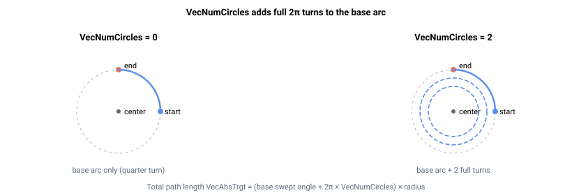

# VecNumCircles

在向量圆弧运动中附加完整圆周数（0 = 仅执行基础圆弧，不添加额外圈数）。

## 概述

`VecNumCircles` 设置在向量圆弧运动（[VecType](VecType.md) = 1）中附加到基础圆弧上的完整圆周数。设为零时，运动仅为从起点到终点的基础圆弧；每增加一个单位，则在路径上额外增加一整圈（2π）。该参数与 [VecArcCenter](VecArcCenter.md) 和 [VecArcDir](VecArcDir.md) 共同作用，后两者定义圆弧的几何形状和方向。该参数为轴相关参数，保存至闪存，运动过程中不可更改。

## 工作原理

圆弧运动开始时，控制器计算从起点到终点沿 [VecArcDir](VecArcDir.md) 方向所需扫过的角度，然后为 `VecNumCircles` 所请求的每一圈添加一整圈（2π）。该总扫过角度乘以半径，即为总路径长度 [VecAbsTrgt](VecAbsTrgt.md)：

| 设置 | 结果 |
|----|----|
| `VecNumCircles = 0`，起点 ≠ 终点 | 从起点到终点的单段局部圆弧。 |
| `VecNumCircles = 0`，起点 = 终点 | 顺时针和逆时针圆弧均为一整圈（2π）；使用 `VecNumCircles` 可添加更多圈数。 |
| `VecNumCircles = N`（1-100） | 基础圆弧加 `N` 圈额外整圈。 |

路径速度规划器随后沿该扩展路径运行，与单段圆弧完全相同：加速、巡航并在整个多圈路径上减速，因此运动仅在最后一圈结束后才减速停止。仍在进行中的运动可通过 [StopVec](StopVec.md) 提前结束。最多可附加 100 圈。



### 计算示例

50 mm 半径上的 90° 基础圆弧，设 `VecNumCircles = 2`，路径长度为 `(π/2 + 2 × 2π) × 50 ≈ 707 mm`。在 `VecSpeed = 200` mm/s 时（忽略斜坡），运动耗时约 3.5 秒；单一速度规划器贯穿整个 707 mm，仅在最后一圈结束后的末段斜坡减速至静止。

## 示例

```text
AVecNumCircles=0     ; 仅基础圆弧，无额外圈数（默认）
AVecNumCircles=5     ; 基础圆弧加五圈额外整圈
```

## 参见

- [VecType](VecType.md) — 选择圆弧向量运动
- [VecArcCenter](VecArcCenter.md) / [VecArcDir](VecArcDir.md) — 圆弧几何形状和方向
- [StopVec](StopVec.md) — 提前结束向量圆弧运动
