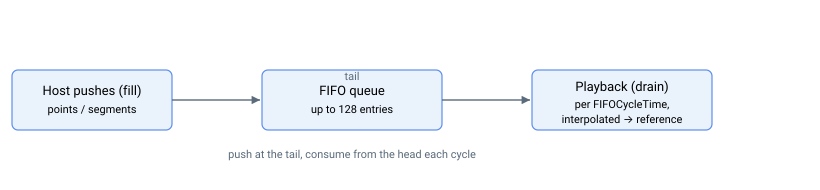

# 运动模式 – 先进先出（FIFO）

FIFO 运动模式允许用户将一系列运动段推入队列，控制器随后按顺序执行这些段。段可在运动前或运动期间推入，队列最多可容纳 128 个条目。

本节记录了两个相关子系统：

- **FIFO 段运动**（[MotionMode](../02-motion-configuration/MotionMode.md) = 9）— 线性（匀速）和抛物线（匀加速）段的序列。完整描述参见 [FIFOType](FIFOType.md)，以及 [FIFOValue](FIFOValue.md)、[FIFOStatus](FIFOStatus.md)、[FIFOCycleTime](FIFOCycleTime.md)、`FIFOPush*` 函数（[FIFOPushCycle](FIFOPushCycle.md)、[FIFOPushLinP](FIFOPushLinP.md)、[FIFOPushLinV](FIFOPushLinV.md)、[FIFOPushParP](FIFOPushParP.md)、[FIFOPushParA](FIFOPushParA.md)）、[FIFORemove](FIFORemove.md)、[FIFOClear](FIFOClear.md) 和 [StopFIFO](StopFIFO.md)。
- **FIFO 位置跟踪**（[MotionMode](../02-motion-configuration/MotionMode.md) = 19）— 从位置队列流式传输的参考轨迹。参见 [FIFOPosType](FIFOPosType.md)、[FIFOPosFIFOEn](FIFOPosFIFOEn.md)、[FIFOPosCycle](FIFOPosCycle.md)、[FIFOPosPush](FIFOPosPush.md)、[FIFOPosTrgt](FIFOPosTrgt.md)、[FIFOPosPosOf](FIFOPosPosOf.md)、[FIFOPosVelOf](FIFOPosVelOf.md)、[FIFOPosCurrOf](FIFOPosCurrOf.md)、[FIFOPosStatus](FIFOPosStatus.md) 和 [FIFOPosClear](FIFOPosClear.md)。

## 各子系统的队列下溢行为

两个子系统在队列清空时的行为不同——这是一个常被忽略的细节：

| 子系统 | 队列清空时的行为 |
|---|---|
| FIFO 段运动（[MotionMode](../02-motion-configuration/MotionMode.md) = 9） | 运动在最后一个被消耗段上**自动结束**（下溢）。使用 [StopFIFO](StopFIFO.md) 可正常结束，或使用 [Stop](../04-motion-command/Stop.md) 减速至零。 |
| FIFO 位置跟踪（[MotionMode](../02-motion-configuration/MotionMode.md) = 19） | 运动**不会**结束。轴保持最后有效目标 [FIFOPosTrgt](FIFOPosTrgt.md) 并等待。使用 [Stop](../04-motion-command/Stop.md) 使其停止。 |
