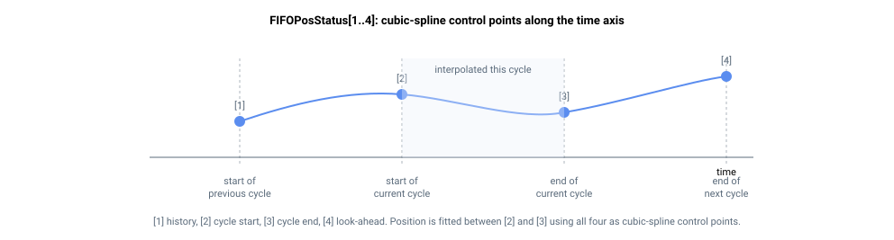

# FIFOPosStatus

报告 FIFO 位置跟踪队列状态的只读数组。

## 概述

`FIFOPosStatus` 是一个只读数组，报告位置跟踪子系统的内部状态：正在使用的插值控制点、周期计数器、队列占用情况以及运动/限位状态。当 [FIFOPosFIFOEn](FIFOPosFIFOEn.md) 使能位置跟踪时，可用它监控由 [FIFOPosPush](FIFOPosPush.md) 填充的队列。该数组为只读，不保存至闪存。

数组索引从 1 开始。

## 工作原理

每个元素报告位置跟踪状态的一项内容：

| 索引 | 报告内容 | 说明 |
|-------|---------|-------|
| 1 | 上一周期起始目标 | 三次样条插值使用的控制点。 |
| 2 | 当前周期起始目标 | 当前周期插值的起始位置。 |
| 3 | 当前周期终止目标 | 当前周期插值的终止位置。 |
| 4 | 下一周期终止目标 | 三次样条插值使用的前瞻控制点。 |
| 5 | 周期计数器 | 运动开始后已完成的周期数。 |
| 6 | 周期内采样计数器 | 当前周期内的采样索引，从 0 到周期长度减一（参见 [FIFOPosCycle](FIFOPosCycle.md)）。 |
| 7 | 队列空闲条目数 | 空槽数量。队列为空时等于完整队列深度；队列已满时为 0（进一步的压入将被拒绝）。 |
| 8 | 最旧条目索引 | 下一个待消耗目标的内部循环缓冲区索引；队列为空时为 -1。 |
| 9 | 最新条目索引 | 最近压入目标的内部循环缓冲区索引；队列为空时为 -1。 |
| 10 | 运动/限位状态 | 参见下表。 |
| 11–12 | 保留 | |

等待播放的已排队目标数量为队列深度减去索引 7 处的空闲计数。



### 运动/限位状态（索引 10）

| 值 | 含义 |
|-------|---------|
| 0 | 无运动。 |
| 1 | 正常运动（跟踪中）。 |
| 2 | 因到达正向限位开关而减速。 |
| 3 | 已停止并在正向限位开关处等待（正向运动被阻止）。 |
| 4 | 因到达反向限位开关而减速。 |
| 5 | 已停止并在反向限位开关处等待（反向运动被阻止）。 |
| 6 | 因停止请求而减速至停止。 |
| 7 | 因受控停止请求而减速至停止。 |
| 8 | 参考值被正向软件位置限位钳位。 |
| 9 | 参考值被反向软件位置限位钳位。 |

## 示例

```text
AFIFOPosStatus[7]   ; free slots in the queue (queue depth = empty)
AFIFOPosStatus[10]  ; motion / limits state
```

## 另请参阅

- [FIFOPosPush](FIFOPosPush.md) — 压入位置目标
- [FIFOPosClear](FIFOPosClear.md) — 清空队列
- [FIFOPosFIFOEn](FIFOPosFIFOEn.md) — 使能队列流式传输
- [FIFOPosCycle](FIFOPosCycle.md) — 每目标采样数
- [MotionStat](../05-motion-status/MotionStat.md) — 轴整体运动状态
