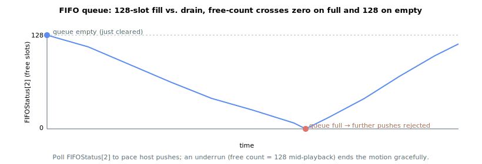

# FIFOStatus

Read-only array reporting the status of the FIFO motion queue.

## Overview

`FIFOStatus` is a read-only array that reports the current state of the FIFO motion queue: where the playback pointer sits, how many slots are free, and the state of the segment being played. Use it to pace the host pushes (so the queue never underruns) and to monitor playback during FIFO motion. The array has 9 elements; index 0 is reserved so that communication indexes start at 1.

See [FIFOType](FIFOType.md) for a full description of FIFO motion mode and all related keywords.

## How it works

The elements report the following:

| Index | Reports |
|----|----|
| 1 | Playback pointer — the queue index of the entry currently being played back. |
| 2 | Number of **free** entries in the queue. The queue holds 128 usable entries, so a freshly cleared queue reports 128; each push decrements this and each consumed entry increments it. The queue is **full** when this reaches 0 (further pushes are rejected) and **empty** when it reaches 128. |
| 3 | Count-down for the active segment — the number of control samples remaining before the current segment ends and the next entry is taken. |
| 4 | Velocity reference of the segment currently being played. |
| 5 | Acceleration reference of the segment currently being played (0 for linear segments). |
| 6–8 | Reserved. |

### Deriving depth, empty and full

The queue holds 128 usable entries, so the number of queued (used) entries is `128 - FIFOStatus[2]`:

- **Empty:** `FIFOStatus[2] = 128` — playback ends here (underrun) if no new segment is pushed.
- **Full:** `FIFOStatus[2] = 0` — the next `FIFOPush*` is rejected with an error.

Poll element 2 while streaming to keep at least one segment queued ahead of the one being played.



## Examples

```text
AFIFOStatus[2]      ; read the number of free entries (128 = empty, 0 = full)
AFIFOStatus[3]      ; read the control samples remaining in the active segment
```

## See also

- [FIFOType](FIFOType.md) — full FIFO mode description
- [FIFOValue](FIFOValue.md) — value of each FIFO entry
- [FIFOClear](FIFOClear.md) — empty the queue (resets free count to 128)
- [StopFIFO](StopFIFO.md) — end the current segment as the last one
