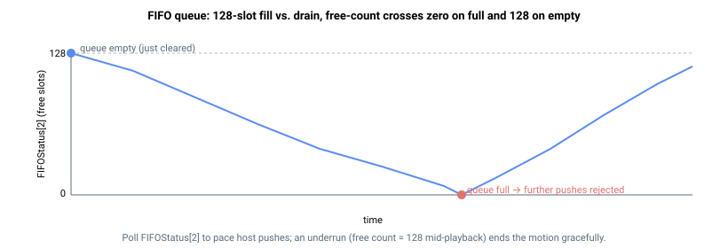

# FIFOStatus

只读数组，报告 FIFO 运动队列的状态。

## 概述

`FIFOStatus` 是一个只读数组，报告 FIFO 运动队列的当前状态：回放指针所在位置、空闲槽位数量，以及当前播放片段的状态。使用该数组可控制上位机推送节奏（确保队列不发生下溢），并在 FIFO 运动期间监控回放状态。数组共有 9 个元素；索引 0 保留，通信索引从 1 开始。

完整的 FIFO 运动模式说明及所有相关关键字，请参阅 [FIFOType](FIFOType.md)。

## 工作原理

各元素报告内容如下：

| 索引 | 报告内容 |
|----|----|
| 1 | 回放指针——队列中当前正在回放的条目索引。 |
| 2 | 队列中的**空闲**条目数。队列最多可容纳 128 个可用条目，因此刚清空的队列报告 128；每次推送减 1，每个已消耗条目加 1。该值降至 0 时队列**满**（后续推送将被拒绝），升至 128 时队列**空**。 |
| 3 | 当前活动片段的倒计时——当前片段结束并取下一条目前剩余的控制周期采样数。 |
| 4 | 当前正在播放的片段的速度参考值。 |
| 5 | 当前正在播放的片段的加速度参考值（线性片段为 0）。 |
| 6–8 | 保留。 |

### 推算深度、空与满

队列可容纳 128 个可用条目，因此已排队（已用）条目数为 `128 - FIFOStatus[2]`：

- **空：** `FIFOStatus[2] = 128`——若无新片段推入，回放将在此结束（下溢）。
- **满：** `FIFOStatus[2] = 0`——下一次 `FIFOPush*` 将被拒绝并返回错误。

在流式传输期间，轮询元素 2，确保当前播放片段前方至少有一个片段已排队。



## 示例

```text
AFIFOStatus[2]      ; read the number of free entries (128 = empty, 0 = full)
AFIFOStatus[3]      ; read the control samples remaining in the active segment
```

## 另请参阅

- [FIFOType](FIFOType.md) — FIFO 模式完整说明
- [FIFOValue](FIFOValue.md) — 每条 FIFO 条目的数据值
- [FIFOClear](FIFOClear.md) — 清空队列（将空闲计数重置为 128）
- [StopFIFO](StopFIFO.md) — 将当前片段设为最后一个片段后结束
