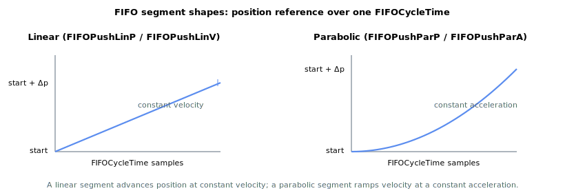
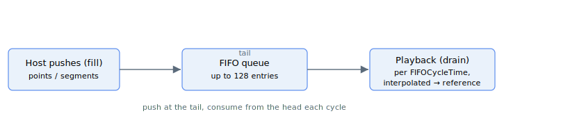

# FIFOType

Read-only array reporting the type of each entry stored in the FIFO motion queue.

## Overview

`FIFOType` is the hub page for FIFO (First In, First Out) motion mode. It reports the entry type of each element currently held in the queue and works together with [FIFOValue](FIFOValue.md), which carries the matching data value for each entry.

FIFO is a streaming motion mode: the host fills a queue of short motion segments, and the controller plays them back one after another, interpolating a position reference across each segment at the control-loop rate. Segments can be pushed to the queue at any time — before the motion starts or while it is running — provided the queue is not full. If the queue is full, the push is rejected with an error.

The motion is built from **linear** (constant-velocity) and **parabolic** (constant-acceleration) segments. If the controller reaches and completes the last segment in the queue and no new segment has been pushed, the motion ends automatically (an *underrun*). The motion can also be ended by [Stop](../04-motion-command/Stop.md), which decelerates the axis to zero speed, or by [StopFIFO](StopFIFO.md), which lets the active segment finish and then ends the motion.

This page describes FIFO motion mode and all related keywords: [FIFOValue](FIFOValue.md), [FIFOStatus](FIFOStatus.md), [FIFOCycleTime](FIFOCycleTime.md), [FIFOPushCycle](FIFOPushCycle.md), [FIFOPushLinP](FIFOPushLinP.md), [FIFOPushLinV](FIFOPushLinV.md), [FIFOPushParP](FIFOPushParP.md), [FIFOPushParA](FIFOPushParA.md), [FIFORemove](FIFORemove.md), [FIFOClear](FIFOClear.md), and [StopFIFO](StopFIFO.md).

## How it works

The queue holds up to **128 usable entries** (the array has 129 elements; index 0 is reserved so that communication indexes start at 1). Each entry has a **type** (reported here) and a **value** (reported by [FIFOValue](FIFOValue.md)). Most entries are motion segments, but one entry type instead carries a new cycle time, so the maximum number of motion segments depends on how many cycle-time entries are interleaved.

### Entry types

`FIFOType` reports one of the following codes for each entry. The value range is 0–5.

| Code | Entry type | Meaning | Pushed by |
|----|----|----|----|
| 0 | Empty | Unused slot (no entry stored). | — |
| 1 | Linear by position delta | Constant-velocity segment defined by a position delta to travel during the segment. | [FIFOPushLinP](FIFOPushLinP.md) |
| 2 | Linear by velocity | Constant-velocity segment defined by the velocity reference held during the segment. | [FIFOPushLinV](FIFOPushLinV.md) |
| 3 | Parabolic by position delta | Constant-acceleration segment defined by a position delta to travel during the segment. | [FIFOPushParP](FIFOPushParP.md) |
| 4 | Parabolic by acceleration | Constant-acceleration segment defined by the acceleration reference held during the segment. | [FIFOPushParA](FIFOPushParA.md) |
| 5 | Cycle time | Not a motion segment: sets the segment duration ([FIFOCycleTime](FIFOCycleTime.md)) applied to the segments that follow it in the queue. | [FIFOPushCycle](FIFOPushCycle.md) |

### The fill → playback → drain pipeline

Each motion segment lasts a fixed number of control-loop samples, given by [FIFOCycleTime](FIFOCycleTime.md). During those samples the controller advances the position reference every control cycle:

- A **linear** (velocity-type) segment holds a constant velocity, so the position reference advances by a fixed step each sample. For a *position-delta* segment the per-sample step is the delta divided by the cycle time, so the requested delta is reached exactly at the end of the segment, starting from the previous position reference.
- A **parabolic** (acceleration-type) segment holds a constant acceleration: the velocity ramps linearly and the position follows a parabola. The segment begins from the current profiler velocity. For a *position-delta* segment the acceleration is computed so the requested delta is reached at the end of the segment.



When a segment ends, the controller frees that slot, advances to the next entry, and pulls entries until it reaches the next motion segment. A cycle-time entry (type 5) is consumed in passing: it updates the segment duration for the segments that follow and does not itself produce motion. Because cycle time is only applied between segments, it can be changed throughout the sequence to vary segment lengths.



### Underrun behavior

If the controller finishes the last available segment and the queue is empty, the motion ends gracefully at that point (the in-motion status is cleared). To keep a continuous motion running, the host must push new segments fast enough that at least one segment is always queued ahead of the one being played. Monitor the queue depth with [FIFOStatus](FIFOStatus.md) to pace the pushes.

### Limits

- A parabolic-by-acceleration segment must request an acceleration at or above the smallest value the controller can resolve (one position unit per second, per second). A push below that is rejected with an error, and a queued segment that resolves to too small an acceleration also faults the motion.
- This mode performs no jerk smoothing: a [Stop](../04-motion-command/Stop.md) decelerates linearly to zero and ends immediately on reaching zero speed.

## Examples

```text
AFIFOType[1]        ; read the type of the first entry currently in the queue
```

A typical fill sequence (axis A) sets a cycle time, then queues a few segments before starting motion:

```text
AFIFOPushCycle=16   ; segments that follow last 16 control samples each
AFIFOPushLinP=10000 ; constant-velocity segment, travel 10000 units
AFIFOPushParP=20000 ; parabolic segment, travel 20000 units
```

### Walk-through: stream points to keep motion running without underrun

Queue a few segments, start motion, then keep pushing while monitoring [FIFOStatus](FIFOStatus.md) so the queue never empties. The cycle-time entry sets how long each following segment lasts; change it between segments to vary the playback rate.

```text
; --- 1) Start from a clean queue ---
AFIFOClear=0                  ; empty the queue (free count returns to 128)

; --- 2) Prime the queue: cycle time + three motion segments ---
AFIFOPushCycle=20             ; each following segment lasts 20 control samples
AFIFOPushLinP=10000           ; constant-velocity, travel 10000 units
AFIFOPushLinP=10000           ; same
AFIFOPushParP=20000           ; parabolic, travel 20000 units

; --- 3) Arm FIFO motion (FIFOType is the hub for FIFO mode) ---
AMotionMode=9                 ; 9 = FIFO segment motion
ABegin                        ; controller starts draining the queue at FIFOCycleTime

; --- 4) Streaming loop: keep at least one closed segment queued ahead ---
;     read free count, push if there is room (full = 0, empty = 128)
AFIFOStatus[2]                ; free entries -- pace pushes against this
AFIFOPushLinP=10000           ; push next segment while there is room

; --- 5) End cleanly ---
AStopFIFO=0                   ; play the active segment to completion, then end
```

The motion ends gracefully (underrun) if the engine reaches the last queued segment with nothing behind it. To stop earlier with a deceleration ramp, use [Stop](../04-motion-command/Stop.md) instead of `StopFIFO`. The companion FIFO-position-tracking subsystem (see [FIFOPosType](FIFOPosType.md), [FIFOPosPush](FIFOPosPush.md), [FIFOPosStatus](FIFOPosStatus.md)) uses the same fill / drain pattern but streams **absolute target positions** under `MotionMode = 19`.

## See also

- [FIFOValue](FIFOValue.md) — value paired with each FIFO entry type
- [FIFOStatus](FIFOStatus.md) — queue depth, free/used entries, empty/full state
- [FIFOCycleTime](FIFOCycleTime.md) — segment duration in control samples
- [FIFOPushLinP](FIFOPushLinP.md), [FIFOPushLinV](FIFOPushLinV.md) — push linear segments
- [FIFOPushParP](FIFOPushParP.md), [FIFOPushParA](FIFOPushParA.md) — push parabolic segments
- [FIFOPushCycle](FIFOPushCycle.md) — push a cycle-time entry
- [StopFIFO](StopFIFO.md) — end the current segment as the last one
- [Stop](../04-motion-command/Stop.md) — decelerate to zero speed
