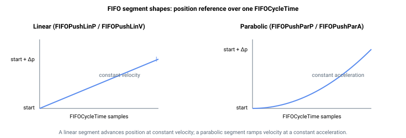

# FIFOType

只读数组，报告 FIFO 运动队列中每条条目的类型。

## 概述

`FIFOType` 是 FIFO（先进先出）运动模式的核心页面。它报告队列中每个元素当前存储的条目类型，与 [FIFOValue](FIFOValue.md) 配合使用——后者携带每条条目对应的数据值。

FIFO 是一种流式运动模式：上位机向队列中填充一系列短运动片段，控制器按顺序逐一回放，在每个片段的控制环频率上插值生成位置参考值。只要队列未满，可在任意时刻向队列推送片段——无论运动是否已开始。若队列已满，推送将被拒绝并返回错误。

运动由**线性**（匀速）和**抛物线**（匀加速）片段构成。若控制器完成队列中最后一个片段后无新片段推入，运动将自动结束（*下溢*）。运动也可由 [Stop](../04-motion-command/Stop.md) 结束（使轴减速至零），或由 [StopFIFO](StopFIFO.md) 结束（让当前活动片段执行完毕后结束运动）。

本页介绍 FIFO 运动模式及所有相关关键字：[FIFOValue](FIFOValue.md)、[FIFOStatus](FIFOStatus.md)、[FIFOCycleTime](FIFOCycleTime.md)、[FIFOPushCycle](FIFOPushCycle.md)、[FIFOPushLinP](FIFOPushLinP.md)、[FIFOPushLinV](FIFOPushLinV.md)、[FIFOPushParP](FIFOPushParP.md)、[FIFOPushParA](FIFOPushParA.md)、[FIFORemove](FIFORemove.md)、[FIFOClear](FIFOClear.md) 及 [StopFIFO](StopFIFO.md)。

## 工作原理

队列最多可容纳 **128 个可用条目**（数组共有 129 个元素；索引 0 保留，通信索引从 1 开始）。每条条目包含一个**类型**（由本关键字报告）和一个**值**（由 [FIFOValue](FIFOValue.md) 报告）。大多数条目是运动片段，但有一种条目类型用于设置新的周期时间，因此实际可用的运动片段数量取决于穿插的周期时间条目数。

通过将 `MotionMode = 9` 并发出 [Begin](../04-motion-command/Begin.md) 命令来启动 FIFO 运动。若队列为空，`Begin` 将被拒绝并返回错误；若队列中第一条条目不是周期时间条目（类型 5），同样被拒绝——在第一个运动片段播放前，必须先确定片段时长。请先推送一条 [FIFOPushCycle](FIFOPushCycle.md) 条目。

### 条目类型

`FIFOType` 为每条条目报告以下代码之一，值范围为 0–5。

| 代码 | 条目类型 | 含义 | 推送方式 |
|----|----|----|----|
| 0 | 空 | 未使用槽位（无条目存储）。 | — |
| 1 | 按位置增量的线性片段 | 匀速片段，以片段期间行进的位置增量定义。 | [FIFOPushLinP](FIFOPushLinP.md) |
| 2 | 按速度的线性片段 | 匀速片段，以片段期间保持的速度参考值定义。 | [FIFOPushLinV](FIFOPushLinV.md) |
| 3 | 按位置增量的抛物线片段 | 匀加速片段，以片段期间行进的位置增量定义。 | [FIFOPushParP](FIFOPushParP.md) |
| 4 | 按加速度的抛物线片段 | 匀加速片段，以片段期间保持的加速度参考值定义。 | [FIFOPushParA](FIFOPushParA.md) |
| 5 | 周期时间 | 非运动片段：设置片段时长（[FIFOCycleTime](FIFOCycleTime.md)），应用于队列中其后的所有片段。 | [FIFOPushCycle](FIFOPushCycle.md) |

### 填充 → 回放 → 排空流水线

每个运动片段持续固定数量的控制环采样周期，由 [FIFOCycleTime](FIFOCycleTime.md) 指定。在这些采样周期内，控制器每个控制周期推进一次位置参考值：

- **线性**（速度型）片段保持匀速，因此位置参考值每采样周期以固定步长推进。对于*位置增量*片段，每采样步长等于增量除以周期时间，从而在片段结束时精确到达请求的增量（从前一位置参考值出发）。
- **抛物线**（加速度型）片段保持匀加速：速度线性变化，位置按抛物线轨迹运动。片段从当前规划器速度开始。对于*位置增量*片段，加速度的计算使得在片段结束时精确到达请求的增量。



当一个片段结束后，控制器释放该槽位，推进至下一条条目，并持续读取条目直到遇到下一个运动片段。周期时间条目（类型 5）在经过时被消耗：它更新其后片段的时长，本身不产生运动。由于周期时间仅在片段之间生效，可在序列中随时修改以改变片段时长。


### 下溢行为

若控制器完成最后一个可用片段而队列为空，运动将在该点平稳结束（运动中状态被清除）。若要保持连续运动，上位机必须以足够快的速度推送新片段，确保当前播放片段前方至少有一个片段已排队。使用 [FIFOStatus](FIFOStatus.md) 监控队列深度以控制推送节奏。

### 限制

- 按加速度的抛物线片段所请求的加速度幅值，必须至少为一个控制采样频率（标准 16 384 Hz 控制频率下为 16 384 counts/s²）——这是每采样速度步长能分辨的最小加速度。低于该值的推送将被拒绝并返回错误，已排队但解析后加速度过小的片段同样会导致运动故障。
- 该模式不执行急动平滑：[Stop](../04-motion-command/Stop.md) 将线性减速至零，并在速度达到零时立即结束。

## 示例

```text
AFIFOType[1]        ; read the type of the first entry currently in the queue
```

典型的填充序列（轴 A）先设置周期时间，再在启动运动前排入若干片段：

```text
AFIFOPushCycle=16   ; segments that follow last 16 control samples each
AFIFOPushLinP=10000 ; constant-velocity segment, travel 10000 units
AFIFOPushParP=20000 ; parabolic segment, travel 20000 units
```

### 演示：流式推送以保持运动不发生下溢

排入若干片段后启动运动，然后持续推送同时监控 [FIFOStatus](FIFOStatus.md)，确保队列不变空。周期时间条目设置其后每个片段的持续时长；可在片段之间修改以变换回放速率。

```text
; --- 1) Start from a clean queue ---
AFIFOClear                    ; empty the queue (free count returns to 128)

; --- 2) Prime the queue: cycle time + three motion segments ---
AFIFOPushCycle=20             ; each following segment lasts 20 control samples
AFIFOPushLinP=10000           ; constant-velocity, travel 10000 units
AFIFOPushLinP=10000           ; same
AFIFOPushParP=20000           ; parabolic, travel 20000 units

; --- 3) Arm FIFO motion (FIFOType is the hub for FIFO mode) ---
AMotionMode=9                 ; 9 = FIFO segment motion
ABegin                        ; controller starts draining the queue at FIFOCycleTime

; --- 4) Streaming loop: keep at least one closed segment queued ahead ---
;     read free count, push if there is room (full = 0, empty = 128)
AFIFOStatus[2]                ; free entries -- pace pushes against this
AFIFOPushLinP=10000           ; push next segment while there is room

; --- 5) End cleanly ---
AStopFIFO                     ; play the active segment to completion, then end
```

若引擎到达最后排队的片段且其后无新片段，运动将平稳结束（下溢）。若需更早结束并进行减速斜坡，请使用 [Stop](../04-motion-command/Stop.md) 代替 `StopFIFO`。配套的 FIFO 位置跟踪子系统（参见 [FIFOPosType](FIFOPosType.md)、[FIFOPosPush](FIFOPosPush.md)、[FIFOPosStatus](FIFOPosStatus.md)）采用相同的填充/排空模式，但在 `MotionMode = 19` 下流式传输**绝对目标位置**。

## 另请参阅

- [FIFOValue](FIFOValue.md) — 与每条 FIFO 条目类型配对的数据值
- [FIFOStatus](FIFOStatus.md) — 队列深度、空闲/已用条目数、空/满状态
- [FIFOCycleTime](FIFOCycleTime.md) — 以控制周期采样数表示的片段时长
- [FIFOPushLinP](FIFOPushLinP.md)、[FIFOPushLinV](FIFOPushLinV.md) — 推送线性片段
- [FIFOPushParP](FIFOPushParP.md)、[FIFOPushParA](FIFOPushParA.md) — 推送抛物线片段
- [FIFOPushCycle](FIFOPushCycle.md) — 推送周期时间条目
- [StopFIFO](StopFIFO.md) — 将当前片段设为最后一个片段后结束
- [Stop](../04-motion-command/Stop.md) — 减速至零速度
