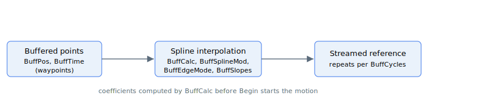

# Motion mode – Spline buffer

Spline buffer motion mode ([MotionMode](../02-motion-configuration/MotionMode.md) = 18) produces smooth interpolated motion by fitting a spline through a set of user-supplied waypoints. The waypoint positions are loaded into [BuffPos](BuffPos.md) and their per-segment durations into [BuffTime](BuffTime.md), then [BuffCalc](BuffCalc.md) pre-computes the spline coefficients before a `Begin` command starts the motion.

The shape of the curve is controlled by [BuffSplineMod](BuffSplineMod.md) (interpolation mode), [BuffEdgeMode](BuffEdgeMode.md) (start/end boundary conditions), and [BuffSlopes](BuffSlopes.md) (edge velocity slopes). [BuffCycles](BuffCycles.md) sets how many times the trajectory repeats, and [BuffStatus](BuffStatus.md) reports the running state. A motion can be stopped with [StopBuff](../04-motion-command/StopBuff.md).

## Keyword summary

| Keyword | Role |
|---|---|
| [BuffPos](BuffPos.md) | Waypoint positions (one per knot, axis-specific) |
| [BuffTime](BuffTime.md) | Cumulative time stamps in servo samples (shared time base) |
| [BuffSplineMod](BuffSplineMod.md) | Curve type: 1 = linear, 2 = parabolic, 3 = cubic (default) |
| [BuffEdgeMode](BuffEdgeMode.md) | Boundary conditions: 0 = specified slope, 1 = natural, 2 = continuous repeat |
| [BuffSlopes](BuffSlopes.md) | Edge velocity slope used when `BuffEdgeMode = 0` |
| [BuffCycles](BuffCycles.md) | Number of times the trajectory replays |
| [BuffCalc](BuffCalc.md) | Pre-computes the spline before `Begin` |
| [BuffStatus](BuffStatus.md) | Live group and playback state |
| [StopBuff](../04-motion-command/StopBuff.md) | Ends playback at the next cycle boundary |

## Product availability

The waypoint buffer ([BuffPos](BuffPos.md) / [BuffTime](BuffTime.md)) is **product-dependent**:

| Build | Usable waypoints |
|---|---|
| Standalone drives (AGD series) | 5 — the spline-buffer feature is effectively not usable on these products |
| Central-i AGM800 | 50 or 10 000, depending on the hardware variant |

The keyword frontmatter shows the largest array size; on smaller builds the same keyword exists but its usable range is reduced.
