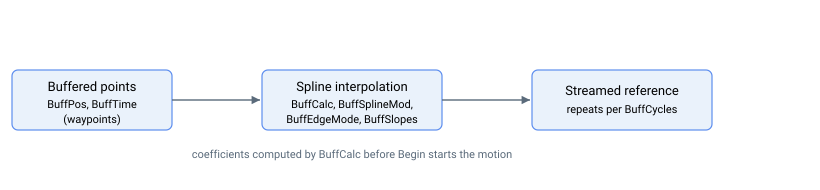

# 运动模式——样条缓冲区

样条缓冲区运动模式（[MotionMode](../02-motion-configuration/MotionMode.md) = 18）通过对一组用户提供的路径点拟合样条曲线，生成平滑的插值运动。路径点位置加载至 [BuffPos](BuffPos.md)，各片段时长加载至 [BuffTime](BuffTime.md)，然后由 [BuffCalc](BuffCalc.md) 在 `Begin` 命令启动运动前预先计算样条系数。

曲线形状由 [BuffSplineMod](BuffSplineMod.md)（插值模式）、[BuffEdgeMode](BuffEdgeMode.md)（起止端边界条件）和 [BuffSlopes](BuffSlopes.md)（边界速度斜率）控制。[BuffCycles](BuffCycles.md) 设置轨迹重复次数，[BuffStatus](BuffStatus.md) 报告运行状态。可使用 [StopBuff](../04-motion-command/StopBuff.md) 停止运动。

## 关键字汇总

| 关键字 | 作用 |
|---|---|
| [BuffPos](BuffPos.md) | 路径点位置（每个节点一个，轴专属） |
| [BuffTime](BuffTime.md) | 以伺服采样数表示的累计时间戳（共享时间基准） |
| [BuffSplineMod](BuffSplineMod.md) | 曲线类型：1 = 线性，2 = 抛物线，3 = 三次（默认） |
| [BuffEdgeMode](BuffEdgeMode.md) | 边界条件：0 = 指定斜率，1 = 自然，2 = 连续重复 |
| [BuffSlopes](BuffSlopes.md) | `BuffEdgeMode = 0` 时使用的边界速度斜率 |
| [BuffCycles](BuffCycles.md) | 轨迹重放次数 |
| [BuffCalc](BuffCalc.md) | 在 `Begin` 前预先计算样条 |
| [BuffStatus](BuffStatus.md) | 实时组及回放状态 |
| [StopBuff](../04-motion-command/StopBuff.md) | 在下一个周期边界结束回放 |

## 产品适用性

路径点缓冲区（[BuffPos](BuffPos.md) / [BuffTime](BuffTime.md)）**因产品而异**：

| 型号 | 可用路径点数 |
|---|---|
| 独立驱动器（AGD 系列） | 5——样条缓冲区功能在这些产品上实际不可用 |
| Central-i AGM800 | 50 或 10 000，取决于硬件版本 |

关键字前端数据显示最大数组尺寸；在较小型号上，相同关键字存在但可用范围有所缩减。
