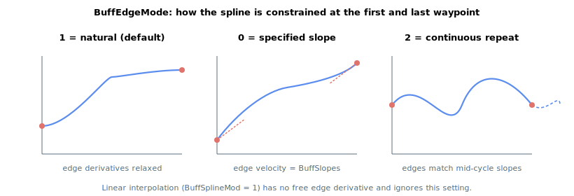

# BuffEdgeMode

Selects the boundary condition at the start and end of the spline buffer trajectory.

## Overview

`BuffEdgeMode` selects how the spline is constrained at the **first and last waypoint** of the trajectory. These end conditions fix the otherwise-free derivatives at the edges of a parabolic or cubic fit, which determines the entry and exit velocity of the move and whether successive repeats join smoothly. The range is 0 to 2 with a default of 1 (natural). Unlike the curve type ([BuffSplineMod](BuffSplineMod.md), taken from the primary axis) and the time base ([BuffTime](BuffTime.md), taken from the primary axis), the edge condition is read **per member axis**: when [BuffCalc](BuffCalc.md) fits each member's curve it uses that member's own `BuffEdgeMode` (and its own [BuffSlopes](BuffSlopes.md)). Members of one spline-buffer group can therefore carry different edge conditions while sharing the same curve type and time base. `BuffEdgeMode` is saved to flash and can be changed at any time, but the change only takes effect after [BuffCalc](BuffCalc.md) is run again.

## How it works

The boundary condition matters only for the parabolic and cubic fits ([BuffSplineMod](BuffSplineMod.md) = 2 or 3); linear interpolation has no free edge derivative and ignores this setting.

| Value | Meaning |
|---|---|
| 0 | Specified-slope edge. The velocity at the start (and end) is forced to the slope supplied in [BuffSlopes](BuffSlopes.md). Use this to enter and leave the trajectory at a defined speed (for example to blend into another move). |
| 1 | Natural edge (default). The free edge derivative is set to zero — for a cubic fit the second derivative (curvature) is zero at both ends, and for a parabolic fit the initial slope is zero — giving a relaxed, low-stress start and finish. [BuffSlopes](BuffSlopes.md) is not used. |
| 2 | Multi-cycle (continuous repeat). The controller treats the trajectory as one period of a repeating motion: it virtually extends the data by one cycle before and one cycle after, fits the spline across the extension, and keeps only the middle cycle's coefficients. The result is that the edge derivatives match what they would be in the *middle* of a continuous repetition, so consecutive cycles ([BuffCycles](BuffCycles.md) > 1) join without a velocity or curvature step. |

In all modes the trajectory positions remain relative to the start point; only the edge derivatives change. Mode 2 is the right choice for smooth cyclic motion; mode 1 for a self-contained move that starts and ends at rest; mode 0 when the entry/exit speed must be set explicitly.



## Examples

```text
ABuffEdgeMode=0      ; enter and leave at the slope set in BuffSlopes
ABuffEdgeMode=1      ; natural edges (default), relaxed start and finish
ABuffEdgeMode=2      ; continuous-repeat edges for smooth multi-cycle motion
```

## See also

- [BuffSlopes](BuffSlopes.md) — edge slope applied when `BuffEdgeMode` = 0
- [BuffSplineMod](BuffSplineMod.md) — curve type the edge condition applies to
- [BuffCycles](BuffCycles.md) — repeat count that benefits from mode 2 (continuous repeat)
- [BuffCalc](BuffCalc.md) — applies the edge condition when fitting the spline
