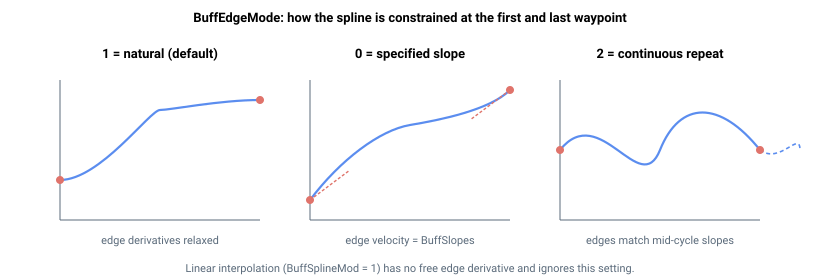

# BuffEdgeMode

选择样条缓冲轨迹起始端和末端的边界条件。

## 概述

`BuffEdgeMode` 选择样条在轨迹**第一个和最后一个路径点**处的约束方式。这些端点条件固定了抛物线或三次曲线拟合时边缘处原本自由的导数，从而决定运动的进入和退出速度，以及连续重复时各周期能否平滑衔接。范围为 0 到 2，默认值为 1（自然边界）。与曲线类型（[BuffSplineMod](BuffSplineMod.md)，取自主轴）和时间基准（[BuffTime](BuffTime.md)，取自主轴）不同，边界条件是**按成员轴**读取的：[BuffCalc](BuffCalc.md) 拟合每个成员轴的曲线时，使用该成员轴自身的 `BuffEdgeMode`（以及其自身的 [BuffSlopes](BuffSlopes.md)）。因此，同一样条缓冲组的各成员轴可以使用不同的边界条件，同时共享相同的曲线类型和时间基准。`BuffEdgeMode` 保存至闪存，可随时修改，但修改只有在重新运行 [BuffCalc](BuffCalc.md) 后才会生效。

## 工作原理

边界条件仅对抛物线和三次曲线拟合（[BuffSplineMod](BuffSplineMod.md) = 2 或 3）有效；线性插值没有自由边缘导数，忽略此设置。

| 值 | 含义 |
|---|---|
| 0 | 指定斜率边界。边缘速度被强制为 [BuffSlopes](BuffSlopes.md) 中提供的斜率：对于抛物线拟合，这设置第一个路径点处的初始速度；对于三次曲线拟合，同时约束进入和退出导数（即钳位边界条件）。用于以指定速度进入（以及对于三次曲线，离开）轨迹（例如，与另一段运动平滑衔接）。 |
| 1 | 自然边界（默认）。自由边缘导数设为零——对于三次曲线拟合，两端的二阶导数（曲率）为零；对于抛物线拟合，初始斜率为零——从而实现轻松、低应力的起止。不使用 [BuffSlopes](BuffSlopes.md)。 |
| 2 | 多周期（连续重复）边界。控制器将轨迹视为重复运动的一个周期：在轨迹前后各虚拟延伸一个周期，跨扩展区域拟合样条，仅保留中间周期的系数。结果是边缘导数与连续重复运动*中间部分*的导数一致，使得连续周期（[BuffCycles](BuffCycles.md) > 1）衔接时不出现速度或曲率突变。 |

所有模式下轨迹位置均相对于起始点；仅边缘导数发生变化。模式 2 适用于平滑循环运动；模式 1 适用于从静止开始并在静止结束的独立运动；模式 0 适用于需要明确指定进入/退出速度的场合。



## 示例

```text
ABuffEdgeMode=0      ; 以 BuffSlopes 中设定的斜率进入和离开
ABuffEdgeMode=1      ; 自然边界（默认），轻松起止
ABuffEdgeMode=2      ; 连续重复边界，用于平滑的多周期运动
```

## 另请参阅

- [BuffSlopes](BuffSlopes.md) — `BuffEdgeMode` = 0 时应用的边缘斜率
- [BuffSplineMod](BuffSplineMod.md) — 边界条件所应用的曲线类型
- [BuffCycles](BuffCycles.md) — 受益于模式 2（连续重复）的重复次数
- [BuffCalc](BuffCalc.md) — 拟合样条时应用边界条件
