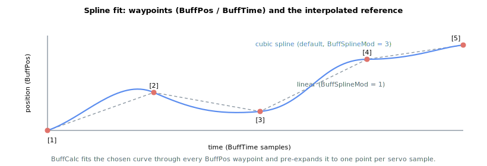

# BuffPos

Array of waypoint positions (user units) that define the spline buffer trajectory.

## Overview

`BuffPos` stores the waypoint positions, in user units, for the spline-buffer motion profile. Each entry is one knot of the trajectory; together with the per-segment durations in [BuffTime](BuffTime.md) (one entry per waypoint, sharing the same index), it defines the shape of the move. The controller fits a spline through these waypoints and plays it back as a smooth position reference. The arrays are turned into a ready-to-run trajectory by [BuffCalc](BuffCalc.md) before motion begins. `BuffPos` is not saved to flash and can be changed at any time, but a change does not take effect until [BuffCalc](BuffCalc.md) is run again.

## How it works

### Waypoints, indexing and the implicit origin

`BuffPos` is a paired array with [BuffTime](BuffTime.md): entry `[i]` is the commanded position at the time given by `BuffTime[i]`. Entries are used starting at index `[1]`; index `[0]` is not user-accessible. The list is terminated by the **first zero entry in [BuffTime](BuffTime.md)** — every waypoint before that terminator is part of the trajectory, so you do not need to clear old entries beyond the terminator.

Positions are interpreted as **relative to the position reference at the moment motion begins**. When the move starts, the controller captures the current reference as an origin and adds the buffered profile on top of it, so the first waypoint is effectively the offset from the start point rather than an absolute target. A waypoint of `0` therefore means "the start position".

### From waypoints to a position reference

[BuffCalc](BuffCalc.md) fits a spline (type chosen by [BuffSplineMod](BuffSplineMod.md), edges by [BuffEdgeMode](BuffEdgeMode.md)/[BuffSlopes](BuffSlopes.md)) through the waypoints and **pre-expands it into one interpolated point per servo sample**, stored internally. During motion the profiler does no curve math: each control cycle it simply reads the next pre-computed point, adds the captured origin, and feeds it to the position loop as [PosRef](../01-kinematics-status/PosRef.md). Because the whole curve is expanded ahead of time, the total number of stored samples per cycle equals the last [BuffTime](BuffTime.md) value, and that value is limited by the controller's internal capacity (see [BuffTime](BuffTime.md)).



For multi-axis spline moves the same time base ([BuffTime](BuffTime.md) of the primary axis) is shared by all member axes, while each member axis carries its own `BuffPos` waypoints — so all axes stay synchronized in time while tracing independent position profiles.

## Examples

```text
ABuffPos[1]=0        ; first waypoint (0 = the start position)
ABuffPos[2]=10000    ; second waypoint, reached at time ABuffTime[2]
ABuffPos[3]=10000    ; third waypoint (dwell at 10000)
```

## See also

- [BuffTime](BuffTime.md) — per-segment time stamps paired with these waypoints (zero entry terminates the list)
- [BuffCalc](BuffCalc.md) — fits the spline and expands it into the interpolated reference
- [BuffSplineMod](BuffSplineMod.md) — spline interpolation mode (linear / parabolic / cubic)
- [BuffEdgeMode](BuffEdgeMode.md) — start/end boundary condition
- [PosRef](../01-kinematics-status/PosRef.md) — position reference the expanded buffer feeds during playback
