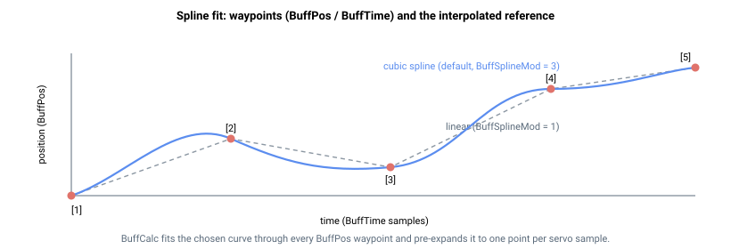

# BuffPos

定义样条缓冲轨迹的路径点位置数组（用户单位）。

## 概述

`BuffPos` 以用户单位存储样条缓冲运动曲线的路径点位置。每个条目是轨迹的一个节点；与 [BuffTime](BuffTime.md) 中的逐段时间（每个路径点一个条目，共享相同索引）共同定义运动的形状。控制器通过这些路径点拟合样条曲线，并将其作为平滑的位置参考进行回放。数组在运动开始前由 [BuffCalc](BuffCalc.md) 转换为可执行轨迹。`BuffPos` 不保存至闪存，可随时修改，但修改只有在重新运行 [BuffCalc](BuffCalc.md) 后才会生效。

> **产品限制。** `BuffPos` 的可用长度取决于产品（参见[章节概述](00-overview.md#product-availability)）：独立型 AGD 驱动器为 5 个条目（实际不可用），Central-i AGM800 根据硬件型号为 50 或 10 000 个条目。前置数据中的 `array_size` 显示最大容量。

## 工作原理

### 路径点、索引与隐式原点

`BuffPos` 与 [BuffTime](BuffTime.md) 是配对数组：条目 `[i]` 是在 `BuffTime[i]` 给定时刻的指令位置。条目从索引 `[1]` 开始使用；索引 `[0]` 不可由用户访问。列表以 [BuffTime](BuffTime.md) 中**第一个零值条目**作为终止符——该终止符之前的每个路径点均属于轨迹，因此无需清除终止符之后的旧条目。

位置被解释为**相对于运动开始时刻的位置参考**。运动开始时，控制器捕获当前参考作为原点，并在其基础上叠加缓冲曲线，因此第一个路径点实际上是相对于起始点的偏移量，而非绝对目标。路径点值为 `0` 表示"起始位置"。

[BuffCalc](BuffCalc.md) 内部在 `BuffPos[1]`/`BuffTime[1]` 之前预置一个隐藏的原点节点（时刻 0，位置 0）。因此样条的第一段从该缓冲原点延伸至第一个用户路径点，这就是为什么 *N* 个路径点产生 *N* 段插值，以及为什么 `BuffPos[1]` 是在 `BuffTime[1]` 时刻**到达**的位置，而非起始位置。缓冲曲线始终从 `0`（隐藏原点）开始；回放期间，控制器加上运动开始时捕获的位置参考，因此从 `0` 开始的曲线将从轴所在的任意位置出发。使用线性插值时，`BuffPos[1]=0` 在 `BuffTime[1]` 之前保持起始位置不变；使用抛物线或三次曲线拟合时，若边缘斜率非零，原点与第一个路径点之间的曲线可能偏离 `0`。

### 从路径点到位置参考

[BuffCalc](BuffCalc.md) 通过路径点拟合样条（曲线类型由 [BuffSplineMod](BuffSplineMod.md) 选择，边界条件由 [BuffEdgeMode](BuffEdgeMode.md)/[BuffSlopes](BuffSlopes.md) 设定），并将其**预扩展为每个伺服采样周期一个插值点**，存储于内部。运动过程中，规划器不进行曲线计算：每个控制周期仅读取下一个预计算点，加上捕获的原点，并将其作为 [PosRef](../01-kinematics-status/PosRef.md) 馈送至位置环。由于整条曲线提前扩展，每个周期存储的采样点总数等于最后一个 [BuffTime](BuffTime.md) 的值，该值受控制器内部容量限制（参见 [BuffTime](BuffTime.md)）。



对于多轴样条运动，所有成员轴共享相同的时间基准（主轴的 [BuffTime](BuffTime.md)），而每个成员轴携带各自的 `BuffPos` 路径点——从而使所有轴在时间上保持同步，同时跟踪独立的位置曲线。

### 段多项式

路径点 `i-1` 到路径点 `i` 之间的每段是关于*局部采样偏移* `k` 的多项式，其中 `k` 从该段起始处（`k = 0` 对应路径点 `i-1`）计数伺服采样次数。[BuffCalc](BuffCalc.md) 每采样计算一次：

$$P_i(k) = a_i + b_i\,k + c_i\,k^2 + d_i\,k^3, \qquad k = 0,1,\dots,\big(\text{BuffTime}[i]-\text{BuffTime}[i-1]\big)-1$$

段的最后一个采样点（`k = BuffTime[i] - BuffTime[i-1]`）不在此处计算；它是下一段的 `k = 0` 采样点，因此相邻段在每个路径点处精确相交。常数项始终为该段的起始位置，`a_i = BuffPos[i-1]`；高阶系数 `b_i`（斜率）、`c_i`（曲率）和 `d_i` 由 [BuffSplineMod](BuffSplineMod.md) 和 [BuffEdgeMode](BuffEdgeMode.md)/[BuffSlopes](BuffSlopes.md) 确定。由于自变量为原始采样计数，[BuffTime](BuffTime.md) 的值直接用作多项式的时间轴，无需重新缩放。线性插值时 `c_i = d_i = 0`；抛物线模式时 `d_i = 0`；三次曲线模式使用全部四个系数。

## 示例

```text
ABuffPos[1]=0        ; 第一个路径点（0 = 起始位置）
ABuffPos[2]=10000    ; 第二个路径点，在 ABuffTime[2] 时刻到达
ABuffPos[3]=10000    ; 第三个路径点（在 10000 处停留）
```

## 另请参阅

- [BuffTime](BuffTime.md) — 与路径点配对的逐段时间戳（零值条目终止列表）
- [BuffCalc](BuffCalc.md) — 拟合样条并将其扩展为插值参考
- [BuffSplineMod](BuffSplineMod.md) — 样条插值模式（线性/抛物线/三次）
- [BuffEdgeMode](BuffEdgeMode.md) — 起始/末端边界条件
- [PosRef](../01-kinematics-status/PosRef.md) — 回放期间扩展缓冲所馈送的位置参考
