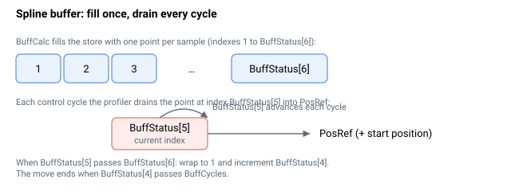

# BuffStatus

报告样条缓冲运动模式状态的只读数组。

## 概述

`BuffStatus` 是一个只读的八元素数组（索引 `[1]` 到 `[8]`），描述样条缓冲组的**配置状态**及其**实时回放状态**。配置元素在 [BuffCalc](BuffCalc.md) 运行时填充；回放元素在运动进行期间每个控制周期更新一次。该数组在每个成员轴上均保持相同内容。不保存至闪存。

## 工作原理

### 元素布局

| 索引 | 含义 |
|---|---|
| [1] | 组成员信息（打包）。低 8 位保存**主轴编号**；高位以位掩码形式保存**成员轴集合**（第 *n* 位置 1 表示轴 *n* 是成员）。 |
| [2] | 该轴计算轨迹的峰值速度，单位为计数/秒。 |
| [3] | 该轴计算轨迹的峰值加速度，单位为计数/秒²。 |
| [4] | 当前正在回放的周期（1 = 第一个周期）。在每个周期边界处递增；当其将超过 [BuffCycles](BuffCycles.md) 时运动结束。 |
| [5] | 当前周期内正在输出的点的索引（1 = 第一个点）。每个控制周期递增一次，在周期边界处回绕至 1。 |
| [6] | 周期内最后一个点的索引——等于最后一个 [BuffTime](BuffTime.md) 时间戳，即一个周期内的插值采样数。 |
| [7] | 组的第一个成员轴（控制器用于驱动索引/周期记录的轴）。 |
| [8] | 周期边界标志：新周期第一个采样时为 1（第一个周期除外），否则为 0。内部用于捕获每周期原点并处理待执行的 [StopBuff](../04-motion-command/StopBuff.md)。 |

`[1]` 中的主轴是 [StopBuff](../04-motion-command/StopBuff.md) 的目标轴，`[2]`/`[3]` 允许在运行前检查运动的峰值速度和加速度是否超出驱动器限值。

### 缓冲区的填充与消耗

[BuffCalc](BuffCalc.md) 将从周期起始到最后一个 [BuffTime](BuffTime.md) 时间戳的每个伺服采样一个插值点**填充**至内部存储——元素 `[6]` 即为这些点的数量。运动过程中，规划器每个控制周期**消耗**一个点：每周期推进周期内索引 `[5]`，读取该点，加上捕获的起始位置，并将其作为 [PosRef](../01-kinematics-status/PosRef.md) 输出。当 `[5]` 超过 `[6]` 时，回绕至 1，周期计数器 `[4]` 递增，对下一个周期重新回放相同的存储点。



### 运动结束

当周期 `[4]` 超过 [BuffCycles](BuffCycles.md) 时，运动结束；若已请求 [StopBuff](../04-motion-command/StopBuff.md)，则在下一个周期边界处提前结束。若任何成员轴在运动方向上到达硬件行程限位（前向运动时到达前向限位，反向运动时到达反向限位），运动也立即结束，并将停止信号传播至组内所有成员轴。在样条缓冲模式下，控制器直接流式输出预计算点，因此没有单独的减速斜坡——轨迹形状已由边界条件（[BuffEdgeMode](BuffEdgeMode.md)）决定。回放期间，输出仍受软件位置限位钳位，因此超出限位的缓冲点将保持在限位处。

## 示例

```text
ABuffStatus[1]      ; 打包值：低字节 = 主轴，高位 = 成员集合
ABuffStatus[4]      ; 当前正在回放的周期
ABuffStatus[5]      ; 当前周期内的点索引
ABuffStatus[6]      ; 每周期点数（= 最后一个 BuffTime 值）
```

## 另请参阅

- [BuffCalc](BuffCalc.md) — 填充内部存储并写入配置元素
- [BuffCycles](BuffCycles.md) — 与周期索引 [4] 进行比较的重复次数
- [BuffTime](BuffTime.md) — 最后一个时间戳等于 [6] 中的每周期点数
- [PosRef](../01-kinematics-status/PosRef.md) — 由消耗的点所馈送的参考
- [StopBuff](../04-motion-command/StopBuff.md) — 在下一个周期边界处结束回放（以 [1] 中的主轴为目标）
