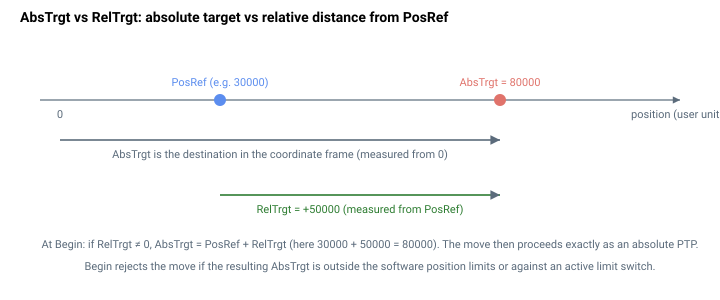

# AbsTrgt

下一次点到点运动的绝对目标位置（用户单位）。

## 概述

`AbsTrgt` 以用户单位设置绝对目标位置，轨迹规划器在点到点（PTP）运动中将位置参考驱动至该目标。当在 PTP 模式（[MotionMode](../02-motion-configuration/MotionMode.md) `= 1`）下发出 [Begin](../04-motion-command/Begin.md) 时，轴运动使参考 [PosRef](../01-kinematics-status/PosRef.md) 精确到达 `AbsTrgt`。它是 [RelTrgt](RelTrgt.md)（指定相对距离）的绝对对应量。该参数不保存至闪存，可随时修改，包括在启用 [PTPKeepMoving](../02-motion-configuration/PTPKeepMoving.md) 时的运动过程中。写入 `AbsTrgt` 同时将 [RelTrgt](RelTrgt.md) 重置为 0，因此下一次 `Begin` 将使用此绝对目标，除非之后写入了新的非零 `RelTrgt`。

`AbsTrgt` 不仅是用户设定值，也是其他若干运动模式每周期写入的内部目标，因此它是所有规划位置运动的唯一"期望参考位置"变量。



## 工作原理

### Begin 时的验证

在 PTP 模式下运行 `Begin` 时，控制器首先合入任何相对目标（若 [RelTrgt](RelTrgt.md) 非零，则 `AbsTrgt = PosRef + RelTrgt`），然后对**结果** `AbsTrgt` 进行范围检查，验证其是否在软件行程限位和有效硬件限位开关范围内：

| 检查 | 失败时的效果 |
|---|---|
| `AbsTrgt < RevPLim` 或 `AbsTrgt > FwdPLim` | `Begin` 被拒绝——最终目标超出软件位置限位（[指令错误码](../../../04-error-codes/instruction-error-codes.md) 161） |
| 向已触发的 FLS / RLS 方向运动 | `Begin` 被拒绝——运动方向朝向有效限位开关（[指令错误码](../../../04-error-codes/instruction-error-codes.md) 162） |

因此，超出限位的 `AbsTrgt` 不会启动被截断的运动，而是直接拒绝指令。

### 规划器每周期的使用方式

运动开始后，PTP 规划器每个控制周期读取 `AbsTrgt`：

1. 每周期重新**钳位**至软件限位（[RevPLim](../../06-protections/03-motion/position-limit-protection/RevPLim.md) / [FwdPLim](../../06-protections/03-motion/position-limit-protection/FwdPLim.md)），因此中途收窄限位会将目标拉近。
2. 通过比较目标与参考 [PosRef](../01-kinematics-status/PosRef.md) 来决定方向：若目标在参考值处或其上方，则轴正向运动，否则负向运动。
3. 根据剩余距离的减速距离前瞻确定制动点；若启用 [JerkMode](../03-kinematics-configuration/JerkMode.md)，急动度规划器直接驱向 `AbsTrgt`。
4. 当参考到达目标（`|PosRef − AbsTrgt| ≤ 1`）且规划器速度较低时，运动结束。此时参考精确对齐目标，不存在残余分数偏移。

### 内部写入 AbsTrgt 的模式

`AbsTrgt` 是若干模式驱动的公共目标；在这些模式下**无需**自行设置：

| 模式 | `AbsTrgt` 的产生方式 |
|---|---|
| 摇杆位置间接 | 每周期 `AbsTrgt = 所选模拟量输入` |
| 重复 PTP | 每段从存储的重复目标重新加载 |
| 间接齿轮运动（[MotionMode](../02-motion-configuration/MotionMode.md) `= 6`） | `AbsTrgt` 每周期跟踪主轴位置偏置，然后进行规划 |
| 间接脉冲方向（[MotionMode](../02-motion-configuration/MotionMode.md) `= 4`） | `AbsTrgt` 每周期跟踪脉冲方向输入，然后进行规划 |

### 取模

若 [ModRev](../../03-encoder/04-modulo-mode/ModRev.md) ≠ 0，当反馈发生环绕时，控制器将 `AbsTrgt` 与参考帧其余部分一起偏移，使目标与环绕后的 `PosRef` 保持一致。

## 示例

```text
AAbsTrgt=100000      ; set absolute target to 100000 user units
ABegin               ; move there (PTP mode)
AAbsTrgt             ; read the current target
```

### 演练：设置具有自定义运动学参数的 PTP 运动并验证稳定到位

完整的 PTP 流程——配置曲线、下达运动指令、轮询到位状态，然后读取停止原因：

```text
AMotionMode=1        ; point-to-point
ASpeed=500000        ; cruise velocity
AAccel=1000000       ; leading slope
ADecel=1000000       ; trailing slope
AJerk=0              ; trapezoid (set non-zero for S-curve smoothing)
AAbsTrgt=100000      ; absolute target (user units)
ABegin               ; start the move
```

运动过程中：

```text
AMotionStat                   ; bit 0 set = in motion; bit 5 set during decel; bit 6 during smoothing tail
AInTargetStat                 ; 2 in motion, 3 settling, 4 target reached
```

运动结束后：

```text
AInTargetStat                 ; expect 4 (target reached) once |PosErr| <= InTargetTol for InTargetTime
AMotionReason                 ; expect 0 (normal end); non-zero = something stopped it (see MotionReason)
APosErr                       ; final position error in user units
```

若 [InTargetStat](../05-motion-status/InTargetStat.md) 未达到 4，可能是 [InTargetTol](../05-motion-status/InTargetTol.md) 设定过严（驻留计数器不断复位）或环路不稳定。若 [MotionReason](../05-motion-status/MotionReason.md) 非零，则运动被提前中断——代码 4–7 指向限位，1–3 指向用户指令，其余参见 [MotionReason](../05-motion-status/MotionReason.md) 页面上的分组说明。

### 边界情况

- **电机关闭：** 值保持不变；不执行验证。
- **超范围写入：** 超出数据类型范围的值将被拒绝并报错（值不变）；`Begin` 时的限位检查及每周期检查随后会拒绝目标超出 `[RevPLim, FwdPLim]` 的运动。
- **仿真模式（`MotorType` = 5）：** 无变化。
- **ModRev 环绕：** 每次环绕时，`AbsTrgt` 随参考帧其余部分一起偏移 `ModRev`。
- **有效故障：** 轴被禁用；值被保留。
- **其他运动模式：** 在摇杆位置间接、重复 PTP、间接齿轮和间接脉冲方向模式下，控制器每周期*写入* `AbsTrgt`——用户写入将被覆盖。在直接模式（脉冲方向直接、直接齿轮、ECAM、FIFO、CNC、矢量、样条、从轴）下，`AbsTrgt` 不被参考。
- **`PTPKeepMoving = 1`：** 运动过程中写入新的 `AbsTrgt` 将重新定向规划器（原运动不会报告"完成"）。
- **运动中实时修改（无 `PTPKeepMoving`）：** 新值等待下一次 `Begin`；当前运动继续驶向原目标。

## 版本间变更

在 **v5（central-i）** 中，`AbsTrgt` 为 64 位整数，范围如 frontmatter 所示，与 64 位位置流水线匹配；验证和规划器使用方式不变。**v5 仅适用于 central-i**，因此在独立型设备上 `AbsTrgt` 仍为 v4 的 32 位值。

## 另请参阅

- [RelTrgt](RelTrgt.md) — 相对目标距离（在 `Begin` 时合入 `AbsTrgt`）
- [Targets](Targets.md) — 用户程序使用的闪存存储目标数组
- [Begin](../04-motion-command/Begin.md) — 验证并启动 PTP 运动
- [PosRef](../01-kinematics-status/PosRef.md) — 规划器驱动至 `AbsTrgt` 的参考
- [Speed](../03-kinematics-configuration/Speed.md) — 驶向目标的巡航速度
- [MotionMode](../02-motion-configuration/MotionMode.md) — 使用或生成 `AbsTrgt` 的模式
- [PTPKeepMoving](../02-motion-configuration/PTPKeepMoving.md) — 运动中实时重定向目标
