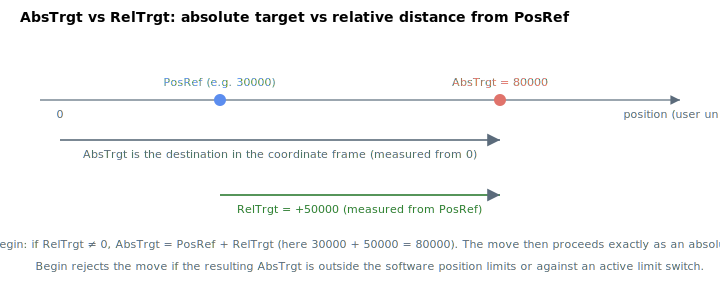

# RelTrgt

Relative target distance (user units) for the next point-to-point move.

## Overview

`RelTrgt` requests a move *relative to the current position reference*. It is the relative counterpart of [AbsTrgt](AbsTrgt.md): at [Begin](../04-motion-command/Begin.md), a non-zero `RelTrgt` is converted into an absolute target and the move then proceeds exactly like an absolute PTP move. It is not saved to flash and can be changed at any time.



## How it works

### RelTrgt is consumed at Begin, not held

The profiler never reads `RelTrgt` directly. When `Begin` runs, the controller does:

```text
if (RelTrgt != 0)
    AbsTrgt = PosRef + RelTrgt
```

so the relative distance is added to the **reference position [PosRef](../01-kinematics-status/PosRef.md)** (not the feedback [Pos](../01-kinematics-status/Pos.md)) to form a new [AbsTrgt](AbsTrgt.md). The same conversion is applied in every mode that accepts a relative target:

- PTP `Begin`
- Repetitive PTP `Begin`
- Vector motion `Begin` (per member axis)
- Quick begin on a switch to position mode

Two consequences follow from this design:

- **`RelTrgt = 0` is "use `AbsTrgt`".** A zero relative target is the signal to leave `AbsTrgt` untouched and move to the absolute target. To command a relative move that should *not* move, you cannot use `RelTrgt = 0`; the axis would instead go to whatever `AbsTrgt` currently holds.
- **Relative to the reference, repeatable.** Because the base is `PosRef`, issuing the same `RelTrgt` again steps by the same distance from where the previous move ended, with no accumulation of following error.

After conversion the resulting `AbsTrgt` is range-checked against the software limits and the limit switches exactly as for an absolute move (see [AbsTrgt](AbsTrgt.md) — *Validation at Begin*); an out-of-range relative target therefore rejects `Begin` rather than clipping.

## Examples

```text
ARelTrgt=5000        ; next Begin moves +5000 user units from the reference
ABegin               ; perform the relative move
ARelTrgt=-5000       ; next Begin moves 5000 user units in the negative direction
ARelTrgt             ; read the current relative target
```

## Changes between versions

In **v5 (central-i)** `RelTrgt` is a 64-bit integer with the larger range shown in the frontmatter, matching the 64-bit position pipeline; the conversion to `AbsTrgt` is unchanged. **v5 is central-i only**, so on standalone `RelTrgt` remains the v4 32-bit value.

## See also

- [AbsTrgt](AbsTrgt.md) — absolute target the relative distance is converted into
- [Targets](Targets.md) — flash-stored target array for user programs
- [Begin](../04-motion-command/Begin.md) — converts `RelTrgt` to `AbsTrgt` and starts the move
- [PosRef](../01-kinematics-status/PosRef.md) — the base the relative distance is added to
