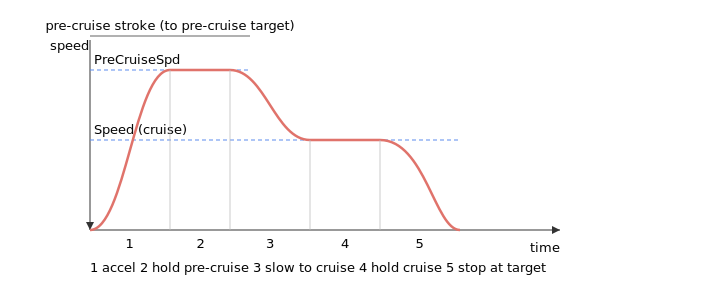

# Pre-cruise

Pre-cruise is an optional first stage of a sine point-to-point move in which the axis travels a defined opening stretch at a higher speed before slowing to the normal cruise speed for the rest of the move.

These keywords apply to the sine point-to-point motion modes added in v5: [MotionMode](../02-motion-configuration/MotionMode.md) `= 20` (sine PTP) and `= 21` (sine PTP repetitive). **The pre-cruise feature, and these keywords, are central-i v5 only.**

## What pre-cruise is for

In an ordinary point-to-point move the axis accelerates to a single cruise speed ([Speed](../03-kinematics-configuration/Speed.md)), holds it, then decelerates to the target. A pre-cruise inserts an earlier, faster stage: the axis first accelerates to a higher **pre-cruise speed** ([PreCruiseSpd](PreCruiseSpd.md)), holds it across an opening stretch (the **pre-cruise stroke**), then drops back down to the cruise speed for the remainder of the move and finally decelerates to the target. It lets you cover the first part of a long move quickly and then approach the destination at a calmer, more controlled speed.

The pre-cruise stroke is the distance from the start of the move to the **pre-cruise target**, set either absolutely with [PreCruAbsTrgt](PreCruAbsTrgt.md) or as a distance with [PreCruRelTrgt](PreCruRelTrgt.md). The final destination is still the usual [AbsTrgt](../13-motion-mode-ptp/AbsTrgt.md) / [RelTrgt](../13-motion-mode-ptp/RelTrgt.md) of the sine point-to-point move.

## How the stages compose

A move with pre-cruise runs as up to five sine-shaped stages:

1. accelerate from rest to the pre-cruise speed,
2. hold the pre-cruise speed,
3. decelerate from the pre-cruise speed down to the cruise speed,
4. hold the cruise speed,
5. decelerate to rest at the target.

A pre-cruise is only inserted when **both** of these hold:

- the pre-cruise speed is **greater than** the cruise speed (`PreCruiseSpd` &gt; `Speed`) — otherwise there is nothing higher to run first, and the move reduces to an ordinary sine point-to-point profile (stages 1, 4, 5); and
- a pre-cruise stroke is defined (a non-zero pre-cruise target).

## Stage kinematics

Each accelerating or decelerating stage is a single **half-sine acceleration pulse**: the acceleration follows $a(t)=a_{AB}\sin(\omega t)$ as $\omega t$ sweeps $0\to\pi$, which integrates to a **raised-cosine velocity** $v(t)=v_0+\tfrac{\Delta v}{2}\bigl(1-\cos(\omega t)\bigr)$ across the stage. A stage that changes speed by $\Delta v$ therefore raises (or lowers) the velocity by exactly $\Delta v$ with zero acceleration at both ends, which is what makes the joins between stages smooth.

The shape of each stage is set by whichever limit binds first — jerk or the acceleration ceiling:

- **Jerk-limited** (short speed change). The peak acceleration reached is

  $$a_{pk}=\sqrt{\tfrac{J\,\Delta v}{2}},\qquad \omega=\sqrt{\tfrac{2J}{\Delta v}},\qquad t_{stage}=\frac{\pi}{\omega}=\pi\sqrt{\frac{\Delta v}{2J}},$$

  where $J$ is the jerk for that stage ([JerkInAcc](../03-kinematics-configuration/JerkInAcc.md) while speeding up, [JerkInDec](../03-kinematics-configuration/JerkInDec.md) while slowing down).
- **Acceleration-limited** (larger speed change). When $a_{pk}$ would exceed the acceleration ceiling $a_{max}$ ([Accel](../03-kinematics-configuration/Accel.md) / [Decel](../03-kinematics-configuration/Decel.md), scaled by [AccelFact](../03-kinematics-configuration/AccelFact.md)), the peak is clipped to $a_{max}$ and the stage stretches:

  $$\omega=\frac{2\,a_{max}}{\Delta v},\qquad t_{stage}=\frac{\pi}{\omega}=\frac{\pi\,\Delta v}{2\,a_{max}}.$$

The crossover between the two regimes is at $\Delta v = 2\,a_{max}^{2}/J$: below it the stage is jerk-limited, above it acceleration-limited.

Either way the average speed over the stage is $v_0\pm\tfrac{\Delta v}{2}$, so the **distance a stage needs** is

$$x_{min}=\Bigl(v_0\pm\tfrac{\Delta v}{2}\Bigr)\,t_{stage},$$

with the $+$ sign for an accelerating stage and $-$ for a decelerating one. These per-stage minimum distances are exactly what the geometry checks below compare against: the opening acceleration from rest needs $x_{min}$ for the rest&rarr;cruise stage, and the final stop needs $x_{min}$ for the cruise&rarr;rest stage.

## Conditions and rejections

When `Begin` is issued the controller checks the geometry before starting. If a condition is not met the move is rejected with an instruction error rather than being silently clipped:

| Condition | Effect if it fails |
|---|---|
| Total stroke is non-zero (the final target differs from the start position) | rejected — total stroke cannot be zero (error 380) |
| The cruise speed is non-zero (`Speed` &gt; 0) | rejected — speed defined cannot be zero (error 382) |
| Total stroke and pre-cruise stroke point in the same direction | rejected — pre-cruise target must lie on the way to the final target (error 381) |
| Total stroke is longer than the pre-cruise stroke | rejected — the final target must be beyond the pre-cruise target (error 383) |
| Pre-cruise stroke is long enough to accelerate from rest to the cruise speed | rejected — pre-cruise stroke insufficient (error 384) |
| Remaining stroke is long enough to decelerate to rest | rejected — stopping stroke insufficient (error 385) |
| A valid acceleration/deceleration blend exists for a short stroke | rejected — profile calculation has no solution (error 386) |

The non-zero-stroke and non-zero-speed checks (errors 380 and 382) apply to every sine point-to-point move, with or without a pre-cruise.

Error 386 comes from the **short-stroke profile solver**. When the stroke is too short to reach the requested speed at a constant acceleration and deceleration, the controller drops the cruise hold and tries to splice the accelerate and decelerate stages directly. It searches a small set of jerk- and acceleration-limited blends (maximum acceleration or maximum acceleration-jerk paired with maximum deceleration or maximum deceleration-jerk) for one that meets the stroke within the jerk and acceleration limits. If none of those blends works it returns error 386. This can occur on a pre-cruise move whose pre-cruise stroke is long enough to *start* but too short to drop from the pre-cruise speed back to the cruise speed, **and** on an ordinary sine point-to-point move (mode 20 or 21, no pre-cruise) whose total stroke is too short to reach the cruise speed at all — so error 386 is not specific to pre-cruise.

See the [instruction error codes](../../../04-error-codes/instruction-error-codes.md) page for the meaning of instruction error codes returned by `Begin`.

## Keywords in this category

| Keyword | Summary |
|---|---|
| [PreCruAbsTrgt](PreCruAbsTrgt.md) | Absolute position of the pre-cruise target (user units). |
| [PreCruRelTrgt](PreCruRelTrgt.md) | Pre-cruise target as a distance from the start of the move (user units). |
| [PreCruiseSpd](PreCruiseSpd.md) | Speed held during the pre-cruise stage. |

## See also

- [MotionMode](../02-motion-configuration/MotionMode.md) — modes 20 and 21 select sine point-to-point motion
- [Speed](../03-kinematics-configuration/Speed.md) — the cruise speed used after the pre-cruise stage
- [AbsTrgt](../13-motion-mode-ptp/AbsTrgt.md) / [RelTrgt](../13-motion-mode-ptp/RelTrgt.md) — the final target of the move
- [Begin](../04-motion-command/Begin.md) — validates the geometry and starts the move
