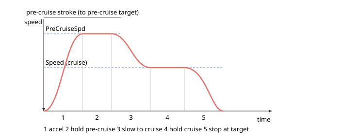

# 预巡航

预巡航是正弦点到点运动的可选初始阶段，在此阶段轴以较高速度行驶一段开始行程，然后降至正常巡航速度完成运动的其余部分。

这些关键字适用于 v5 新增的正弦点到点运动模式：[MotionMode](../02-motion-configuration/MotionMode.md) `= 20`（正弦 PTP）和 `= 21`（正弦 PTP 重复）。**预巡航功能及这些关键字仅适用于 central-i v5。**

## 预巡航的用途

在普通点到点运动中，轴加速至单一巡航速度（[Speed](../03-kinematics-configuration/Speed.md)），保持该速度，然后减速至目标。预巡航在此之前插入一个更快的阶段：轴先加速至更高的**预巡航速度**（[PreCruiseSpd](PreCruiseSpd.md)），在开始行程（**预巡航行程**）上保持该速度，然后降回巡航速度完成运动的其余部分，最终减速至目标。这使您可以在长行程的初始部分快速推进，再以更平稳、受控的速度接近目的地。

预巡航行程是从运动起点到**预巡航目标**的距离，可通过 [PreCruAbsTrgt](PreCruAbsTrgt.md) 以绝对位置设定，或通过 [PreCruRelTrgt](PreCruRelTrgt.md) 以距离设定。最终目的地仍由正弦点到点运动的常规 [AbsTrgt](../13-motion-mode-ptp/AbsTrgt.md) / [RelTrgt](../13-motion-mode-ptp/RelTrgt.md) 设定。

## 各阶段的组合方式

带预巡航的运动最多包含五个正弦形阶段：

1. 从静止加速至预巡航速度，
2. 保持预巡航速度，
3. 从预巡航速度减速至巡航速度，
4. 保持巡航速度，
5. 减速至目标位置静止。

仅当**以下两个条件同时满足**时才插入预巡航：

- 预巡航速度**大于**巡航速度（`PreCruiseSpd` &gt; `Speed`）——否则没有更高速度可先运行，运动退化为普通正弦点到点曲线（阶段 1、4、5）；且
- 已定义预巡航行程（预巡航目标非零）。

## 阶段运动学参数

每个加速或减速阶段均为一个**半正弦加速度脉冲**：加速度遵循 $a(t)=a_{AB}\sin(\omega t)$，当 $\omega t$ 从 $0$ 扫至 $\pi$ 时，积分得到一个**升余弦速度** $v(t)=v_0+\tfrac{\Delta v}{2}\bigl(1-\cos(\omega t)\bigr)$。速度变化量为 $\Delta v$ 的阶段在两端加速度均为零，这使各阶段间的衔接平滑。

每个阶段的形状由首先达到限制的参数决定——急动度或加速度上限：

- **急动度限制**（速度变化小）。达到的峰值加速度为

  $$a_{pk}=\sqrt{\tfrac{J\,\Delta v}{2}},\qquad \omega=\sqrt{\tfrac{2J}{\Delta v}},\qquad t_{stage}=\frac{\pi}{\omega}=\pi\sqrt{\frac{\Delta v}{2J}},$$

  其中 $J$ 为该阶段的急动度（加速时为 [JerkInAcc](../03-kinematics-configuration/JerkInAcc.md)，减速时为 [JerkInDec](../03-kinematics-configuration/JerkInDec.md)）。
- **加速度限制**（速度变化大）。当 $a_{pk}$ 将超过加速度上限 $a_{max}$（[Accel](../03-kinematics-configuration/Accel.md) / [Decel](../03-kinematics-configuration/Decel.md)，由 [AccelFact](../03-kinematics-configuration/AccelFact.md) 缩放）时，峰值被截至 $a_{max}$，阶段时长延伸：

  $$\omega=\frac{2\,a_{max}}{\Delta v},\qquad t_{stage}=\frac{\pi}{\omega}=\frac{\pi\,\Delta v}{2\,a_{max}}.$$

两种制度的临界点在 $\Delta v = 2\,a_{max}^{2}/J$：低于此值为急动度限制，高于此值为加速度限制。

无论哪种情况，阶段上的平均速度均为 $v_0\pm\tfrac{\Delta v}{2}$，因此**阶段所需距离**为

$$x_{min}=\Bigl(v_0\pm\tfrac{\Delta v}{2}\Bigr)\,t_{stage},$$

加速阶段取 $+$ 号，减速阶段取 $-$ 号。这些每阶段最小距离正是下方几何检查所比较的量：从静止开始的初始加速阶段需要 $x_{min}$ 完成静止→巡航，最终停止阶段需要 $x_{min}$ 完成巡航→静止。

## 条件与拒绝

发出 `Begin` 时，控制器在启动前检查几何条件。若某条件不满足，运动将以指令错误被拒绝，而非被静默截断：

| 条件 | 失败时的效果 |
|---|---|
| 总行程非零（最终目标与起始位置不同） | 被拒绝——总行程不能为零（错误 380） |
| 巡航速度非零（`Speed` &gt; 0） | 被拒绝——设定速度不能为零（错误 382） |
| 总行程与预巡航行程方向相同 | 被拒绝——预巡航目标必须位于通往最终目标的路径上（错误 381） |
| 总行程长于预巡航行程 | 被拒绝——最终目标必须超过预巡航目标（错误 383） |
| 预巡航行程足以从静止加速至巡航速度 | 被拒绝——预巡航行程不足（错误 384） |
| 剩余行程足以减速至静止 | 被拒绝——制动行程不足（错误 385） |
| 短行程存在有效的加减速融合方案 | 被拒绝——曲线计算无解（错误 386） |

非零行程和非零速度检查（错误 380 和 382）适用于所有正弦点到点运动，无论是否有预巡航。

错误 386 来自**短行程曲线求解器**。当行程过短，无法在恒定加减速下达到请求速度时，控制器放弃巡航保持，尝试直接拼接加速和减速阶段。它在一组急动度与加速度限制的融合方案（最大加速度或最大加速度-急动度，与最大减速度或最大减速度-急动度的组合）中搜索满足行程且在急动度和加速度限制内的方案。若无方案可行，则返回错误 386。这可能发生在预巡航行程足够*开始*但不足以将速度从预巡航速度降回巡航速度的预巡航运动中，**也**可能发生在总行程过短、无法达到巡航速度的普通正弦点到点运动（模式 20 或 21，无预巡航）中——因此错误 386 并非专属于预巡航。

指令错误码的含义请参见[指令错误码](../../../04-error-codes/instruction-error-codes.md)页面。

## 本分类下的关键字

| 关键字 | 摘要 |
|---|---|
| [PreCruAbsTrgt](PreCruAbsTrgt.md) | 预巡航目标的绝对位置（用户单位）。 |
| [PreCruRelTrgt](PreCruRelTrgt.md) | 预巡航目标相对于运动起点的距离（用户单位）。 |
| [PreCruiseSpd](PreCruiseSpd.md) | 预巡航阶段保持的速度。 |

## 另请参阅

- [MotionMode](../02-motion-configuration/MotionMode.md) — 模式 20 和 21 选择正弦点到点运动
- [Speed](../03-kinematics-configuration/Speed.md) — 预巡航阶段后使用的巡航速度
- [AbsTrgt](../13-motion-mode-ptp/AbsTrgt.md) / [RelTrgt](../13-motion-mode-ptp/RelTrgt.md) — 运动的最终目标
- [Begin](../04-motion-command/Begin.md) — 验证几何条件并启动运动
