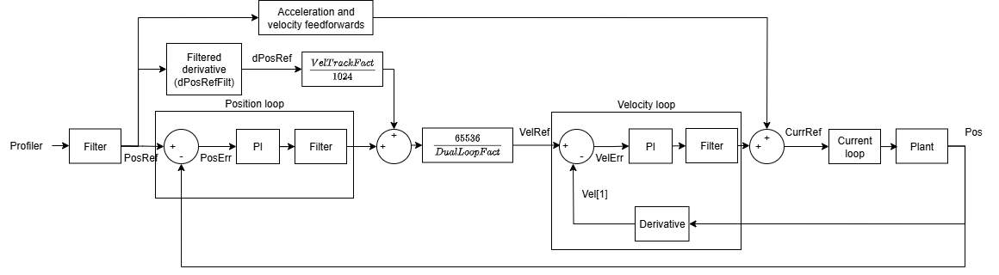

# Control tuning

The typical Agito overall position control structure (not dual-loop control) is as below.

The profiler will produce user-desired position reference. To ensure the position feedback equals to the desired reference, feedback and feedforwards controls are used.

1.  Feedback control

Position and velocity errors are derived from reference minus feedback. Position and velocity controls (PIV control) then evaluate the control effort needed to drive these errors to minimum values.

2.  Feedforward control

Feedforward evaluates desired control effort from position reference, so that control acts in advance to reduce tracking error.

Current loop will ensure motor current tracks the given current reference, through feedback control.

To improve motion performance, gain scheduling is available for position, velocity and feedforward gains. Input shaping is also available to reduce settling oscillation.

For non-collocated control, dual-loop control can be used to allow 2 separate feedback sources (one for position feedback and one for velocity feedback), in order to eliminate backlash.

In general, this section is divided into 8 subsections:

1.  General keywords

2.  Dual-loop control

3.  Position control

4.  Velocity control

5.  Feedforwards

6.  Current control

7.  Force control

8.  Input-shaping

Which group of control keywords is active depends on the axis [OperationMode](../../02-keywords/08-axis-operation/01-general-keywords/OperationMode.md). The table below summarises which keyword groups apply in each operation mode (for force control, also depending on [ForcePIVOn](../../02-keywords/11-control-tuning/07-force-control/ForcePIVOn.md)).

| OperationMode | Position | Velocity | Feedforward | Current | Force |
|---|---|---|---|---|---|
| 1 (Current control) | No | No | No | Yes | No |
| 2 (Velocity control) | No | Yes | No | Yes | No |
| 3 (Position control) | Yes | Yes | Yes | Yes | No |
| 4 (Force control, ForcePIVOn = 0) | No | No | No | Yes | Yes |
| 4 (Force control, ForcePIVOn = 1) | Yes | Yes | Yes | Yes | Yes |
