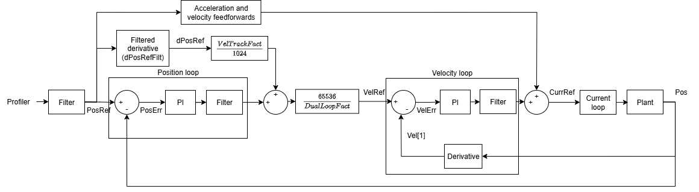

# 控制整定

Agito 典型整体位置控制结构（非双环控制）如下图所示。

运动规划器产生用户期望的位置参考值。为使位置反馈等于期望参考值，需使用反馈控制和前馈控制。

1.  反馈控制

位置误差和速度误差由参考值减去反馈值得到。位置控制和速度控制（PIV 控制）计算将这些误差驱动至最小值所需的控制量。

2.  前馈控制

前馈控制根据位置参考值计算期望控制量，使控制提前作用以减小跟踪误差。

电流环通过反馈控制确保电机电流跟踪给定的电流参考值。

为提升运动性能，位置、速度和前馈增益均支持增益调度。输入整形也可用于减少整定振荡。

对于非同位控制，可使用双环控制允许两路独立反馈源（一路用于位置反馈，一路用于速度反馈），以消除反向间隙的影响。

本节总体分为 10 个子节：

1.  通用关键字

2.  双环控制

3.  位置控制

4.  速度控制

5.  前馈

6.  电流控制

7.  力控制

8.  输入整形

9.  补偿滤波器（仅限 central-i v5）

10. 稳定性诊断（仅限 central-i v5）

哪组控制关键字处于激活状态取决于轴的 [OperationMode](../../02-keywords/08-axis-operation/01-general-keywords/OperationMode.md)。下表汇总了各运行模式下适用的关键字组（力控制模式还取决于 [ForcePIVOn](../../02-keywords/11-control-tuning/07-force-control/ForcePIVOn.md)）。

| OperationMode | 位置 | 速度 | 前馈（AccFFW / VelFFW） | 电流 | 力 |
|---|---|---|---|---|---|
| 1（电流控制模式） | 否 | 否 | 否 | 是 | 否 |
| 2（速度控制模式） | 否 | 是 | 否 | 是 | 否 |
| 3（位置控制模式） | 是 | 是 | 是 | 是 | 否 |
| 4（力控制模式，ForcePIVOn = 0） | 否 | 否 | 否 | 是 | 是 |
| 4（力控制模式，ForcePIVOn = 1） | 是 | 是 | 否 | 是 | 是 |

位置环前馈 [AccFFW](../../02-keywords/11-control-tuning/05-feedforwards/AccFFW.md) 和 [VelFFW](../../02-keywords/11-control-tuning/05-feedforwards/VelFFW.md) 仅在 `OperationMode = 3` 时有效。在力叠加 PIV 模式下，位置环和速度环仍正常运行，但叠加至电流参考的前馈项为力环前馈 [ForceFFW](../../02-keywords/11-control-tuning/07-force-control/ForceFFW.md) 和 [ForceVelFFW](../../02-keywords/11-control-tuning/07-force-control/ForceVelFFW.md)，而非位置环前馈项。
