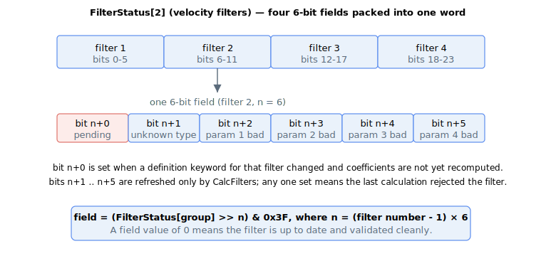

# FilterStatus

Per-filter status word reporting which customisable filters have pending definition changes and whether their last calculation found a problem.

## Overview

`FilterStatus` is an array that reports the state of the customisable loop filters relative to their definition keywords and to the last [CalcFilters](CalcFilters.md). Each array element covers one filter group, and within each element every filter occupies a **6-bit field**. The fields describe whether a filter is waiting for recalculation and, after a [CalcFilters](CalcFilters.md), whether the filter type and parameters were valid.

| Index | Filter group | Field layout (each field = 6 bits) |
|---|---|---|
| `FilterStatus[1]` | Position filters | bits 0–5: position reference filter; bits 6–11: position error filter |
| `FilterStatus[2]` | Velocity filters | bits 0–5: filter 1; bits 6–11: filter 2; bits 12–17: filter 3; bits 18–23: filter 4 |
| `FilterStatus[3]` | Feedforward filter | bits 0–5: feedforward filter |
| `FilterStatus[4]` | Force filters | bits 0–5: filter 1; bits 6–11: filter 2 |



## How it works

For a given filter, let `n` be the offset of its 6-bit field, where `n = (filter number − 1) × 6`. The bits within the field are:

| Bit | Meaning when 0 (cleared) | Meaning when 1 (set) |
|---|---|---|
| `n+0` | Coefficients are up to date | Definition has changed; coefficients pending recalculation |
| `n+1` | Filter type is recognised | Unknown filter type |
| `n+2` | First parameter in range | First parameter out of range |
| `n+3` | Second parameter in range | Second parameter out of range |
| `n+4` | Third parameter in range | Third parameter out of range |
| `n+5` | Fourth parameter in range | Fourth parameter out of range |

### How the bits update

- **Bit `n+0` (pending)** is set the moment a filter definition keyword for that filter is written to a value different from the one currently in use (`FiltDef` / `FiltOn` — see [CalcFilters](CalcFilters.md)). It is cleared when that filter is successfully recalculated. While any filter has bit `n+0` set, [StatReg](../../07-status-and-faults/StatReg.md) bit 26 ("filters modified") is also set.
- **Bits `n+1` to `n+5` (validity)** are refreshed only when [CalcFilters](CalcFilters.md) is commanded. They reflect the result of validating that filter's definition at the last calculation: the type-recognition check and the per-parameter range checks. If a filter passed validation, all five bits are clear; if it failed, the offending bit(s) are set and that filter's definition is rejected (the running filter is left unchanged — see [CalcFilters](CalcFilters.md)).

To read one filter's field, mask the element with `0x3F` after shifting right by `n`. For example, the position error filter (filter 2 of the position group, `n = 6`) is `(FilterStatus[1] >> 6) & 0x3F`.

## Examples

```text
AFilterStatus[2]                 ; read the velocity-filter status word
```

A value of `0` in a filter's field means that filter is up to date and was last calculated without any issue. A field value of `1` (only bit `n+0` set) means the definition changed and a [CalcFilters](CalcFilters.md) is still needed.

### Worked example: reading individual filter fields

Suppose `FilterStatus[2]` reads `0x000041` (decimal `65`). In binary that is `0000 0000 0000 0000 0000 0000 0100 0001`. Splitting into 6-bit fields from the least-significant side:

| Filter | Field bits | Field value | Meaning |
|---|---|---|---|
| 1 | bits 0–5 | `000001` | pending (bit 0 set); validity bits clear |
| 2 | bits 6–11 | `000001` | pending; validity bits clear |
| 3 | bits 12–17 | `000000` | up to date and last calculation passed |
| 4 | bits 18–23 | `000000` | up to date and last calculation passed |

So velocity filters 1 and 2 have new definitions waiting for a `CalcFilters`, while filters 3 and 4 are already running their current definitions. After issuing `CalcFilters`, if both new definitions are valid the word reads `0x000000`.

## See also

- [CalcFilters](CalcFilters.md) — recalculates coefficients and refreshes the validity bits
- [StatReg](../../07-status-and-faults/StatReg.md) — bit 26 (filters modified) summarises the pending state across all filters
