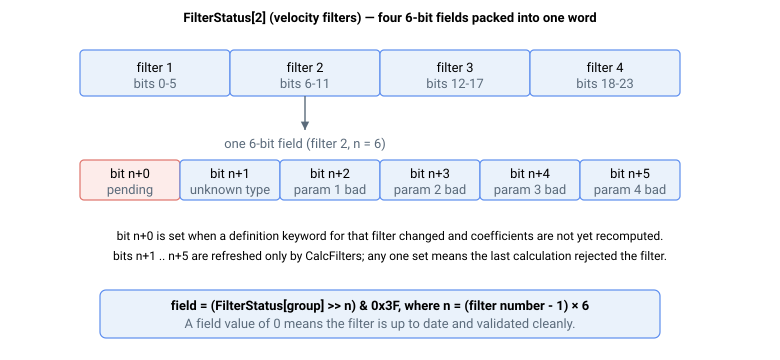

# FilterStatus

每个滤波器的状态字，报告哪些可定制滤波器有待处理的定义更改，以及上次计算是否发现问题。

## 概述

`FilterStatus` 是一个数组，报告可定制环路滤波器相对于其定义关键字及上次 [CalcFilters](CalcFilters.md) 的状态。每个数组元素对应一个滤波器组，每个元素内每个滤波器占用一个 **6 位字段**。这些字段描述滤波器是否等待重新计算，以及在执行 [CalcFilters](CalcFilters.md) 后，滤波器类型和参数是否有效。

| 索引 | 滤波器组 | 字段布局（每个字段 = 6 位） |
|---|---|---|
| `FilterStatus[1]` | 位置滤波器 | 位 0–5：位置参考滤波器；位 6–11：位置误差滤波器 |
| `FilterStatus[2]` | 速度滤波器 | 位 0–5：滤波器 1；位 6–11：滤波器 2；位 12–17：滤波器 3；位 18–23：滤波器 4 |
| `FilterStatus[3]` | 前馈滤波器 | 位 0–5：前馈滤波器 |
| `FilterStatus[4]` | 力滤波器 | 位 0–5：滤波器 1；位 6–11：滤波器 2 |



## 工作原理

对于给定的滤波器，设其 6 位字段的偏移量为 `n`，其中 `n = (滤波器编号 − 1) × 6`。字段内各位含义如下：

| 位 | 值为 0（清除）的含义 | 值为 1（置位）的含义 |
|---|---|---|
| `n+0` | 系数已是最新 | 定义已更改；系数待重新计算 |
| `n+1` | 滤波器类型已识别 | 未知滤波器类型 |
| `n+2` | 第一参数在范围内 | 第一参数超出范围 |
| `n+3` | 第二参数在范围内 | 第二参数超出范围 |
| `n+4` | 第三参数在范围内 | 第三参数超出范围 |
| `n+5` | 第四参数在范围内 | 第四参数超出范围 |

### 位的更新方式

- **位 `n+0`（待处理位）**：当该滤波器的定义关键字（`FiltDef` / `FiltOn`——参见 [CalcFilters](CalcFilters.md)）被写入与当前使用值不同的值时，该位立即置位；写回相同值则保持清除。当该滤波器成功重新计算后，该位清除。相关的 [StatReg](../../07-status-and-faults/StatReg.md) 位 26（"滤波器已修改"）是一个单独的汇总标志：当滤波器定义从闪存加载时置位，在成功执行 [CalcFilters](CalcFilters.md) 后清除；它不逐位反映这些每个滤波器的待处理位。
- **位 `n+1` 至 `n+5`（有效性位）**：仅在执行 [CalcFilters](CalcFilters.md) 命令时刷新。它们反映上次计算时对该滤波器定义的验证结果：类型识别检查和各参数范围检查。如果滤波器通过验证，所有五个位均清除；如果失败，相应位置位，该滤波器的定义被拒绝（正在运行的滤波器保持不变——参见 [CalcFilters](CalcFilters.md)）。

要读取某个滤波器的字段，将元素右移 `n` 位后与 `0x3F` 做与运算。例如，位置误差滤波器（位置组的滤波器 2，`n = 6`）为 `(FilterStatus[1] >> 6) & 0x3F`。

`FilterStatus` 也可写，且唯一接受的值为 `0`。向某个元素写入 `0` 将丢弃该整个滤波器组尚未应用的定义编辑：滤波器的开关状态和定义值将恢复为控制器当前正在运行的值，且该元素的状态字（包括待处理位）被清除。这是在不重新计算的情况下放弃自上次 [CalcFilters](CalcFilters.md) 以来所做编辑的方法。写入任何非零值将以越界错误被拒绝，不做任何更改。

## 示例

```text
AFilterStatus[2]                 ; read the velocity-filter status word
AFilterStatus[2]=0               ; discard unapplied velocity-filter edits and clear the word
```

元素中某个滤波器字段值为 `0` 表示该滤波器已是最新，且上次计算未发现任何问题。字段值为 `1`（仅 `n+0` 位置位）表示定义已更改，仍需执行 [CalcFilters](CalcFilters.md)。

### 示例详解：读取各滤波器字段

假设 `FilterStatus[2]` 读数为 `0x000041`（十进制 `65`）。以二进制表示为 `0000 0000 0000 0000 0000 0000 0100 0001`。从最低有效位起按 6 位字段拆分：

| 滤波器 | 字段位 | 字段值 | 含义 |
|---|---|---|---|
| 1 | 位 0–5 | `000001` | 待处理（位 0 置位）；有效性位清除 |
| 2 | 位 6–11 | `000001` | 待处理；有效性位清除 |
| 3 | 位 12–17 | `000000` | 已是最新，上次计算通过 |
| 4 | 位 18–23 | `000000` | 已是最新，上次计算通过 |

因此，速度滤波器 1 和 2 有新定义等待执行 `CalcFilters`，而滤波器 3 和 4 已在运行其当前定义。执行 `CalcFilters` 后，如果两个新定义均有效，则该字读数为 `0x000000`。

## 另请参阅

- [CalcFilters](CalcFilters.md) — 重新计算系数并刷新有效性位
- [StatReg](../../07-status-and-faults/StatReg.md) — 位 26（滤波器已修改）在滤波器定义从闪存加载时置位，在成功执行 `CalcFilters` 后清除
